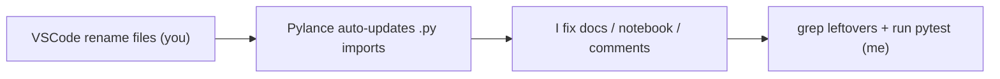

# Plan for issue #381: Refactor module naming to prevent name clash with cellpy core

## Goal

Rename the two modules in `cellpy` that are accidentally named `core` so they no longer
collide conceptually with the new `cellpy-core` package:

- `cellpy/readers/core.py` -> `cellpy/readers/data_structures.py`
- `cellpy/internals/core.py` -> `cellpy/internals/connections.py`

## Constraints

- Project rules: use `uv` for everything; activate `.venv` (recommend conda `cellpy_dev_313` for pytest).
- Do **not** rename the deliberate cellpy-core seam in `cellpy/readers/cellreader.py`
  (`self.core`, `OldCellpyCellCore`, `make_core_summary`, `add_scaled_summary_columns`). Those are intentional.
- Keep public import surface working. Many modules and tests import names from these two modules.
- **Pickle/serialization risk:** classes like `Data` and `FileID` live in `readers/core.py`.
  If cellpy save files store the fully-qualified module path (pickle), moving the module could
  break loading of existing `.clp`/`.h5` files. Must verify before closing (see Open questions).

## Approach

Two-phase, matching the chosen workflow (you do the renames in VSCode, I do the rest + verify):

1. **VSCode rename (you):** Use "Rename Symbol" / "Rename File" on each module so Pylance
   auto-updates all `.py` imports across `cellpy/` and `tests/`:
   - `cellpy/readers/core.py` -> `data_structures.py`
   - `cellpy/internals/core.py` -> `connections.py`
   This handles aliased imports too (e.g. `import cellpy.readers.core as core`,
   `import cellpy.internals.core as internals` keep their aliases, only the module path changes).
2. **Non-Python references (me):** VSCode does not touch docs, notebooks, comments, or docstrings.
   I update those (list below) and then verify nothing references the old paths.
3. **Verify (me):** grep for any leftover `readers.core` / `internals.core` / `readers import core` /
   `internals import core`, then run the test suite.

## Files to touch

Python (auto-updated by VSCode rename, ~40 files incl. tests). Aliased/explicit imports to sanity-check:
- `cellpy/readers/cellreader.py` — `from cellpy.readers import core`, `import cellpy.internals.core as internals`
- `cellpy/readers/instruments/base.py` — `import cellpy.readers.core as core`, `import cellpy.internals.core`

Non-Python / comments / docstrings (I edit manually):
- `docs/source/cellpy.readers.rst` — `cellpy.readers.core` heading + `automodule` -> `data_structures`
- `docs/source/cellpy.internals.rst` — `cellpy.internals.core` heading + `automodule` -> `connections`
- `examples/06_loading_different_formats.ipynb` — line 86 import + usages `core.find_all_instruments()`,
  `core.instrument_configurations(...)` (lines 88, 778, 1352). Likely use `from cellpy.readers import data_structures as core` to keep cell bodies unchanged.
- `cellpy/__init__.py:31` — commented `# from cellpy.readers.core import Q, ureg`
- `cellpy/exporters/bdf.py:248` — docstring `:func:\`cellpy.readers.core.Q\``
- `cellpy/readers/cellreader.py:7124` — comment `cellpy.readers.core.Data objects`
- `tests/test_pure_functions.py`, `tests/test_exporters_bdf.py` — docstring mentions of the old paths
- `.issueflows/04-designs-and-guides/bdf-export.md:74` — link to `cellpy/readers/core.py` (accuracy)

## Test strategy

- After renames + manual edits, grep to confirm zero remaining references to the old module paths
  (`readers.core`, `internals.core`, `readers import core`, `internals import core`, `readers/core.py`, `internals/core.py`).
- Run `uv run pytest` (or conda `cellpy_dev_313` + `pytest`).
- Targeted: `tests/test_otherpaths.py`, `tests/test_cell_readers.py`, `tests/test_units.py`,
  `tests/test_pure_functions.py` exercise both modules directly.
- Load an existing saved-cell fixture to confirm no pickle/path breakage (pickle risk check).

## Open questions

- **Pickle back-compat:** do saved cellpy files store the module path of `Data`/`FileID`? If yes,
  we may need a compatibility shim (a thin `readers/core.py` re-exporting from `data_structures`, or
  an unpickle alias) so old files still load. I'll confirm during implementation and flag if a shim is needed.
- Keep a temporary back-compat shim module (`core.py` re-exporting the new names) for downstream code
  that imports `cellpy.readers.core` externally, or do a clean break? (Default: clean break unless pickle forces a shim.)
