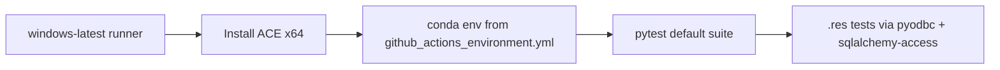

# Issue #407 — Plan

## Goal

Retire AppVeyor as the Windows CI provider and run the same conda-based pytest smoke check on GitHub Actions instead, including whatever is needed to read Arbin `.res` files (MS Access via ODBC).

## Constraints

- Keep CI behavior equivalent to today's AppVeyor job: conda env from [`github_actions_environment.yml`](../../github_actions_environment.yml), full default-deselected pytest suite, ignore `tests/test_plotutils_summary_plot.py`.
- Do not expand scope into uv migration of all workflows ([`build-and-versioning.md`](../04-designs-and-guides/build-and-versioning.md) lists that as follow-up).
- [`pip-install-win.yml`](../../.github/workflows/pip-install-win.yml) stays as a separate pip-install smoke test unless we explicitly decide to merge later.
- After GHA Windows job is green, remove [`appveyor.yml`](../../appveyor.yml) from the repo (disabling the AppVeyor project itself is a manual step outside the repo).

### Prior art

- [`appveyor.yml`](../../appveyor.yml) — working Windows conda pytest today; downloads and silently installs **Access Database Engine 2016 x64** before conda env create; Python **3.12** only.
- [`.github/workflows/pytest_posix.yml`](../../.github/workflows/pytest_posix.yml) — active push/PR conda pytest on Linux; Python **3.13**; same pytest ignore flag; model for triggers and step layout.
- [`.github/workflows/pytest_win.yml`](../../.github/workflows/pytest_win.yml) — disabled (`workflow_dispatch` only); name says **NOT WORKING DUE TO MISSING ACCESSDATABASEENGINE**; missing ACE install step.
- [`.github/workflows/test-win.yml`](../../.github/workflows/test-win.yml) — dead experiment (`DID NOT WORK`); references a local `bin/AccessDatabaseEngine.exe` that does not exist in repo.
- [`.github/workflows/pip-install-win.yml`](../../.github/workflows/pip-install-win.yml) — active pip smoke on Windows; only runs `tests/test_maccor.py` — does **not** cover `.res` / ODBC path.
- [`github_actions_environment.yml`](../../github_actions_environment.yml) — already includes `pyodbc` and pip `sqlalchemy-access`; env file shared with Linux GHA job.
- [Issue #360 plan/status](../03-solved-issues/issue360_plan.md) — AppVeyor trimmed to Windows-conda smoke; full matrix intentionally on GHA (Linux side).
- [Issue #372 status](../02-partly-solved-issues/issue372_status.md) — on a **local** Windows dev box, `sqlalchemy-access` alone fixed `.res` tests without manually installing ACE (driver may already have been present). **Do not rely on this for CI** until proven on a clean `windows-latest` runner.
- [`testing-and-coverage.md`](../04-designs-and-guides/testing-and-coverage.md) — canonical pytest command and marker policy.
- [`cellpy/readers/instruments/arbin_res.py`](../../cellpy/readers/instruments/arbin_res.py) — `.res` loading uses `access+pyodbc` → needs `{Microsoft Access Driver (*.mdb, *.accdb)}` on the runner.
- Toolbox (`00-tools/`): none relevant.

## Approach

### 1. Fix Windows conda workflow (replace AppVeyor)

Revive [`.github/workflows/pytest_win.yml`](../../.github/workflows/pytest_win.yml) in place (rename title to drop "NOT WORKING"):

1. **Triggers** — match [`pytest_posix.yml`](../../.github/workflows/pytest_posix.yml): `push` on all branches, `pull_request` to `master`, plus `workflow_dispatch`.
2. **Runner** — `windows-latest`, `defaults.run.shell: bash -l {0}` for conda activation (same as posix job uses for bash).
3. **ACE install step** — port the PowerShell block from [`appveyor.yml`](../../appveyor.yml) (download Microsoft URL if missing, `Start-Process … /quiet /norestart`, fail on non-zero exit). Cache installer under `$env:RUNNER_TEMP` or `actions/cache` keyed on workflow file hash (optional nice-to-have; start with download-each-run if simpler).
4. **Conda** — `conda-incubator/setup-miniconda@v3` with `environment-file: github_actions_environment.yml`, `activate-environment: cellpy_dev`, `python-version: "3.13"` (align with posix job).
5. **Pytest** — `pytest --ignore=tests/test_plotutils_summary_plot.py` (same as AppVeyor + posix).
6. **Driver sanity check (optional but cheap)** — after ACE install, a one-liner `python -c "import pyodbc; assert any(d.startswith('Microsoft Access Driver') for d in pyodbc.drivers())"` to fail fast with a clear message.

Do **not** add mdbtools on Windows (Linux-only concern in posix workflow).

### 2. Remove AppVeyor artifacts

- Delete [`appveyor.yml`](../../appveyor.yml).
- Remove AppVeyor references from:
  - [`docs/contributing/developers_guide/dev_cellpy_folder_structure.md`](../../docs/contributing/developers_guide/dev_cellpy_folder_structure.md)
  - [`_old_docs/_developers_guide/dev_cellpy_folder_structure.md`](../../_old_docs/_developers_guide/dev_cellpy_folder_structure.md) (keep in sync if we touch the live doc)
- Update stale skip reason in [`tests/test_batch.py`](../../tests/test_batch.py) (`"fails sometimes on appveyor"` → generic flaky-CI wording).

### 3. Clean up dead Windows workflow experiments

- Delete [`.github/workflows/test-win.yml`](../../.github/workflows/test-win.yml) (non-functional, misleading).
- Leave [`pip-install-win.yml`](../../.github/workflows/pip-install-win.yml) unchanged.

### 4. Verification order

1. Push branch; confirm new GHA Windows job passes (especially `.res`-touching tests in default suite).
2. Only then remove `appveyor.yml` (or same PR if confident — prefer single PR with workflow first, AppVeyor removal in same commit once green).

### Data flow (unchanged from AppVeyor)



## Files to touch

| File | Change |
| --- | --- |
| [`.github/workflows/pytest_win.yml`](../../.github/workflows/pytest_win.yml) | Enable on push/PR; add ACE install; align env/python with posix job |
| [`appveyor.yml`](../../appveyor.yml) | **Delete** |
| [`.github/workflows/test-win.yml`](../../.github/workflows/test-win.yml) | **Delete** |
| [`docs/contributing/developers_guide/dev_cellpy_folder_structure.md`](../../docs/contributing/developers_guide/dev_cellpy_folder_structure.md) | Drop `appveyor.yml` from tree listing |
| [`tests/test_batch.py`](../../tests/test_batch.py) | Refresh skip reason text (one line) |

Optional follow-up (out of scope unless ACE step is flaky): `actions/cache` for the ~30 MB ACE installer.

## Test strategy

No new unit tests — CI **is** the test.

After implementation:

```bash
# Local (Linux/WSL) — ensure no regressions to shared env file
conda activate cellpy_dev_313   # or project conda env
pytest --ignore=tests/test_plotutils_summary_plot.py
```

Primary validation: GitHub Actions **`Run pytest on win`** (renamed workflow) green on the issue branch PR, with `.res`-related tests passing (watch for failures in `test_cell_readers.py`, `test_cellpy.py`, etc.).

## Open questions

1. **Python version on Windows GHA** — use **3.13** (match posix) or **3.12** (match current AppVeyor)? Recommendation: **3.13** for one canonical GHA Python; confirm OK.
2. **AppVeyor project** — disable/delete the AppVeyor.com project manually after merge? (Not repo-automatable.)
3. **ACE install caching** — download every run vs `actions/cache` — start without cache unless first run is too slow?
