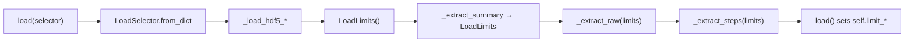

# Issue #447 — plan

## Goal

Execute file-plan **Steps 2 + 3** in two separate commits: (1) move stateless cellpy-file helpers into `cellpy/readers/cellpy_file/` with one-line `CellpyCell` delegators; (2) introduce explicit `LoadSelector` / `LoadLimits` and stop using `self.limit_*` as a hidden side channel during HDF5 extraction — while keeping external load behavior identical (verified by Stage-0 tests).

## Constraints

- **Behavior-preserving:** no user-visible load/save changes; full essential suite green after each commit.
- **Stage 1 scope only:** extractors stay as `CellpyCell` methods for now (Step 4 in the architecture plan moves the read path). Do not start `read.py` / legacy reader extraction (#448).
- **Dependencies satisfied:** #429 (characterization tests), #446 (format.py), #450 (units/`core` alias) are closed.
- **Acceptance grep:** after commit 2, `self.limit_loaded_cycles` / `self.limit_data_points` in `cellreader.py` appear only in `__init__`, repr/html, and **`load()`** (assignment from returned limits) — not inside extractors or `_hdf5_cycle_filter`.
- **Preserve subtle selector semantics:** when `selector is None`, summary extraction currently **clears** `limit_loaded_cycles` before filtering (it does *not* apply `prms.Reader.limit_loaded_cycles` during cellpy-file load). Do not “fix” that in this issue.

### Prior art

- [`cellpy/readers/cellpy_file/format.py`](../../cellpy/readers/cellpy_file/format.py) — `CellpyFileFormat`, version constants (#446).
- [`architecture-plan/cellpy-file-loading-refactor-plan.md`](../../../architecture-plan/cellpy-file-loading-refactor-plan.md) — Steps 2–3, §2.2 (`LoadSelector`/`LoadResult`), §3.2 API shape.
- [`tests/test_cellpy_file_roundtrip.py`](../../tests/test_cellpy_file_roundtrip.py) — selector oracle (`test_v8_load_selector_max_cycle_truncates_consistently`, essential).
- [`tests/cellpy_file_support.py`](../../tests/cellpy_file_support.py) — `load_cellpy_file()` helper.
- Side-channel today: `_extract_summary_from_cellpy_file` → `_hdf5_cycle_filter` → `_extract_raw/steps_from_cellpy_file` read `self.limit_*` ([`cellreader.py`](../../cellpy/readers/cellreader.py) ~2207–2305).
- Toolbox: `scan_*` scripts — not applicable (no AST inventory needed).
- Graph: `graphify-out/` absent — grep-only discovery.

## Approach

### Commit 1 — stateless helpers (Step 2)

Move **verbatim** (rename to public module functions, drop leading `_` in the module; keep private names on delegators):

| Current `CellpyCell` method | New module |
|---|---|
| `_check_keys_in_cellpy_file` | `cellpy_file/keys.py` → `check_keys_in_cellpy_file` |
| `_extract_from_meta_dictionary` | `cellpy_file/meta.py` → `extract_from_meta_dictionary` |
| `_get_cellpy_file_version` | `cellpy_file/meta.py` → `get_cellpy_file_version` (uses `extract_from_meta_dictionary`; no `self`) |
| `_convert2fid_list`, `_convert2fid_table` | `cellpy_file/fids.py` |
| `_fix_dtype_step_table` | `cellpy_file/dtype.py` (single function; writer-adjacent but listed in Step 2) |

Each `CellpyCell` method becomes a one-line delegate (static where appropriate). Update `cellpy_file/__init__.py` exports only if needed for tests — internal imports from submodules are fine.

**No** signature or call-order changes in commit 1.

### Commit 2 — explicit selector/limits (Step 3)

Add [`cellpy/readers/cellpy_file/selectors.py`](../../cellpy/readers/cellpy_file/selectors.py):

```python
@dataclass(frozen=True)
class LoadSelector:
    max_cycle: int | None = None

    @classmethod
    def from_dict(cls, selector: dict | None) -> "LoadSelector":
        if not selector:
            return cls(max_cycle=None)
        return cls(max_cycle=selector.get("max_cycle"))

@dataclass
class LoadLimits:
    limit_loaded_cycles: int | None = None
    limit_data_points: int | None = None
```

Use **`LoadLimits`** now (not full `LoadResult` with `data` — that lands in #448).

Refactor in `cellreader.py` (still instance methods; they need `self.headers_summary` / `self.headers_normal`):

1. **`_unpack_selector`** → delegate to `LoadSelector.from_dict`.
2. **`_hdf5_cycle_filter(table, limits: LoadLimits)`** — pure w.r.t. `self.limit_*`; builds `where=` from `limits` only.
3. **`_extract_summary_from_cellpy_file(..., selector, limits: LoadLimits) -> LoadLimits`** — apply selector branch exactly as today:
   - `selector` dict with `max_cycle` → set `limits.limit_loaded_cycles`, build filter directly.
   - else → `limits.limit_loaded_cycles = None`, call `_hdf5_cycle_filter("summary", limits)`.
   - compute `limits.limit_data_points` from summary max data-point column; return `limits`.
4. **`_extract_raw_from_cellpy_file(..., limits)`** — use `_hdf5_cycle_filter("raw", limits)`.
5. **`_extract_steps_from_cellpy_file(..., limits)`** — filter on `limits.limit_data_points` instead of `self.limit_data_points`.

Thread `LoadLimits` through all five reader orchestrators that call the extractors:

- `_load_hdf5_current_version`
- `_load_hdf5_v5`, `_load_hdf5_v6`, `_load_hdf5_v7`
- `_load_old_hdf5_v3_to_v4`

Each builds `sel = LoadSelector.from_dict(selector)`, starts with `limits = LoadLimits()`, passes `limits` through summary → raw → steps, and **returns `(data, limits)`**.

Propagate upward:

- `_load_hdf5` → `(data, limits)` (both current-version and old-version branches).
- **`load()`** — after successful `_load_hdf5`, assign:
  ```python
  self.limit_loaded_cycles = limits.limit_loaded_cycles
  self.limit_data_points = limits.limit_data_points
  ```
  (Today these are set only as side effects inside extractors; this makes the contract explicit and satisfies the acceptance grep.)

Leave `_hdf5_locate_data_points_from_max_cycle_number` untouched (not in #447 scope).

### Data flow (commit 2)



## Files to touch

| Path | Change |
|---|---|
| `cellpy/readers/cellpy_file/keys.py` | **new** — `check_keys_in_cellpy_file` |
| `cellpy/readers/cellpy_file/meta.py` | **new** — meta dict + version read |
| `cellpy/readers/cellpy_file/fids.py` | **new** — fid table ↔ `FileID` |
| `cellpy/readers/cellpy_file/dtype.py` | **new** — `fix_dtype_step_table` |
| `cellpy/readers/cellpy_file/selectors.py` | **new** (commit 2) — `LoadSelector`, `LoadLimits` |
| `cellpy/readers/cellpy_file/__init__.py` | optional re-exports |
| `cellpy/readers/cellreader.py` | delegators (c1); selector/limits refactor + `load()` assignment (c2) |
| `tests/test_cellpy_file_roundtrip.py` | no changes expected if behavior preserved |
| `tests/test_cellpy_file_format.py` | run; no changes expected |

## Test strategy

After **each** commit:

```bash
uv run pytest -m essential
uv run pytest tests/test_cellpy_file_roundtrip.py
```

Commit 2 additionally:

- Acceptance grep (manual or small comment in status — no new test required unless grep is fragile):
  ```bash
  rg 'self\.limit_(loaded_cycles|data_points)' cellpy/readers/cellreader.py
  ```
  Expect hits in `__init__`, repr, and `load()` only.
- Full selector oracle unchanged: `test_v8_load_selector_max_cycle_truncates_consistently` (limits `3119`, summary length 3).
- Legacy matrix spot-check: `test_legacy_v4_v7_load_shapes_and_columns` (uses extractors without selector dict).

No new tests unless a regression appears during implementation; Stage-0 coverage is the guardrail.

## Open questions

- **None blocking.** File split (`keys`/`meta`/`fids`/`dtype` vs one `helpers.py`) follows the architecture plan layout; can collapse to fewer files if the diff is noisy, but keep `selectors.py` separate for #448 reuse.
