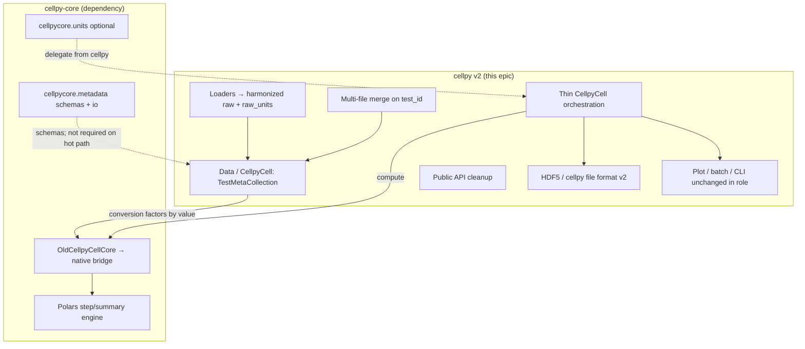
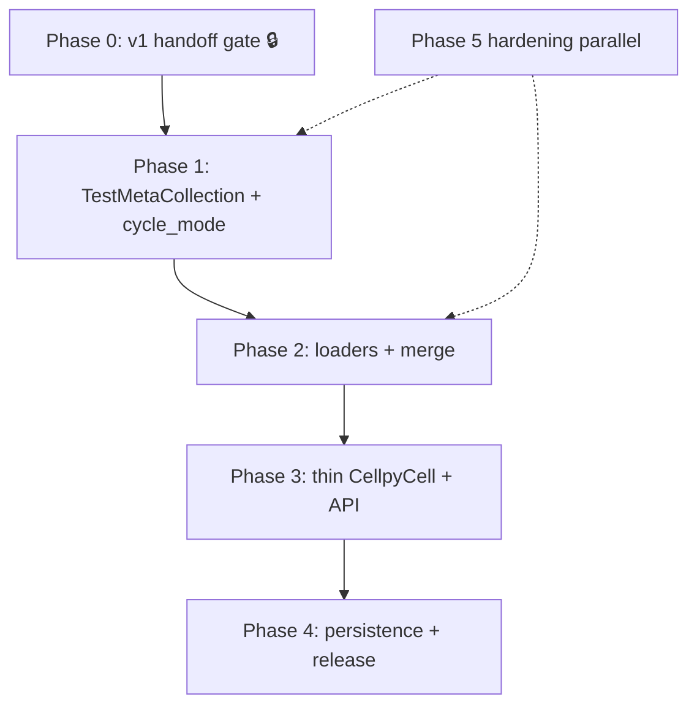

# cellpy v2.0 — epic (consumer-side)

Durable planning document for **cellpy v2.0** work in the `cellpy` repo. This is the
**epic layer**: it captures scope, sequencing, boundaries, and success criteria. Individual
GitHub issues will be carved out of the themes below once the epic is agreed.

**Prerequisite context** (read first; live in the sibling `cellpy-core` checkout):

- [`cellpy-core-integration-into-cellpy.md`](../../cellpy-core/.issueflows/04-designs-and-guides/cellpy-core-integration-into-cellpy.md) — strategy and seam design
- [`cellpy-core-migration.md`](../../cellpy-core/.issueflows/04-designs-and-guides/cellpy-core-migration.md) — dev wiring, parity tests, metadata boundary
- [`cellpy-core-integration-roadmap.md`](../../cellpy-core/.issueflows/04-designs-and-guides/cellpy-core-integration-roadmap.md) — STEP-01–12 integration roadmap (mostly ✅)
- [`test-metadata-and-merging.md`](../../cellpy-core/.issueflows/04-designs-and-guides/test-metadata-and-merging.md) — multi-test metadata model
- [`metadata-scaffolding.md`](../../cellpy-core/.issueflows/04-designs-and-guides/metadata-scaffolding.md) — what core already ships

## What v2 is (and is not)

**v2 is** the consumer upgrade that builds on a **finished v1→core handoff**: cellpy keeps
loaders, plotting, batch tools, CLI, HDF5 persistence, and user-facing API — but treats
`cellpy-core` as the sole compute engine and adopts the harmonized data model (multi-test
metadata, native schema path, cleaner public API).

**v2 is not** a rewrite of the processing engine (that lives in `cellpy-core`), a new repo,
or a merge of branch 334. Integration stays on branches of the real `cellpy` repo.

## Branching

**All v2 epic work lands on the long-lived `v2` branch.** `master` remains the stable **1.x**
line for other contributors. PRs for epic #402 and child issues **target `v2`**, not
`master`. Phase 0 gate work (#384, #385) may land on `master` when parity tests prove
behaviour is unchanged.

Full conventions: [`cellpy-v2-branching.md`](cellpy-v2-branching.md).

## Relationship to the core integration roadmap

The STEP-01–12 roadmap in `cellpy-core` covers **wiring and engine parity**. Most steps
are ✅ as of 2026-07. v2 work **starts after Phase 0** (below) and assumes:

| Integration prerequisite | Status (2026-07) | v2 depends on it because |
|--------------------------|------------------|---------------------------|
| Seam on `OldCellpyCellCore` (#377) | ✅ | Data ownership and compute delegation already live |
| Contract + acceptance tests (#378, `test_slim.py`) | ✅ | Regression guard while v2 changes land |
| `make_step_table` / summary in core (#12, #13) | ✅ | v2 does not re-port the engine |
| Metadata scaffolding in core (#37, #41) | ✅ | v2 **populates** `TestMeta`; core owns shape/tools only |
| Header harmonization (#34/#35) | ✅ | Loaders can target harmonized cols over time |
| PyPI release + pin (`cellpycore>=0.1.2`, core #44) | ✅ | Reproducible releases without git hacks |
| Golden oracle (STEP-06) | 🟡 ongoing | Extend as v2 loaders/merge paths grow |
| Unit boundary (STEP-12) | 🟡 partly | cellpy still duplicates converters; v2 should delegate |
| Legacy engine cleanup (#384, #385) | ⬜ open | v2 must not carry two compute paths |

## Goal (one sentence)

Ship **cellpy v2.0** as a behaviour-compatible upgrade where `CellpyCell` orchestrates
`cellpy-core`, adopts keyed per-test metadata for merged campaigns, simplifies the public
API, and retires legacy duplication — with parity enforced by tests, not vigilance.

## Architecture (consumer vs engine)

**Diagram:** [`cellpy-v2-architecture.excalidraw`](cellpy-v2-architecture.excalidraw) (open in
Excalidraw / VS Code Excalidraw extension).



**Boundary rule (unchanged from migration guide §4):** core owns metadata *scaffolding and
tooling*; cellpy v2 owns *population, policy, and persistence*. Core must keep working when
metadata is absent.

## Epic phases

Status legend: ✅ done · 🟡 in progress · ⬜ not started · 🔒 gate (must finish before v2)

### Phase 0 — Finish the v1 handoff (gate)

🔒 **No v2 feature work until this phase is green.** Tracked on `cellpy` today as open
integration issues; not part of the v2 version bump itself but blocks a clean baseline.

| Theme | Anchor | Work | Done when |
|-------|--------|------|-----------|
| Pin + parity smoke | jepegit/cellpy#384 | Sync to current `cellpycore` (PyPI or editable), run `-m essential` + full suite, confirm Arbin goldens (103 steps / 18 cycles / cyc-1 `data_point` 1457) | Essential + full suite green on pinned core |
| Retire legacy engine | jepegit/cellpy#385 | Inventory/remove `_make_summar_legacy`, `old=True` summary path, dead step helpers in `cellreader.py`; optional oracle test before removal | No parallel compute engine in cellpy |
| Delegate unit converters | STEP-12 cellpy side | Route `get_converter_to_specific` / `nominal_capacity_as_absolute` through `cellpycore.units`; extend parity tests | Converter parity tests pass; duplicates retired or thin wrappers |
| Header single source | ad hoc | Drop redundant `HEADERS_*` module constants in `cellreader.py` where core legacy is authoritative | No third copy of header strings |
| Close alignment umbrella | jepegit/cellpy#387 | Close when 384+385+unit delegation land | — |
| Archive blueprint issue | jepegit/cellpy#334 | Close as superseded by #377 (do not merge branch) | — |

**Test commands (integration inner loop):**

```bash
uv run pytest -m essential          # ~15 tests, header parity + pipeline smoke
uv run pytest tests/test_slim.py tests/test_core_settings_parity.py
uv run pytest                      # full suite before release
```

Use **uv** (not conda) for integration work — editable `cellpycore` is wired via
`[tool.uv.sources]`.

### Phase 1 — Data model: keyed metadata (v2 core)

Replace the scalar `Data.meta_test_dependent` / single `cycle_mode` with the hybrid model
from `test-metadata-and-merging.md`. Core already has `TestMeta`, `CellMeta`,
`TestMetaCollection`, and `test_id` on raw/step/cycle schemas (#41 ✅).

| Theme | Primary codebase | Work | Done when |
|-------|------------------|------|-----------|
| **V2-01** `TestMetaCollection` on `Data` | `cellpy/readers/data_structures.py` | Hold per-test metadata keyed by `test_id`; migration path from `CellpyMetaIndividualTest` | Load/save round-trip preserves collection |
| **V2-02** `cycle_mode` per test | `CellpyCell`, `Data` | Replace scalar property (`# TODO: v2.0` in `cellreader.py` ~880–895) with lookup via `test_id` / active test | Merged object can mix anode/cathode tests without silent overwrite |
| **V2-03** Composite group keys | merge + core seam | Ensure step/summary calls never group on `cycle_num` alone when multiple tests present | Engine groups on `(test_id, cycle_num, step_num, …)` end-to-end |
| **V2-04** Backward compat read | loaders, HDF5 | Read v1 cellpy files → populate `test_id=0` + single `TestMeta` row | Existing user files load unchanged |

**Out of scope for Phase 1:** HDF5 v2 on-disk layout (Phase 4); loader rewrite (Phase 2).

### Phase 2 — Loaders and harmonized raw

Move instrument loaders toward `docs/data_format_specifications/harmonized_raw.md` output
so the native schema path is reachable without lossy legacy rename at the bridge.

| Theme | Primary codebase | Work | Done when |
|-------|------------------|------|-----------|
| **V2-05** Emit `test_id` + `raw_units` | `cellpy/readers/instruments/*` | Each load assigns `test_id` (0 for single file); populate `raw_units` dict for unit tooling | Parity tests pass; units flow to core by value |
| **V2-06** Populate `TestMeta` on load | loaders + `CellpyCell.from_raw` | Map existing `CellpyMetaCommon` / `CellpyMetaIndividualTest` fields into `TestMeta` / `CellMeta` | Loaded object has structured metadata, not only legacy boxes |
| **V2-07** Multi-file merge | `CellpyCell` merge / concat | Vertical concat raw; assign distinct `test_id`; merge `TestMetaCollection`; no cycle/step collision | Campaign-style merge integration test green |
| **V2-08** Arbin / legacy metadata | #318 and related | Mine vendor-specific metadata into `TestMeta` where spec allows | Documented mapping; no silent drops |

**Sequencing note:** start with one reference loader (Arbin — goldens already exist), then
expand.

### Phase 3 — Thin orchestration and API

Shrink `CellpyCell` / `cellreader.py` (~3.5k lines) into orchestration: loaders, metadata,
I/O, plotting hooks — not compute.

| Theme | Primary codebase | Work | Done when |
|-------|------------------|------|-----------|
| **V2-09** Slim `CellpyCell` | `cellreader.py` | Extract load/save/merge/plot utilities (# TODO clusters in file); dependency injection for testability | Measurable line reduction; behaviour unchanged |
| **V2-10** Public API cleanup | `cellpy/__init__.py`, docs | Resolve `# TODO: (v2.0)` shortcuts; explicit import paths (`cellpy.get`, session module) | Deprecation warnings in v2.0; removal plan documented |
| **V2-11** Native schema opt-in | `CellpyCell` + core bridge | Optional path: loader emits native cols → core without legacy rename (for new code) | Feature-flagged; goldens pass on legacy path by default |
| **V2-12** `exclude_step_types` | summary API | Expose core #54 native exclude-types on `make_summary` (replaces removed selector exclusion) | Matches legacy exclusion behaviour on fixtures |

### Phase 4 — Persistence and release

| Theme | Primary codebase | Work | Done when |
|-------|------------------|------|-----------|
| **V2-13** cellpy file format v2 | HDF5 layer | Version bump; serialize `TestMetaCollection`; migration from v1 files | Round-trip test v1→v2→read |
| **V2-14** Metadata persistence policy | cellpy (not core) | Implement real `save_archive` / load paths cellpy needs (core stubs stay stubs) | User can save merged campaign metadata |
| **V2-15** Release discipline | `pyproject.toml` | Pin exact `cellpycore==` before tagging v2.0; changelog + migration guide | Reproducible release artifact |

### Phase 5 — Hardening (parallel, both repos)

Can proceed alongside Phases 1–3 where dependencies allow. Tracked primarily on
`cellpy-core` but affects v2 quality.

| Theme | Repo | Anchor | Notes |
|-------|------|--------|-------|
| Units API for standalone core | core | cellpy/cellpy-core#68 | `CellMeta` / explicit args instead of `data.mass` fallback |
| Selectors fate | core | cellpy/cellpy-core#67 | Bridge-only or native port — cellpy must not import removed internals |
| Engine contract docs | core | cellpy/cellpy-core#70 | `<signal>_<stat>` naming; `cycle_mode` default polarity |
| Golden oracle extension | core | STEP-06 | Add fixtures as v2 merge/load paths appear |
| CI / coverage | both | #372, core #69 | Confidence for large refactor |

## Status at a glance (epic themes)

Reconciled **2026-07-03**. Update this table when phases start/complete.

| Phase | Theme ID | Title | Status |
|-------|----------|-------|--------|
| 0 | — | Finish v1 handoff (gate) | 🟡 #384 #385 open; STEP-12 cellpy partly |
| 1 | V2-01 | `TestMetaCollection` on `Data` | ⬜ |
| 1 | V2-02 | Per-test `cycle_mode` | ⬜ |
| 1 | V2-03 | Composite group keys in merge/engine path | ⬜ |
| 1 | V2-04 | v1 file backward compat | ⬜ |
| 2 | V2-05 | Loaders emit `test_id` + `raw_units` | ⬜ |
| 2 | V2-06 | Populate `TestMeta` on load | ⬜ |
| 2 | V2-07 | Multi-file merge | ⬜ |
| 2 | V2-08 | Vendor metadata (Arbin etc.) | ⬜ |
| 3 | V2-09 | Slim `CellpyCell` | ⬜ |
| 3 | V2-10 | Public API cleanup | ⬜ |
| 3 | V2-11 | Native schema opt-in | ⬜ |
| 3 | V2-12 | `exclude_step_types` on `make_summary` | ⬜ |
| 4 | V2-13 | HDF5 / cellpy file v2 | ⬜ |
| 4 | V2-14 | Metadata persistence (cellpy-owned) | ⬜ |
| 4 | V2-15 | Release pin + migration guide | ⬜ |

## Recommended sequencing



1. **Phase 0** — mandatory gate (#384, #385, unit delegation).
2. **Phase 1** — data model first (everything else hangs off `test_id` + `TestMeta`).
3. **Phase 2** — loaders and merge (validates Phase 1 on real campaigns).
4. **Phase 3** — refactor and API (safer once model is stable).
5. **Phase 4** — ship v2.0 (format bump + docs + exact core pin).

Phase 5 items (#68, #67, #70) should not block Phase 1 design but **must** be resolved
before v2.0 tag if cellpy delegates units and drops legacy imports.

## Success criteria (v2.0 release)

- [ ] Phase 0 gate complete (no legacy compute engine in `cellreader.py`).
- [ ] Full `uv run pytest` green; `-m essential` stays the fast inner loop.
- [ ] Merged multi-test object: distinct `test_id`, no cycle/step collision, per-test
      `cycle_mode` and nominal capacity.
- [ ] v1 cellpy files load with automatic single-test migration (`test_id=0`).
- [ ] Public API deprecations documented; migration guide published.
- [ ] `cellpycore` pinned to exact version in release build.
- [ ] Core goldens + cellpy parity tests unchanged on legacy path unless intentionally
      regenerated.

## Non-goals (v2.0)

- PyPI publication policy for `cellpy-core` beyond what core #44 already decided (cellpy
  pins a version; separate decision).
- Rewriting plot/batch/CLI subsystems (touch only where metadata/model requires).
- Requiring populated metadata on core's hot path (must remain optional).
- Merging branch 334 or maintaining two compute engines.

## Breaking changes policy

v2.0 may introduce **documented deprecations** with warnings in 2.0 and removal in 2.x.
Prefer:

1. Read v1 files transparently (Phase 1 V2-04).
2. Warn on deprecated import paths (Phase 3 V2-10).
3. Bump cellpy file format version only when metadata model requires it (Phase 4 V2-13).

Avoid silent behaviour changes on single-test legacy loads — goldens are the oracle.

## Issue breakdown (next step)

When carving GitHub issues from this epic, suggested grouping:

| GitHub issue slug (proposed) | Epic themes | Repo |
|------------------------------|-------------|------|
| `v2-gate-parity-and-legacy-cleanup` | Phase 0 (#384, #385, headers) | cellpy |
| `v2-testmeta-on-data` | V2-01, V2-02, V2-04 | cellpy |
| `v2-composite-keys-merge` | V2-03, V2-07 | cellpy |
| `v2-loader-harmonized-raw` | V2-05, V2-06, V2-08 | cellpy |
| `v2-slim-cellpycell-api` | V2-09, V2-10, V2-12 | cellpy |
| `v2-file-format-and-persistence` | V2-13, V2-14, V2-15 | cellpy |
| `v2-native-schema-opt-in` | V2-11 | cellpy (+ core if needed) |

Parent epic issue on GitHub: [#402](https://github.com/jepegit/cellpy/issues/402) —
**cellpy v2.0 — consumer upgrade on cellpy-core**.

## Tracking

- **GitHub epic:** [#402](https://github.com/jepegit/cellpy/issues/402) — PRs target **`v2`**
- **Branching:** [`cellpy-v2-branching.md`](cellpy-v2-branching.md) · integration branch **`v2`**
- **Architecture diagram:** [`cellpy-v2-architecture.excalidraw`](cellpy-v2-architecture.excalidraw)
- **This document:** `.issueflows/04-designs-and-guides/cellpy-v2-epic.md`
- **Integration roadmap (engine):** `cellpy-core/.issueflows/04-designs-and-guides/cellpy-core-integration-roadmap.md`
- **Open gate issues:** jepegit/cellpy#384, #385, #387
- **Core hardening (parallel):** cellpy/cellpy-core#67, #68, #70

Update the [Status at a glance](#status-at-a-glance-epic-themes) table when starting or
closing each theme.
