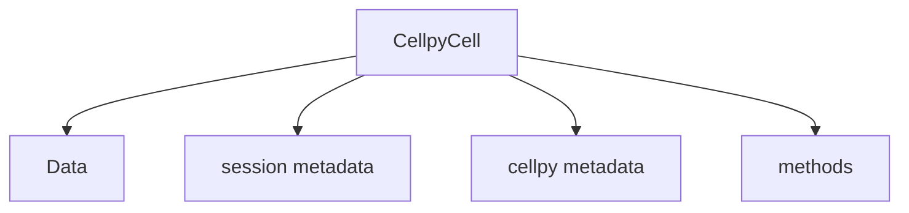

(cellpy-objects)=

# Main cellpy objects

!!! note
    This chapter would benefit from some more love and care. Any help
    on that would be highly appreciated.

(cellpycell-object)=

## The `CellpyCell` object



The `CellpyCell` object contains the main methods as well as the actual data:

```
cellpy_instance = CellpyCell(...)
```

Data is stored within an instance of the `Data` class.

```mermaid
flowchart TD
    n0[CellpyCell] --> n1[Data]
    n1[Data] --> n2[cell metadata (cell)]
    n1[Data] --> n3[cell metadata (test)]
    n1[Data] --> n4[methods]
    n1[Data] --> n5[raw]
    n1[Data] --> n6[steps]
    n1[Data] --> n7[summary]
```

The `Data` instance can be reached using the `data` property:

```
cell_data = cellpy_instance.data
```

(data-object)=

## The `Data` object

The `Data` object contains the data and the meta-data for the cell characterisation experiment(s).

(cellpy-file-object)=

## The cellpy file format

As default (cellpy 2.x / file version 9), cellpy stores files as a zip of
parquet tables plus ``meta.json`` (``.cellpy``). Older HDF5 layouts (v4–v8)
remain readable; pass a ``.h5`` path or ``cellpy_file_format="hdf5"`` to write
HDF5. See [migration v1 to v2](../../getting_started/migration_v1_to_v2.md).
