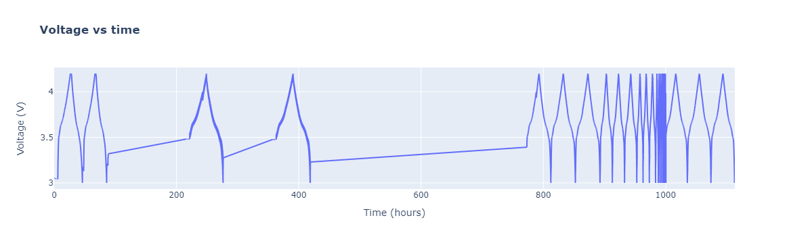
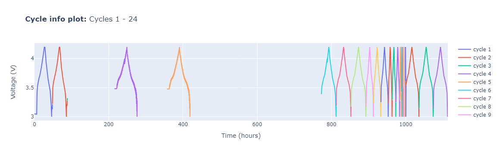
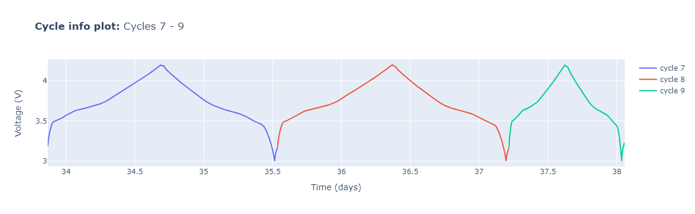
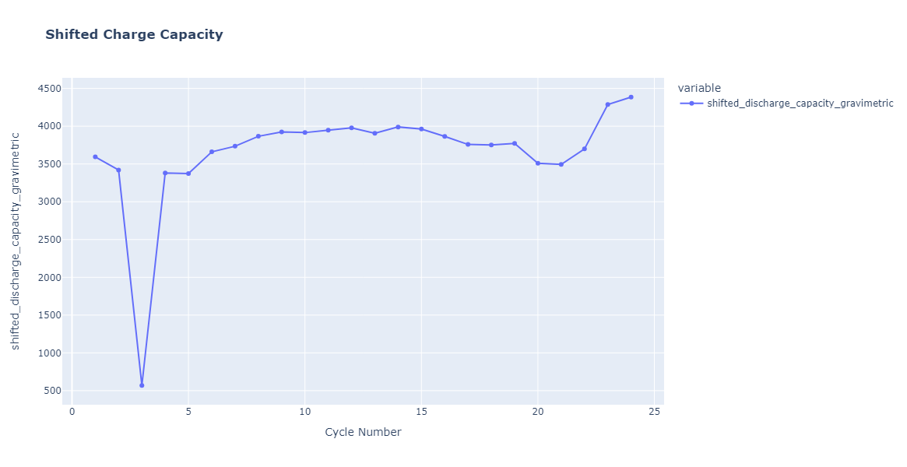
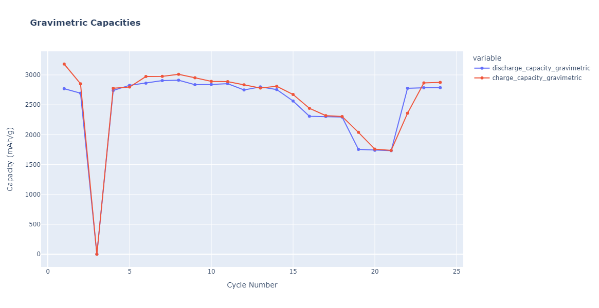
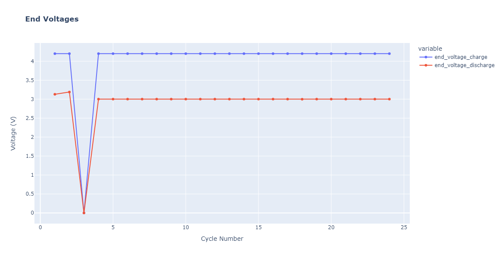

# Initial data inspection and plotting


```python
import pathlib

from rich import print

import cellpy
from cellpy.utils import plotutils
```

<div class="admonition hint">
    <p class="admonition-title">Hint</p>
    <p>
    If you have <code class="docutils literal notranslate"><span class="pre">plotly</span></code> installed, some of the functions will produce interactive plots. If not, the output will be simpler <code class="docutils literal notranslate"><span class="pre">matplotlib</span></code> figures. If you have not installed <code class="docutils literal notranslate"><span class="pre">plotly</span></code>, you can do so by running <code class="docutils literal notranslate"><span class="pre">pip install plotly</span></code>.
    </p>
</div>

Either load raw data or your saved cellpy files:


```python
filedir = pathlib.Path("data")  # foldername within the same directory
c = cellpy.get(filedir / "out" / "20210210_FC.h5")
```

## Looking at the data
Your **CellpyCell** object (here called `c`) contains all your raw data as well as some additional elements, in the format of pandas DataFrames:

- **Raw data**: `c.data.raw`, raw data from the run (with units `c.data.raw_units`)
- **Summary**: `c.data.summary` with cycle-based summaries
- **Steps**: `c.data.steps` with Stats from each step (and step type), created using the `c.make_step_table` method


```python
c.data.raw.head(2)
```


                test_id  data_point  test_time  step_time           date_time  \
    data_point                                                                  
    1                 1           1   5.008961   5.008961 2021-05-10 10:14:45   
    2                 1           2  10.019319  10.019319 2021-05-10 10:14:50   
    
                step_index  cycle_index  is_fc_data  current   voltage  \
    data_point                                                           
    1                    1            1           0      0.0  3.051165   
    2                    1            1           0      0.0  3.051165   
    
                charge_capacity  discharge_capacity  charge_energy  \
    data_point                                                       
    1                       0.0                 0.0            0.0   
    2                       0.0                 0.0            0.0   
    
                discharge_energy     dv_dt  internal_resistance  ac_impedance  \
    data_point                                                                  
    1                        0.0 -0.000061                  0.0           0.0   
    2                        0.0  0.000000                  0.0           0.0   
    
                aci_phase_angle  
    data_point                   
    1                       0.0  
    2                       0.0  


```python
c.data.summary.head(2)
```


                 data_point      test_time           date_time  \
    cycle_index                                                  
    1                  5797  174328.601353 2021-05-12 10:40:11   
    2                  7188  317161.773416 2021-05-14 02:20:47   
    
                 end_voltage_charge  end_voltage_discharge  charge_capacity  \
    cycle_index                                                               
    1                      4.200052               3.129170         0.003819   
    2                      4.200052               3.188442         0.003422   
    
                 discharge_capacity  coulombic_efficiency  \
    cycle_index                                             
    1                      0.003324             87.049469   
    2                      0.003234             94.510786   
    
                 cumulated_coulombic_efficiency  cumulated_charge_capacity  ...  \
    cycle_index                                                             ...   
    1                                 87.049469                   0.003819  ...   
    2                                181.560255                   0.007241  ...   
    
                 cumulated_charge_capacity_areal  \
    cycle_index                                    
    1                                   3.818560   
    2                                   7.240795   
    
                 cumulated_discharge_capacity_areal  coulombic_difference_areal  \
    cycle_index                                                                   
    1                                      3.324036                    0.494524   
    2                                      6.558417                    0.187854   
    
                 cumulated_coulombic_difference_areal  \
    cycle_index                                         
    1                                        0.494524   
    2                                        0.682378   
    
                 discharge_capacity_loss_areal  charge_capacity_loss_areal  \
    cycle_index                                                              
    1                                      NaN                         NaN   
    2                                 0.089654                    0.396324   
    
                 cumulated_discharge_capacity_loss_areal  \
    cycle_index                                            
    1                                                NaN   
    2                                           0.089654   
    
                 cumulated_charge_capacity_loss_areal  \
    cycle_index                                         
    1                                             NaN   
    2                                        0.396324   
    
                 shifted_charge_capacity_areal  shifted_discharge_capacity_areal  
    cycle_index                                                                   
    1                                 0.494524                          4.313083  
    2                                 0.682378                          4.104613  
    
    [2 rows x 49 columns]


```python
c.data.steps.head(2)
```


       index  cycle  step  sub_step  point_avr   point_std  point_min  point_max  \
    0      0      1     1         1     2157.5  1245.48886          1       4314   
    1      1      1     2         1     4315.0         NaN       4315       4315   
    
       point_first  point_last  ...  ir_std    ir_min    ir_max  ir_first  \
    0            1        4314  ...     0.0  0.000000  0.000000  0.000000   
    1         4315        4315  ...     NaN  6.650723  6.650723  6.650723   
    
        ir_last  ir_delta  rate_avr  type  sub_type  info  
    0  0.000000       0.0   0.00000  rest       NaN        
    1  6.650723       0.0   1.75791    ir       NaN        
    
    [2 rows x 64 columns]


## Simple plotting

The `plotutils` module contains several convenient plot functions:

### Raw plots

The `raw_plot` gives an overview of your datacollection, plotting voltage vs time:


```python
plotutils.raw_plot(c, title="Voltage vs time")
```


    

    


### Cycle info plots

The `cycle_info_plot` function plots the raw data together with step and cycle info:


```python
plotutils.cycle_info_plot(c, title="Cycle info plot:")
```


    

    


These plot functions offer some flexibility. You can, e.g. select specific cycles to look at, or adjust the units of the plot variables:


```python
plotutils.cycle_info_plot(c, cycle=[7, 8, 9], title="Cycle info plot:", t_unit="days")
```


    

    


## Summary plots

`summary_plots` allows you to plot different summary variables. You can inspect the columns of `c.data.summary` to check what variables are available.


```python
print(c.data.summary.columns)
```


    Index(['data_point', 'test_time', 'date_time', 'end_voltage_charge',
           'end_voltage_discharge', 'charge_capacity', 'discharge_capacity',
           'coulombic_efficiency', 'cumulated_coulombic_efficiency',
           'cumulated_charge_capacity', 'cumulated_discharge_capacity',
           'discharge_capacity_loss', 'charge_capacity_loss',
           'coulombic_difference', 'cumulated_coulombic_difference',
           'cumulated_discharge_capacity_loss', 'cumulated_charge_capacity_loss',
           'shifted_charge_capacity', 'shifted_discharge_capacity',
           'cumulated_ric', 'cumulated_ric_sei', 'cumulated_ric_disconnect',
           'normalized_cycle_index', 'charge_c_rate', 'discharge_c_rate',
           'discharge_capacity_gravimetric', 'charge_capacity_gravimetric',
           'cumulated_charge_capacity_gravimetric',
           'cumulated_discharge_capacity_gravimetric',
           'coulombic_difference_gravimetric',
           'cumulated_coulombic_difference_gravimetric',
           'discharge_capacity_loss_gravimetric',
           'charge_capacity_loss_gravimetric',
           'cumulated_discharge_capacity_loss_gravimetric',
           'cumulated_charge_capacity_loss_gravimetric',
           'shifted_charge_capacity_gravimetric',
           'shifted_discharge_capacity_gravimetric', 'discharge_capacity_areal',
           'charge_capacity_areal', 'cumulated_charge_capacity_areal',
           'cumulated_discharge_capacity_areal', 'coulombic_difference_areal',
           'cumulated_coulombic_difference_areal', 'discharge_capacity_loss_areal',
           'charge_capacity_loss_areal', 'cumulated_discharge_capacity_loss_areal',
           'cumulated_charge_capacity_loss_areal', 'shifted_charge_capacity_areal',
           'shifted_discharge_capacity_areal'],
          dtype='object')
    


Here is one example:


```python
plotutils.summary_plot(
    c,
    y="shifted_discharge_capacity_gravimetric",
    title="<b>Shifted Charge Capacity</b>",
)
```


    

    


The `summary_plot` function also have some pre-defined sets of variables for plotting the most common variables.


```python
plotutils.summary_plot(
    c, y="capacities_gravimetric", title="<b>Gravimetric Capacities</b>"
)
```


    

    


```python
plotutils.summary_plot(c, y="voltages", title="<b>End Voltages</b>")
```


    

    


The pre-defined variable sets for the summary plots are: 
- "voltages"
- "capacities_gravimetric"
- "capacities_areal"
- "capacities_gravimetric_split_constant_voltage"
- "capacities_areal_split_constant_voltage"
