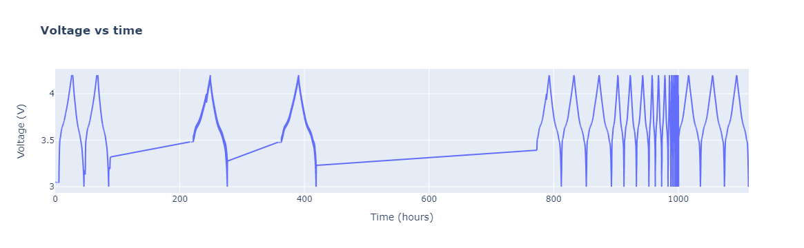
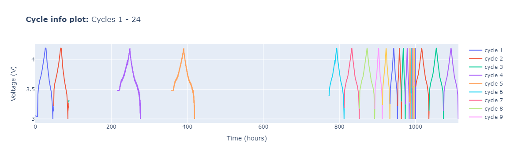
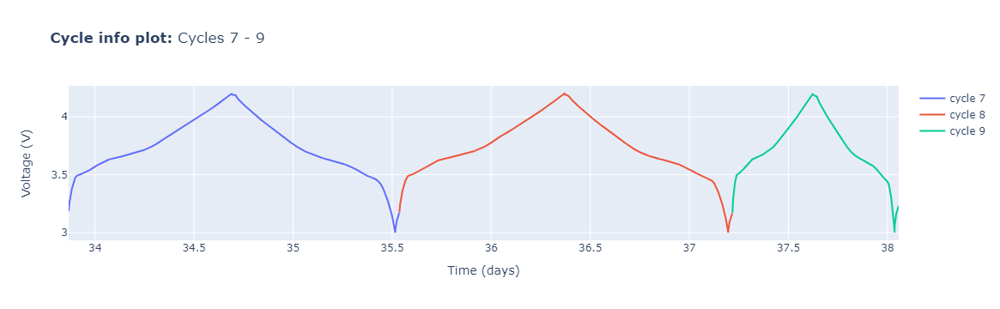
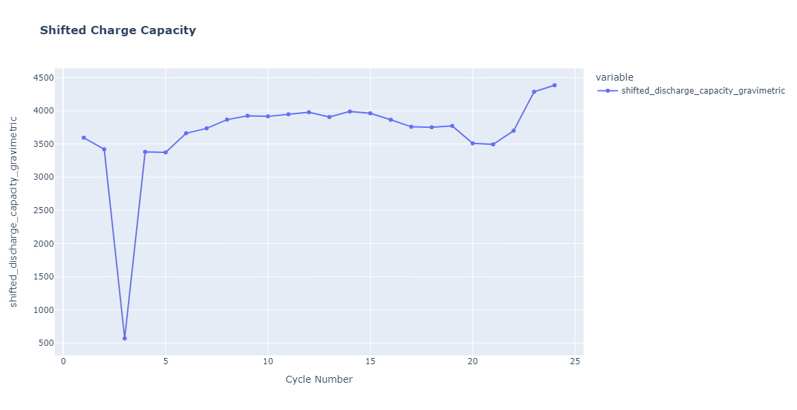
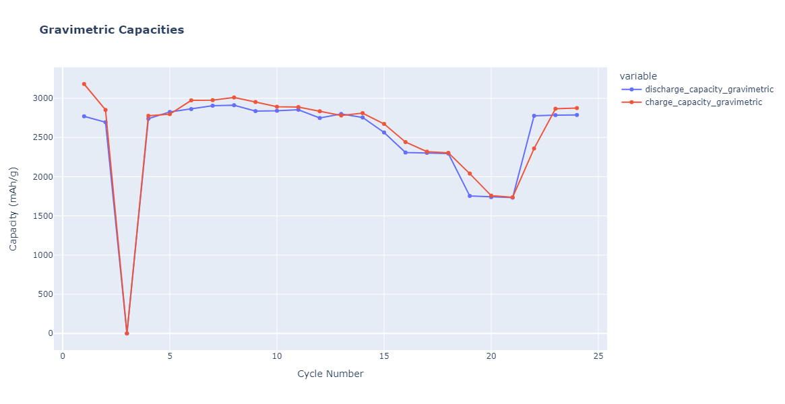
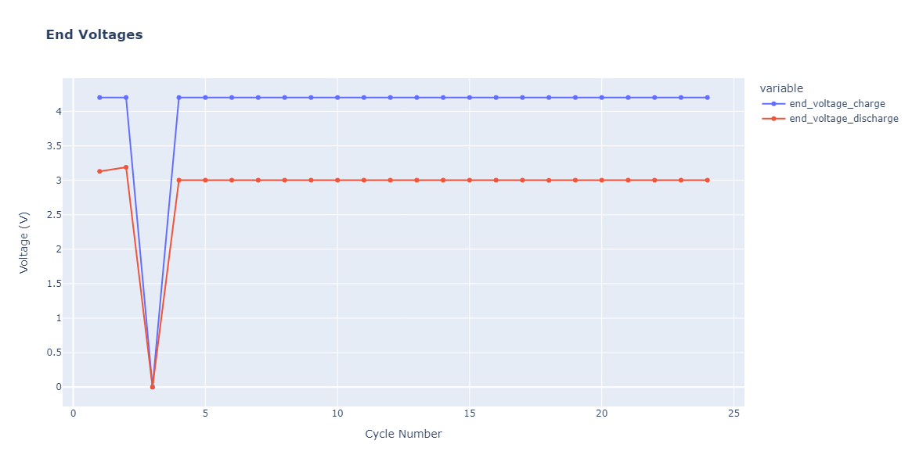

# Initial data inspection and plotting


```python
import pathlib

from rich import print

import cellpy
from cellpy.utils import plotutils
```

<div class="admonition hint">
    <p class="admonition-title">Hint</p>
    <p>
    If you have <code class="docutils literal notranslate"><span class="pre">plotly</span></code> installed, some of the functions will produce interactive plots. If not, the output will be simpler <code class="docutils literal notranslate"><span class="pre">matplotlib</span></code> figures. If you have not installed <code class="docutils literal notranslate"><span class="pre">plotly</span></code>, you can do so by running <code class="docutils literal notranslate"><span class="pre">pip install plotly</span></code>.
    </p>
</div>

Either load raw data or your saved cellpy files:


```python
filedir = pathlib.Path("data")  # foldername within the same directory
candidates = [
    filedir / "20210210_FC.h5",
    filedir / "out" / "20210210_FC.h5",
]
cellpy_path = next((p for p in candidates if p.exists()), None)
if cellpy_path is None:
    from cellpy.utils import example_data

    c = example_data.cellpy_file()
else:
    c = cellpy.get(cellpy_path)

```

## Looking at the data
Your **CellpyCell** object (here called `c`) contains all your raw data as well as some additional elements, in the format of pandas DataFrames:

- **Raw data**: `c.data.raw`, raw data from the run (with units `c.data.raw_units`)
- **Summary**: `c.data.summary` with cycle-based summaries
- **Steps**: `c.data.steps` with Stats from each step (and step type), created using the `c.make_step_table` method


```python
c.data.raw.head(2)
```


<div class="cellpy-dataframe">
<table border="1" class="dataframe">
  <thead>
    <tr style="text-align: right;">
      <th></th>
      <th>test_id</th>
      <th>data_point</th>
      <th>test_time</th>
      <th>step_time</th>
      <th>date_time</th>
      <th>step_index</th>
      <th>cycle_index</th>
      <th>is_fc_data</th>
      <th>current</th>
      <th>voltage</th>
      <th>charge_capacity</th>
      <th>discharge_capacity</th>
      <th>charge_energy</th>
      <th>discharge_energy</th>
      <th>dv_dt</th>
      <th>internal_resistance</th>
      <th>ac_impedance</th>
      <th>aci_phase_angle</th>
    </tr>
    <tr>
      <th>data_point</th>
      <th></th>
      <th></th>
      <th></th>
      <th></th>
      <th></th>
      <th></th>
      <th></th>
      <th></th>
      <th></th>
      <th></th>
      <th></th>
      <th></th>
      <th></th>
      <th></th>
      <th></th>
      <th></th>
      <th></th>
      <th></th>
    </tr>
  </thead>
  <tbody>
    <tr>
      <th>1</th>
      <td>1</td>
      <td>1</td>
      <td>5.008961</td>
      <td>5.008961</td>
      <td>2021-05-10 10:14:45</td>
      <td>1</td>
      <td>1</td>
      <td>0</td>
      <td>0.0</td>
      <td>3.051165</td>
      <td>0.0</td>
      <td>0.0</td>
      <td>0.0</td>
      <td>0.0</td>
      <td>-0.000061</td>
      <td>0.0</td>
      <td>0.0</td>
      <td>0.0</td>
    </tr>
    <tr>
      <th>2</th>
      <td>1</td>
      <td>2</td>
      <td>10.019319</td>
      <td>10.019319</td>
      <td>2021-05-10 10:14:50</td>
      <td>1</td>
      <td>1</td>
      <td>0</td>
      <td>0.0</td>
      <td>3.051165</td>
      <td>0.0</td>
      <td>0.0</td>
      <td>0.0</td>
      <td>0.0</td>
      <td>0.000000</td>
      <td>0.0</td>
      <td>0.0</td>
      <td>0.0</td>
    </tr>
  </tbody>
</table>
</div>


```python
c.data.summary.head(2)
```


<div class="cellpy-dataframe">
<table border="1" class="dataframe">
  <thead>
    <tr style="text-align: right;">
      <th></th>
      <th>data_point</th>
      <th>test_time</th>
      <th>date_time</th>
      <th>end_voltage_charge</th>
      <th>end_voltage_discharge</th>
      <th>charge_capacity</th>
      <th>discharge_capacity</th>
      <th>coulombic_efficiency</th>
      <th>cumulated_coulombic_efficiency</th>
      <th>cumulated_charge_capacity</th>
      <th>...</th>
      <th>cumulated_charge_capacity_areal</th>
      <th>cumulated_discharge_capacity_areal</th>
      <th>coulombic_difference_areal</th>
      <th>cumulated_coulombic_difference_areal</th>
      <th>discharge_capacity_loss_areal</th>
      <th>charge_capacity_loss_areal</th>
      <th>cumulated_discharge_capacity_loss_areal</th>
      <th>cumulated_charge_capacity_loss_areal</th>
      <th>shifted_charge_capacity_areal</th>
      <th>shifted_discharge_capacity_areal</th>
    </tr>
    <tr>
      <th>cycle_index</th>
      <th></th>
      <th></th>
      <th></th>
      <th></th>
      <th></th>
      <th></th>
      <th></th>
      <th></th>
      <th></th>
      <th></th>
      <th></th>
      <th></th>
      <th></th>
      <th></th>
      <th></th>
      <th></th>
      <th></th>
      <th></th>
      <th></th>
      <th></th>
      <th></th>
    </tr>
  </thead>
  <tbody>
    <tr>
      <th>1</th>
      <td>5797</td>
      <td>174328.601353</td>
      <td>2021-05-12 10:40:11</td>
      <td>4.200052</td>
      <td>3.129170</td>
      <td>0.003819</td>
      <td>0.003324</td>
      <td>87.049469</td>
      <td>87.049469</td>
      <td>0.003819</td>
      <td>...</td>
      <td>3.818560</td>
      <td>3.324036</td>
      <td>0.494524</td>
      <td>0.494524</td>
      <td>NaN</td>
      <td>NaN</td>
      <td>NaN</td>
      <td>NaN</td>
      <td>0.494524</td>
      <td>4.313083</td>
    </tr>
    <tr>
      <th>2</th>
      <td>7188</td>
      <td>317161.773416</td>
      <td>2021-05-14 02:20:47</td>
      <td>4.200052</td>
      <td>3.188442</td>
      <td>0.003422</td>
      <td>0.003234</td>
      <td>94.510786</td>
      <td>181.560255</td>
      <td>0.007241</td>
      <td>...</td>
      <td>7.240795</td>
      <td>6.558417</td>
      <td>0.187854</td>
      <td>0.682378</td>
      <td>0.089654</td>
      <td>0.396324</td>
      <td>0.089654</td>
      <td>0.396324</td>
      <td>0.682378</td>
      <td>4.104613</td>
    </tr>
  </tbody>
</table>
<p>2 rows × 49 columns</p>
</div>


```python
c.data.steps.head(2)
```


<div class="cellpy-dataframe">
<table border="1" class="dataframe">
  <thead>
    <tr style="text-align: right;">
      <th></th>
      <th>index</th>
      <th>cycle</th>
      <th>step</th>
      <th>sub_step</th>
      <th>point_avr</th>
      <th>point_std</th>
      <th>point_min</th>
      <th>point_max</th>
      <th>point_first</th>
      <th>point_last</th>
      <th>...</th>
      <th>ir_std</th>
      <th>ir_min</th>
      <th>ir_max</th>
      <th>ir_first</th>
      <th>ir_last</th>
      <th>ir_delta</th>
      <th>rate_avr</th>
      <th>type</th>
      <th>sub_type</th>
      <th>info</th>
    </tr>
  </thead>
  <tbody>
    <tr>
      <th>0</th>
      <td>0</td>
      <td>1</td>
      <td>1</td>
      <td>1</td>
      <td>2157.5</td>
      <td>1245.48886</td>
      <td>1</td>
      <td>4314</td>
      <td>1</td>
      <td>4314</td>
      <td>...</td>
      <td>0.0</td>
      <td>0.000000</td>
      <td>0.000000</td>
      <td>0.000000</td>
      <td>0.000000</td>
      <td>0.0</td>
      <td>0.00000</td>
      <td>rest</td>
      <td>NaN</td>
      <td></td>
    </tr>
    <tr>
      <th>1</th>
      <td>1</td>
      <td>1</td>
      <td>2</td>
      <td>1</td>
      <td>4315.0</td>
      <td>NaN</td>
      <td>4315</td>
      <td>4315</td>
      <td>4315</td>
      <td>4315</td>
      <td>...</td>
      <td>NaN</td>
      <td>6.650723</td>
      <td>6.650723</td>
      <td>6.650723</td>
      <td>6.650723</td>
      <td>0.0</td>
      <td>1.75791</td>
      <td>ir</td>
      <td>NaN</td>
      <td></td>
    </tr>
  </tbody>
</table>
<p>2 rows × 64 columns</p>
</div>


## Simple plotting

The `plotutils` module contains several convenient plot functions:

### Raw plots

The `raw_plot` gives an overview of your datacollection, plotting voltage vs time:


```python
plotutils.raw_plot(c, title="Voltage vs time")
```


    

    


### Cycle info plots

The `cycle_info_plot` function plots the raw data together with step and cycle info:


```python
plotutils.cycle_info_plot(c, title="Cycle info plot:")
```


    

    


These plot functions offer some flexibility. You can, e.g. select specific cycles to look at, or adjust the units of the plot variables:


```python
cycles = list(c.get_cycle_numbers())[:3]
plotutils.cycle_info_plot(c, cycle=cycles, title="Cycle info plot:", t_unit="days")

```


    

    


## Summary plots

`summary_plots` allows you to plot different summary variables. You can inspect the columns of `c.data.summary` to check what variables are available.


```python
print(c.data.summary.columns)
```

    Index(['data_point', 'test_time', 'date_time', 'end_voltage_charge',
           'end_voltage_discharge', 'charge_capacity', 'discharge_capacity',
           'coulombic_efficiency', 'cumulated_coulombic_efficiency',
           'cumulated_charge_capacity', 'cumulated_discharge_capacity',
           'discharge_capacity_loss', 'charge_capacity_loss',
           'coulombic_difference', 'cumulated_coulombic_difference',
           'cumulated_discharge_capacity_loss', 'cumulated_charge_capacity_loss',
           'shifted_charge_capacity', 'shifted_discharge_capacity',
           'cumulated_ric', 'cumulated_ric_sei', 'cumulated_ric_disconnect',
           'normalized_cycle_index', 'charge_c_rate', 'discharge_c_rate',
           'discharge_capacity_gravimetric', 'charge_capacity_gravimetric',
           'cumulated_charge_capacity_gravimetric',
           'cumulated_discharge_capacity_gravimetric',
           'coulombic_difference_gravimetric',
           'cumulated_coulombic_difference_gravimetric',
           'discharge_capacity_loss_gravimetric',
           'charge_capacity_loss_gravimetric',
           'cumulated_discharge_capacity_loss_gravimetric',
           'cumulated_charge_capacity_loss_gravimetric',
           'shifted_charge_capacity_gravimetric',
           'shifted_discharge_capacity_gravimetric', 'discharge_capacity_areal',
           'charge_capacity_areal', 'cumulated_charge_capacity_areal',
           'cumulated_discharge_capacity_areal', 'coulombic_difference_areal',
           'cumulated_coulombic_difference_areal', 'discharge_capacity_loss_areal',
           'charge_capacity_loss_areal', 'cumulated_discharge_capacity_loss_areal',
           'cumulated_charge_capacity_loss_areal', 'shifted_charge_capacity_areal',
           'shifted_discharge_capacity_areal'],
          dtype='object')


Here is one example:


```python
plotutils.summary_plot(
    c,
    y="capacities_gravimetric_coulombic_efficiency",
    title="<b>Gravimetric Capacities and Coulombic Efficiency</b>",
)

```


    

    


The `summary_plot` function also have some pre-defined sets of variables for plotting the most common variables.


```python
plotutils.summary_plot(
    c, y="capacities_gravimetric", title="<b>Gravimetric Capacities</b>"
)
```


    

    


```python
plotutils.summary_plot(c, y="voltages", title="<b>End Voltages</b>")
```


    

    


The `summary_plot` function also has some pre-defined sets of variables for plotting the most common variables.

The pre-defined variable sets for the summary plots are:

- `"voltages"`
- `"capacities"`
- `"capacities_gravimetric"` / `"capacities_areal"` / `"capacities_absolute"`
- `"capacities_gravimetric_coulombic_efficiency"` / `"capacities_areal_coulombic_efficiency"` / `"capacities_absolute_coulombic_efficiency"`
- `"capacities_gravimetric_with_rate"` / `"capacities_areal_with_rate"` / `"capacities_absolute_with_rate"`
- `"capacities_gravimetric_split_constant_voltage"` / `"capacities_areal_split_constant_voltage"`
- `"fullcell_standard_gravimetric"` / `"fullcell_standard_areal"` / `"fullcell_standard_absolute"`
- `"fullcell_standard_cumloss_gravimetric"` / `"fullcell_standard_cumloss_areal"` / `"fullcell_standard_cumloss_absolute"`
- `"fullcell_standard_dev"`

