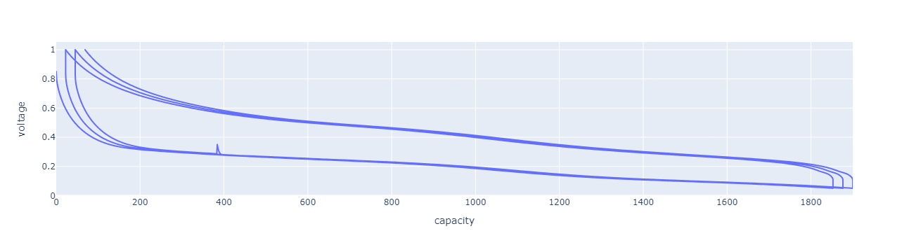
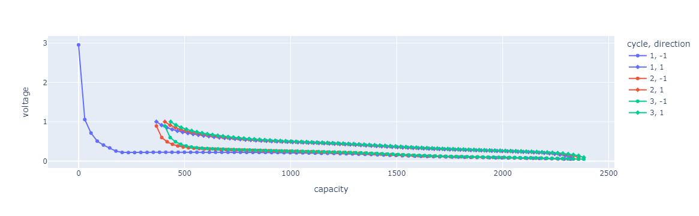
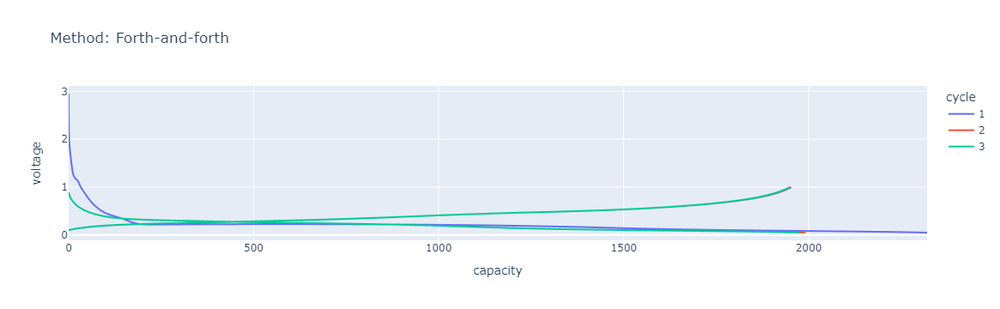
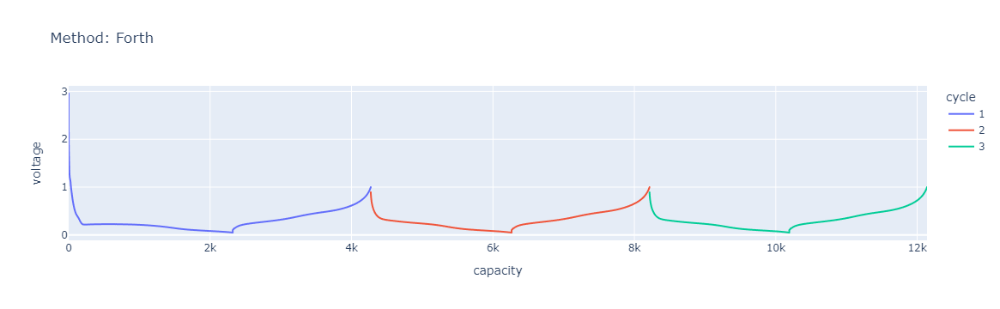

# Capacity vs voltage


```python
import cellpy
from cellpy.utils import example_data
```

<div class="admonition hint">
    <p class="admonition-title">Hint</p>
    <p>
    If you have <code class="docutils literal notranslate"><span class="pre">plotly</span></code> installed, some of the functions will produce interactive plots. If not, the output will be simpler <code class="docutils literal notranslate"><span class="pre">matplotlib</span></code> figures. If you have not installed <code class="docutils literal notranslate"><span class="pre">plotly</span></code>, you can do so by running <code class="docutils literal notranslate"><span class="pre">pip install plotly</span></code>.
    </p>
</div>


```python
import plotly.express as px
```

Load the data:


```python
c = example_data.cellpy_file()
```

Get the number of cycles in the test:


```python
c.get_number_of_cycles()
```


    304


## Get capacities
### The basics
The capacities for selected cycles can be extracted using the `get_cap` method:


```python
cap = c.get_cap(cycle=[7, 8, 9])
cap.head(2)
```


           voltage  capacity
    5088  0.850685  0.002657
    5089  0.845150  0.029224


In its simplest form, this returns a pandas DataFrame, containing the voltage and capacity for the selected cycles.


```python
px.line(cap, x="capacity", y="voltage")
```


    

    


Several additional options are available to include more info to the resulting dataframe, e.g., including a column for cycle number (`label_cycle_number=True`) or adding a column indicating charge or discharge (`categorical_column=True`), as well as interpolation:


```python
cap1 = c.get_cap(
    cycle=[1, 2, 3],
    label_cycle_number=True,
    categorical_column=True,
    interpolated=True,
    number_of_points=80,
    interpolate_along_cap=True,
)
```


```python
cap1.head(2)
```


       cycle   capacity   voltage  direction
    0      1   0.000652  2.954229         -1
    1      1  29.363975  1.056753         -1


```python
px.line(cap1, x="capacity", y="voltage", color="cycle", symbol="direction")
```


    

    


### Different methods for extracting capacities
Another useful option when extracting the capacities it the 'method' argument that allows for the following keywords:
- **back-and-forth**: standard back and forth; discharge (or charge) reversed from where charge (or discharge) ends.
- **forth**: discharge (or charge) continues along x-axis
- **forth-and-forth**: discharge (or charge) also starts at 0 (or shift if not shift=0.0).


```python
cap2 = c.get_cap(
    cycle=[1, 2, 3],
    label_cycle_number=True,
    categorical_column=True,
    method="forth-and-forth",
)
px.line(cap2, x="capacity", y="voltage", color="cycle", title="Method: Forth-and-forth")
```


    

    


```python
cap3 = c.get_cap(
    cycle=[1, 2, 3], label_cycle_number=True, categorical_column=True, method="forth"
)
px.line(cap3, x="capacity", y="voltage", color="cycle", title="Method: Forth")
```


    

    


### More details on get_cap
(from the source code)

```python
def get_cap(
        self,
        cycle=None,
        cycles=None,
        method="back-and-forth",
        insert_nan=None,
        shift=0.0,
        categorical_column=False,
        label_cycle_number=False,
        split=False,
        interpolated=False,
        dx=0.1,
        number_of_points=None,
        ignore_errors=True,
        dynamic=False,
        inter_cycle_shift=True,
        interpolate_along_cap=False,
        capacity_then_voltage=False,
        mode="gravimetric",
        mass=None,
        area=None,
        volume=None,
        cycle_mode=None,
        **kwargs,
    ):
        """Gets the capacity for the run.

        Args:
            cycle (int, list): cycle number (s).
            cycles (list): list of cycle numbers.
            method (string): how the curves are given
                "back-and-forth" - standard back and forth; discharge
                (or charge) reversed from where charge (or discharge) ends.
                "forth" - discharge (or charge) continues along x-axis.
                "forth-and-forth" - discharge (or charge) also starts at 0
                (or shift if not shift=0.0)
            insert_nan (bool): insert a np.nan between the charge and discharge curves.
                Defaults to True for "forth-and-forth", else False
            shift: start-value for charge (or discharge) (typically used when
                plotting shifted-capacity).
            categorical_column: add a categorical column showing if it is
                charge or discharge.
            label_cycle_number (bool): add column for cycle number
                (tidy format).
            split (bool): return a list of c and v instead of the default
                that is to return them combined in a DataFrame. This is only
                possible for some specific combinations of options (neither
                categorical_column=True or label_cycle_number=True are
                allowed).
            interpolated (bool): set to True if you would like to get
                interpolated data (typically if you want to save disk space
                or memory). Defaults to False.
            dx (float): the step used when interpolating.
            number_of_points (int): number of points to use (over-rides dx)
                for interpolation (i.e. the length of the interpolated data).
            ignore_errors (bool): don't break out of loop if an error occurs.
            dynamic: for dynamic retrieving data from cellpy-file.
                [NOT IMPLEMENTED YET]
            inter_cycle_shift (bool): cumulative shifts between consecutive
                cycles. Defaults to True.
            interpolate_along_cap (bool): interpolate along capacity axis instead
                of along the voltage axis. Defaults to False.
            capacity_then_voltage (bool): return capacity and voltage instead of
                voltage and capacity. Defaults to False.
            mode (string): 'gravimetric', 'areal', 'volumetric' or 'absolute'. Defaults
                to 'gravimetric'.
            mass (float): mass of active material (in set cellpy unit, typically mg).
            area (float): area of electrode (in set cellpy units, typically cm2).
            volume (float): volume of electrode (in set cellpy units, typically cm3).
            cycle_mode (string): if 'anode' the first step is assumed to be the discharge,
                else charge (defaults to CellpyCell.cycle_mode).
            **kwargs: sent to get_ccap and get_dcap.

        Returns:
            pandas.DataFrame ((cycle) voltage, capacity, (direction (-1, 1)))
            unless split is explicitly set to True. Then it returns a tuple
            with capacity and voltage.
```
