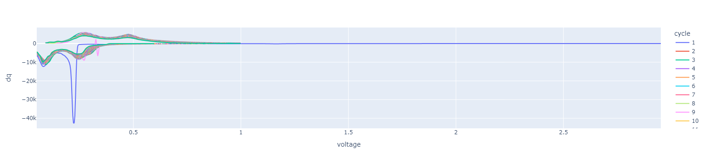
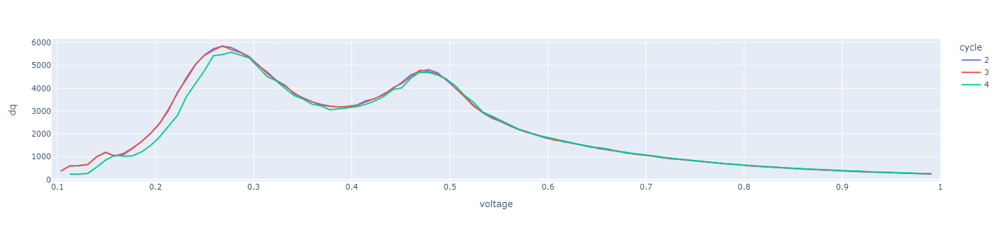
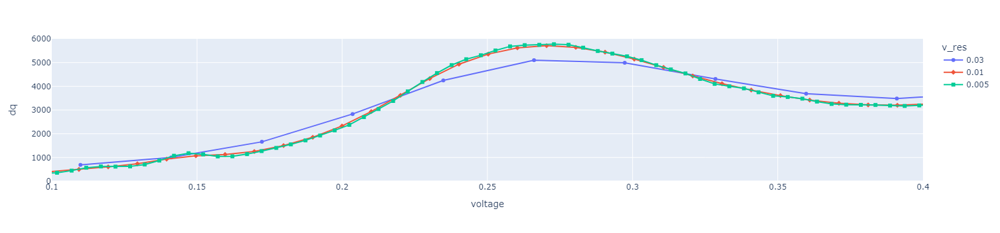

# Incremental capacity analysis (dQ/dV)
In this notebook we illustrate, how to use cellpy to extract dQ/dV data for selected cycles.

The respective methods are collected in the ica utilities (cellpy.utils.ica):

- **`ica.dqdv`**: This is the main and recommended method, taking data contained within the CellpyCell object as input.

- Additional methods allow for the calculation of dQ/dV data based on voltage and capacity data provided in different, cellpy-agnostic formats:
    - `ica.dqdv_cycle` and `ica.dqdv_cycles` takes Pandas DataFrames containing capacity vs voltage data for one or multiple cycles as input
    - `ica.dqdv_np` uses simple arrays or Pandas DataSeries of capacity and voltage as input.
    
For more details on these, have a look at the source code.


```python
import cellpy
from cellpy.utils import example_data, ica
```

<div class="alert alert-block alert-info">
<b>Tip:</b> The plots in this notebook are based on <code>plotly</code>. If you have not installed plotly, you can do so by running <code>pip install plotly</code>. Alternatively, you can of course also use standard plotting tools such as <code>matplotlib</code> to plot the data from the obtained pandas DataFrames.</div>


```python
import plotly.express as px
```

Load an example datafile:


```python
c = example_data.cellpy_file()
```

## Extracting dQ/dV data using `ica.dqdv`
This example shows how to get dQ/dV data directly and easily from the CellpyCell object (obtained by loading the data using `cellpy.get()`).

The dQ/dV data is provided as a Pandas DataFrame.

Without specifying any further options, the dQ/dV for all cycles contained within the CellpyCell is calculated:


```python
ica_df = ica.dqdv(c)
ica_df.head()
```


       cycle   voltage           dq
    0      1  0.051583 -6388.687162
    1      1  0.054792 -6828.975477
    2      1  0.058001 -7514.790533
    3      1  0.061210 -8284.857174
    4      1  0.064420 -9098.355196


```python
px.line(ica_df, x="voltage", y="dq", color="cycle")
```


    

    


If cycle number(s) are specified using the `cycle` keyword (as an integer or list of integers), the dQ/dV will be calculated for those cycles only. If `split=True`, two separate Pandas Dataframes will be obtained, one containing charge, and one containing discharge data:


```python
cycles = [2, 3, 4]
charge_ica, discharge_ica = ica.dqdv(c, split=True, cycle=cycles)
```


```python
charge_ica.head(3)
```


        voltage cycle          dq
    0  0.094257     2         NaN
    1  0.103407     2  365.946074
    2  0.112558     2  598.189449


```python
discharge_ica.head(3)
```


        voltage cycle           dq
    0  0.049979     2          NaN
    1  0.058489     2 -6538.113356
    2  0.066999     2 -7797.598247


```python
px.line(charge_ica, x="voltage", y="dq", color="cycle")
```


    

    


### Tweaking the algorithm


```python
ica_df_1 = ica.dqdv(c, cycle=3, voltage_resolution=0.03)
ica_df_2 = ica.dqdv(c, cycle=3, voltage_resolution=0.01)
ica_df_3 = ica.dqdv(c, cycle=3, voltage_resolution=0.005)
```


```python
import pandas as pd

ica_both = pd.concat(
    [ica_df_1, ica_df_2, ica_df_3],
    keys=["0.03", "0.01", "0.005"],
    names=["v_res", "index"],
).reset_index()
px.line(
    ica_both,
    x="voltage",
    y="dq",
    color="v_res",
    range_x=[0.1, 0.4],
    range_y=[0, 6000],
    symbol="v_res",
)
```


    

    


### More details on dqdv
A lot of different options with respect to smoothing, interpolation etc. are available when calculating the dQ/dV. For more details, have a look at the source code:

```python
def dqdv(cell, split=False, tidy=True, label_direction=False, **kwargs):
    """Calculates dq-dv data for all cycles contained in
    the given CellpyCell object, returns data as pandas.DataFrame(s) 

    Args:
        cell (CellpyCell-object).
        split (bool): return one frame for charge and one for
            discharge if True (defaults to False).
        tidy (bool): returns the split frames in wide format (defaults
            to True. Remark that this option is currently not available
            for non-split frames).

    Returns:
        one or two ``pandas.DataFrame`` with the following columns:
        cycle: cycle number (if split is set to True).
        voltage: voltage
        dq: the incremental capacity


    Additional key-word arguments are sent to Converter:

    Keyword Args:
        cycle (int or list of ints (cycle numbers)): will process all (or up to max_cycle_number)
            if not given or equal to None.
        points_pr_split (int): only used when investigating data
            using splits, defaults to 10.
        max_points: None
        voltage_resolution (float): used for interpolating voltage
            data (e.g. 0.005)
        capacity_resolution: used for interpolating capacity data
        minimum_splits (int): defaults to 3.
        interpolation_method: scipy interpolation method
        increment_method (str): defaults to "diff"
        pre_smoothing (bool): set to True for pre-smoothing (window)
        smoothing (bool): set to True for smoothing during
            differentiation (window)
        post_smoothing (bool): set to True for post-smoothing
            (gaussian)
        normalize (bool): set to True for normalizing to capacity
        normalizing_factor (float):
        normalizing_roof  (float):
        savgol_filter_window_divisor_default (int): used for window
            smoothing, defaults to 50
        savgol_filter_window_order: used for window smoothing
        voltage_fwhm (float): used for setting the post-processing
            gaussian sigma, defaults to 0.01
        gaussian_order (int): defaults to 0
        gaussian_mode (str): defaults to "reflect"
        gaussian_cval (float): defaults to 0.0
        gaussian_truncate (float): defaults to 4.0

    Example:
        >>> from cellpy.utils import ica
        >>> charge_df, dcharge_df = ica.dqdv(my_cell, split=True)
        >>> charge_df.plot(x="voltage",y="dq")
```

## Using the cellpy-agnostic methods
- `ica.dqdv_cycle` and `ica.dqdv_cycles` takes Pandas DataFrames containing capacity vs voltage data for one or multiple cycles as input
- `ica.dqdv_np` uses simple arrays or Pandas DataSeries of capacity and voltage as input.


To use the cellpy-agnostic methods mentioned above, capacity vs voltage data is needed as input. This has to be extracted first and can be done, e.g., by using the `get_cap` method.

Specify cycle number(s):


```python
cycle = 2
cycles = [2, 3, 4]
```

Get capacities (note here that the dqdv methods require `categorical_column` and `label_cycle_number` to be set to `True`):


```python
vcap = c.get_cap(
    cycle=cycle,
    categorical_column=True,
    method="forth-and-forth",
    insert_nan=False,
    label_cycle_number=True,
)
vcap.head(2)
```


          cycle   voltage  capacity  direction
    1525      2  0.892503  0.041180         -1
    1526      2  0.887276  0.176045         -1


`dqdv_cycle` then outputs a tuple containing voltage and incremental capacity:


```python
voltage, capacity = ica.dqdv_cycle(vcap)
print(f"voltage:\n{voltage[:10]}\n\ncapacity:\n{capacity[:10]}")
```

    voltage:
    [0.05087869 0.05267896 0.05447923 0.05627949 0.05807976 0.05988003
     0.06168029 0.06348056 0.06528083 0.06708109]
    
    capacity:
    [-5707.83447516 -5816.23674218 -6004.10155608 -6234.12949797
     -6480.74747702 -6733.15734537 -6987.70817472 -7244.6875613
     -7512.44888318 -7811.17678808]
    

while `dqdv_cycles` returns a pandas DataFrame:


```python
ica_cycles = ica.dqdv_cycles(vcap)
ica_cycles.head()
```


       cycle   voltage           dq
    0      2  0.050879 -5707.834475
    1      2  0.052679 -5816.236742
    2      2  0.054479 -6004.101556
    3      2  0.056279 -6234.129498
    4      2  0.058080 -6480.747477


Doing the same for multiple cycle numbers:


```python
vcaps = c.get_cap(
    cycle=cycles,
    categorical_column=True,
    method="forth-and-forth",
    insert_nan=False,
    label_cycle_number=True,
)
ica_curves = ica.dqdv_cycles(vcaps)
```


```python
ica_curves.head(2)
```


       cycle   voltage           dq
    0      2  0.050879 -5707.834475
    1      2  0.052679 -5816.236742


