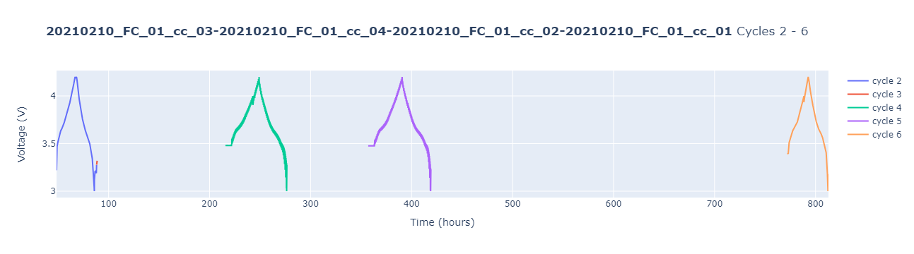
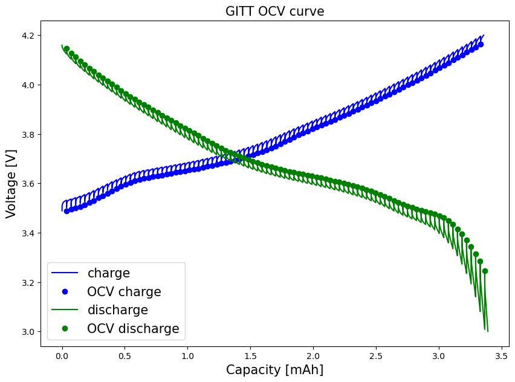

# GITT analysis
In this notebook we will use cellpy to extract the open circuit voltages (OCV) from a GITT measurement. The extracted OCVs will be plotted, and the results saved in .csv format."


```python
import pathlib
import pandas as pd
import matplotlib.pyplot as plt

import cellpy
from cellpy.utils import plotutils
```

Set filepath and load the datafile:


```python
filedir = pathlib.Path("data")  # foldername within the same directory
c = cellpy.get(filedir / "out" / "20210210_FC.h5")
```

Produce an overview plot to identify cycle numbers for the GITT experiment (for an interactive version of this plot, you have to have `plotly` installed):


```python
plotutils.cycle_info_plot(c, cycle=list(range(2, 7)))
```


    

    


### OCV extraction
From the overview plot above, we can identify the GITT cycles to be cycle number 4 and 5. In the following, we will focus on cycle 5 only.

For further analysis, we create the **step table**, called  ``steps``, a dataframe that contains a lot ofnformation on all the cycle steps for the cell.

In the following, we apply several filters to ``steps``, to eventually extract OCV voltages and corresponding capacities:

1. **``steps_cycle``**: Extract the rows specifically for the selected GITT cycle (here: cycle Nr 5).


NB: For simplicity, ``steps_cycle`` only contains rows relevant for further analysis, i.e. *"cycle", "step""charge_last", "discharge_last", "voltage_first" ,"voltage_last", "type"*."


```python
GITT_cycle = 5
c.make_step_table(all_steps=True)
steps = c.data.steps
steps_cycle = steps.loc[
    (steps.cycle == GITT_cycle),
    [
        "cycle",
        "step",
        "charge_last",
        "discharge_last",
        "voltage_first",
        "voltage_last",
        "type",
    ],
]
```

Taking a closer look at the created ``steps_cycle`` dataframe:

- `steps_cycle.head(10)` to view the first 10 rows
- `steps_cycle.tail(10)` to view the last 10 rows


```python
steps_cycle.tail(10)
```


         cycle  step  charge_last  discharge_last  voltage_first  voltage_last  \
    755      5     8     0.003358        0.003258       3.212396      3.343531   
    756      5     7     0.003358        0.003294       3.330632      3.139919   
    757      5     8     0.003358        0.003294       3.162645      3.314970   
    758      5     7     0.003358        0.003330       3.302993      3.080647   
    759      5     8     0.003358        0.003330       3.102759      3.283338   
    760      5     7     0.003358        0.003366       3.272282      3.008170   
    761      5     8     0.003358        0.003366       3.029361      3.246485   
    762      5     7     0.003358        0.003392       3.233587      2.999878   
    763      5    10     0.003358        0.003392       3.010627      3.010627   
    764      5    11     0.003358        0.003392       3.037038      3.228980   
    
              type  
    755  ocvrlx_up  
    756  discharge  
    757  ocvrlx_up  
    758  discharge  
    759  ocvrlx_up  
    760  discharge  
    761  ocvrlx_up  
    762  discharge  
    763         ir  
    764  ocvrlx_up  


2. To extract the OCV voltages, we then filter the `steps_cycle` dataframe for 
    - the OCV relaxation steps on discharge, ``steps_ocv_dch``, of type *oxvrlx_up* (and *rest*), corresponding to ``step==3``, and
    - the OCV relaxation steps on charge ``steps_ocv_cha``, of type *oxvrlx_down* (and *rest*), corresponding to ``step==8``.
Thereby we obtain two new dataframes


```python
steps_ocv_cha = steps_cycle.loc[steps_cycle.step == 3]
steps_ocv_dch = steps_cycle.loc[steps_cycle.step == 8]
```


```python
steps_ocv_cha.head(5)
```


         cycle  step  charge_last  discharge_last  voltage_first  voltage_last  \
    390      5     3     0.000036             0.0       3.512440      3.487564   
    392      5     3     0.000072             0.0       3.518582      3.494320   
    394      5     3     0.000109             0.0       3.524724      3.499848   
    396      5     3     0.000145             0.0       3.530559      3.505991   
    398      5     3     0.000181             0.0       3.537315      3.513054   
    
         type  
    390  rest  
    392  rest  
    394  rest  
    396  rest  
    398  rest  


The voltages at the end of these steps (`voltage_last`), contain the (pseudo-) OCV voltages:


```python
V_cha = steps_ocv_cha.voltage_last.reset_index(drop=True)
V_dch = steps_ocv_dch.voltage_last.reset_index(drop=True)
cap_cha = (
    steps_ocv_cha.charge_last.reset_index(drop=True) * 1000
)  # *1000 to convert to mAh
cap_dch = (
    steps_ocv_dch.discharge_last.reset_index(drop=True) * 1000
)  # *1000 to convert to mAh
```

To plot our results, we additionally get the entire voltage vs capacity curves for the selected GITT cycle, employing the `.get_ccap` and `.get_dcap` methods. The cell mass is used to convert from gravimetric capacity (mAh/g) to capacity (mAh).


```python
c.make_step_table(all_steps=False)
ccap = c.get_ccap(cycle=GITT_cycle)
dcap = c.get_dcap(cycle=GITT_cycle)
mass = c.get_mass()  # in mg
```


```python
fig, ax = plt.subplots()
ax.plot(
    ccap["charge_capacity"] * mass / 1000, ccap["voltage"], color="blue", label="charge"
)
ax.plot(cap_cha, V_cha, "bo", label="OCV charge")
ax.plot(
    dcap["discharge_capacity"] * mass / 1000,
    dcap["voltage"],
    color="green",
    label="discharge",
)
ax.plot(cap_dch, V_dch, "go", label="OCV discharge")
plt.xlabel("Capacity [mAh]", fontsize=15)
plt.ylabel("Voltage [V]", fontsize=15)
plt.title("GITT OCV curve", fontsize=15)
# plt.ylim(0, 0.91)
# plt.xlim(0, 4.70)
ax.legend(fontsize=15)
fig.set_figheight(7)
fig.set_figwidth(10)
plt.show()
```


    

    


### Saving the data
Concatenate the OCV voltages and capacities into a dataframe, and save as a .csv file.


```python
OCV_cha = pd.concat([cap_cha, V_cha], axis=1, keys=["Charge_cap_mAh", "OCV_V"])
OCV_dch = pd.concat([cap_dch, V_dch], axis=1, keys=["Discharge_cap_mAh", "OCV_V"])
```


```python
# OCV_cha.to_csv('GITT_OCV_cycle'+str(GITT_cycle)+'_cha.csv', index=False)
# OCV_dch.to_csv('GITT_OCV_cycle'+str(GITT_cycle)+'_dch.csv', index=False)
```
