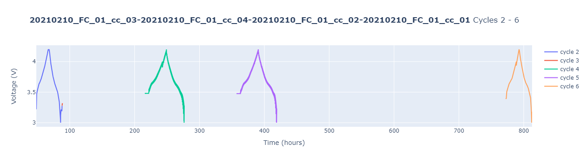
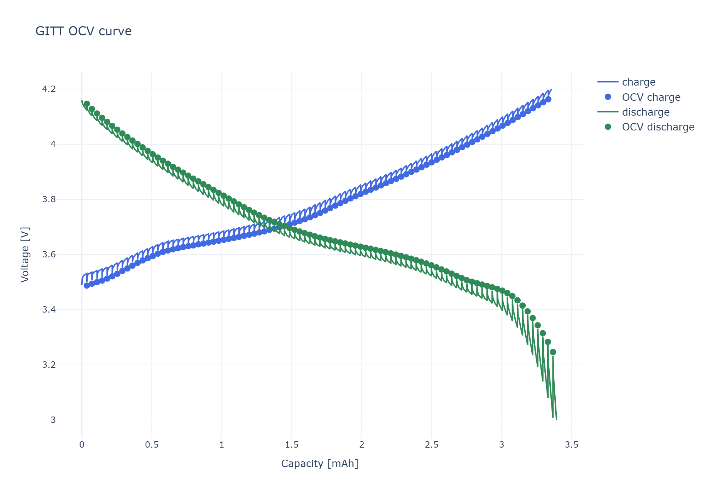

# GITT analysis
In this notebook we will use cellpy to extract the open circuit voltages (OCV) from a GITT measurement. The extracted OCVs will be plotted, and the results saved in .csv format.


```python
import pathlib

import pandas as pd
import plotly.graph_objects as go

import cellpy
from cellpy.utils import plotutils

```

Set filepath and load the datafile:


```python
filedir = pathlib.Path("data")  # foldername within the same directory
candidates = [
    filedir / "20210210_FC.h5",
    filedir / "out" / "20210210_FC.h5",
]
cellpy_path = next((p for p in candidates if p.exists()), None)
if cellpy_path is None:
    raise FileNotFoundError(
        "Could not find 20210210_FC.h5 in examples/data/ or examples/data/out/. "
        "Run notebook 01, or place the file in examples/data/."
    )
c = cellpy.get(cellpy_path)

```

Produce an overview plot to identify cycle numbers for the GITT experiment (for an interactive version of this plot, you have to have `plotly` installed):


```python
cycles = [n for n in c.get_cycle_numbers() if 2 <= n <= 6]
plotutils.cycle_info_plot(c, cycle=cycles)

```


    

    


From the overview plot above, we can identify the GITT cycles to be cycle number 4 and 5. In the following, we will focus on cycle 5 only.

For further analysis, we create the **step table**, called  ``steps``, a dataframe that contains a lot of information on all the cycle steps for the cell.

In the following, we apply several filters to ``steps``, to eventually extract OCV voltages and corresponding capacities:

1. **``steps_cycle``**: Extract the rows specifically for the selected GITT cycle (here: cycle Nr 5).

NB: For simplicity, ``steps_cycle`` only contains columns relevant for further analysis, i.e. ``cycle_num``, ``step_num``, ``charge_capacity_last``, ``discharge_capacity_last``, ``potential_first``, ``potential_last``, ``step_type``.


```python
GITT_cycle = 5
c.make_step_table(all_steps=True)
steps = c.data.steps
steps_cycle = steps.loc[
    steps.cycle_num == GITT_cycle,
    [
        "cycle_num",
        "step_num",
        "charge_capacity_last",
        "discharge_capacity_last",
        "potential_first",
        "potential_last",
        "step_type",
    ],
]

```

Taking a closer look at the created ``steps_cycle`` dataframe:

- `steps_cycle.head(10)` to view the first 10 rows
- `steps_cycle.tail(10)` to view the last 10 rows


```python
steps_cycle.tail(10)
```


<div class="cellpy-dataframe">
<table border="1" class="dataframe">
  <thead>
    <tr style="text-align: right;">
      <th></th>
      <th>cycle_num</th>
      <th>step_num</th>
      <th>charge_capacity_last</th>
      <th>discharge_capacity_last</th>
      <th>potential_first</th>
      <th>potential_last</th>
      <th>step_type</th>
    </tr>
  </thead>
  <tbody>
    <tr>
      <th>755</th>
      <td>5</td>
      <td>8</td>
      <td>0.003358</td>
      <td>0.003258</td>
      <td>3.212396</td>
      <td>3.343531</td>
      <td>ocvrlx_up</td>
    </tr>
    <tr>
      <th>756</th>
      <td>5</td>
      <td>7</td>
      <td>0.003358</td>
      <td>0.003294</td>
      <td>3.330632</td>
      <td>3.139919</td>
      <td>discharge</td>
    </tr>
    <tr>
      <th>757</th>
      <td>5</td>
      <td>8</td>
      <td>0.003358</td>
      <td>0.003294</td>
      <td>3.162645</td>
      <td>3.314970</td>
      <td>ocvrlx_up</td>
    </tr>
    <tr>
      <th>758</th>
      <td>5</td>
      <td>7</td>
      <td>0.003358</td>
      <td>0.003330</td>
      <td>3.302993</td>
      <td>3.080647</td>
      <td>discharge</td>
    </tr>
    <tr>
      <th>759</th>
      <td>5</td>
      <td>8</td>
      <td>0.003358</td>
      <td>0.003330</td>
      <td>3.102759</td>
      <td>3.283338</td>
      <td>ocvrlx_up</td>
    </tr>
    <tr>
      <th>760</th>
      <td>5</td>
      <td>7</td>
      <td>0.003358</td>
      <td>0.003366</td>
      <td>3.272282</td>
      <td>3.008170</td>
      <td>discharge</td>
    </tr>
    <tr>
      <th>761</th>
      <td>5</td>
      <td>8</td>
      <td>0.003358</td>
      <td>0.003366</td>
      <td>3.029361</td>
      <td>3.246485</td>
      <td>ocvrlx_up</td>
    </tr>
    <tr>
      <th>762</th>
      <td>5</td>
      <td>7</td>
      <td>0.003358</td>
      <td>0.003392</td>
      <td>3.233587</td>
      <td>2.999878</td>
      <td>discharge</td>
    </tr>
    <tr>
      <th>763</th>
      <td>5</td>
      <td>10</td>
      <td>0.003358</td>
      <td>0.003392</td>
      <td>3.010627</td>
      <td>3.010627</td>
      <td>ir</td>
    </tr>
    <tr>
      <th>764</th>
      <td>5</td>
      <td>11</td>
      <td>0.003358</td>
      <td>0.003392</td>
      <td>3.037038</td>
      <td>3.228980</td>
      <td>ocvrlx_up</td>
    </tr>
  </tbody>
</table>
</div>


2. To extract the OCV voltages, we then filter the `steps_cycle` dataframe for 
    - the OCV relaxation steps on charge, ``steps_ocv_cha``, of type *rest*, corresponding to ``step_num == 3``, and
    - the OCV relaxation steps on discharge, ``steps_ocv_dch``, of type *rest*, corresponding to ``step_num == 8``.
Thereby we obtain two new dataframes


```python
steps_ocv_cha = steps_cycle.loc[steps_cycle.step_num == 3]
steps_ocv_dch = steps_cycle.loc[steps_cycle.step_num == 8]

```


```python
steps_ocv_cha.head(5)
```


<div class="cellpy-dataframe">
<table border="1" class="dataframe">
  <thead>
    <tr style="text-align: right;">
      <th></th>
      <th>cycle_num</th>
      <th>step_num</th>
      <th>charge_capacity_last</th>
      <th>discharge_capacity_last</th>
      <th>potential_first</th>
      <th>potential_last</th>
      <th>step_type</th>
    </tr>
  </thead>
  <tbody>
    <tr>
      <th>390</th>
      <td>5</td>
      <td>3</td>
      <td>0.000036</td>
      <td>0.0</td>
      <td>3.512440</td>
      <td>3.487564</td>
      <td>rest</td>
    </tr>
    <tr>
      <th>392</th>
      <td>5</td>
      <td>3</td>
      <td>0.000072</td>
      <td>0.0</td>
      <td>3.518582</td>
      <td>3.494320</td>
      <td>rest</td>
    </tr>
    <tr>
      <th>394</th>
      <td>5</td>
      <td>3</td>
      <td>0.000109</td>
      <td>0.0</td>
      <td>3.524724</td>
      <td>3.499848</td>
      <td>rest</td>
    </tr>
    <tr>
      <th>396</th>
      <td>5</td>
      <td>3</td>
      <td>0.000145</td>
      <td>0.0</td>
      <td>3.530559</td>
      <td>3.505991</td>
      <td>rest</td>
    </tr>
    <tr>
      <th>398</th>
      <td>5</td>
      <td>3</td>
      <td>0.000181</td>
      <td>0.0</td>
      <td>3.537315</td>
      <td>3.513054</td>
      <td>rest</td>
    </tr>
  </tbody>
</table>
</div>


The voltages at the end of these steps (`potential_last`) contain the (pseudo-) OCV voltages:


```python
V_cha = steps_ocv_cha.potential_last.reset_index(drop=True)
V_dch = steps_ocv_dch.potential_last.reset_index(drop=True)
cap_cha = (
    steps_ocv_cha.charge_capacity_last.reset_index(drop=True) * 1000
)  # *1000 to convert to mAh
cap_dch = (
    steps_ocv_dch.discharge_capacity_last.reset_index(drop=True) * 1000
)  # *1000 to convert to mAh

```

To plot our results, we additionally get the entire voltage vs capacity curves for the selected GITT cycle, employing the `.get_ccap` and `.get_dcap` methods. The cell mass is used to convert from gravimetric capacity (mAh/g) to capacity (mAh).


```python
c.make_step_table(all_steps=False)
ccap = c.get_ccap(cycle=GITT_cycle)
dcap = c.get_dcap(cycle=GITT_cycle)
mass = c.get_mass()  # in mg
```


```python
fig = go.Figure()
fig.add_trace(
    go.Scatter(
        x=ccap["cumulative_charge_capacity"] * mass / 1000,
        y=ccap["potential"],
        mode="lines",
        name="charge",
        line=dict(color="royalblue"),
    )
)
fig.add_trace(
    go.Scatter(
        x=cap_cha,
        y=V_cha,
        mode="markers",
        name="OCV charge",
        marker=dict(color="royalblue", size=9),
    )
)
fig.add_trace(
    go.Scatter(
        x=dcap["cumulative_discharge_capacity"] * mass / 1000,
        y=dcap["potential"],
        mode="lines",
        name="discharge",
        line=dict(color="seagreen"),
    )
)
fig.add_trace(
    go.Scatter(
        x=cap_dch,
        y=V_dch,
        mode="markers",
        name="OCV discharge",
        marker=dict(color="seagreen", size=9),
    )
)
fig.update_layout(
    title="GITT OCV curve",
    xaxis_title="Capacity [mAh]",
    yaxis_title="Voltage [V]",
    width=1000,
    height=700,
    template="plotly_white",
    legend=dict(font=dict(size=14)),
)
fig.show()

```


    

    


### Saving the data
Concatenate the OCV voltages and capacities into a dataframe, and save as a .csv file.


```python
OCV_cha = pd.concat([cap_cha, V_cha], axis=1, keys=["Charge_cap_mAh", "OCV_V"])
OCV_dch = pd.concat([cap_dch, V_dch], axis=1, keys=["Discharge_cap_mAh", "OCV_V"])
```


```python
# OCV_cha.to_csv('GITT_OCV_cycle'+str(GITT_cycle)+'_cha.csv', index=False)
# OCV_dch.to_csv('GITT_OCV_cycle'+str(GITT_cycle)+'_dch.csv', index=False)
```
