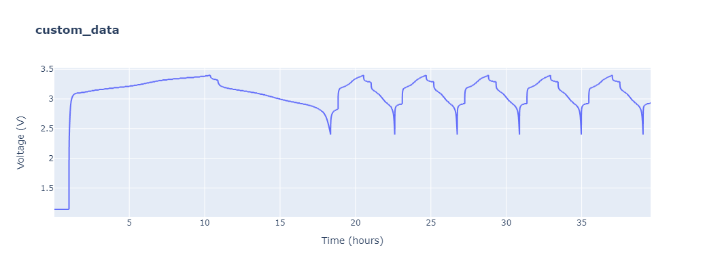

# Defining your own custom loaders


```python
from rich import print

import cellpy
from cellpy.utils import example_data, plotutils
```

Defining a simple utility-function to get a peek of the file in question:


```python
def head(f, n=5):
    print(f" {f.name} ".center(80, "="))
    with open(f) as datafile:
        if n > 1:
            for j in range(n):
                line = datafile.readline()
                print(f"[{j + 1:02}] {line.rstrip()}")
        else:
            for j, line in enumerate(datafile.readlines()):
                print(f"[{j + 1:02}] {line.rstrip()}")
    print(f" {f.name} ".center(80, "="))
```

## Using the "custom" instrument

This loader can be used if you have simple but unusual files. It needs an instrument file containing a description of the structure of the data file.
You can load files in csv, xlsx, and xls format using this loader.

Here is an example of a custom data file and a corresponding instrument file (yaml format).


```python
p_csv = example_data.custom_file_path()
instrument_file = example_data.custom_instrument_path()
```


```python
head(p_csv, 30)
```


    =============================== custom_data.csv ================================
    


    [01] # PRIME INSTRUMENT FILE --- M12X---!! HEAD !!---M13B---;;;;;;;;;
    


    [02] number of headers ;19;;;;;;;;
    


    [03] operator;Jan Petter Maehlen;;;;;;;;
    


    [04] date;01.01.2016;;;;;;;;
    


    [05] instrument;bobby;;;;;;;;
    


    [06] schedule;galvanic;;;;;;;;
    


    [07] cell;ee002;;;;;;;;
    


    [08] geometry;half-cell;;;;;;;;
    


    [09] counter;Li-metal;;;;;;;;
    


    [10] material;si-based;;;;;;;;
    


    [11] mass;0.0012;;;;;;;;
    


    [12] # PRIME INSTRUMENT FILE ---L01---''LOG'' ---0000000-;;;;;;;;;
    


    [13] 15;Started collecting auxilary data (saved to output.log);;;;;;;;
    


    [14] 773;Problem encountered - reloading config;;;;;;;;
    


    [15] 1111;R12;;;;;;;;
    


    [16] 6588;R12;;;;;;;;
    


    [17] 7712;Problem encountered - reloading config;;;;;;;;
    


    [18] 78999;R0;;;;;;;;
    


    [19] # PRIME INSTRUMENT FILE ---268876-;;;;;;;;;
    


    [20] index;test_time;step_time;date_stamp;step;cycle;current;voltage;charge_capacity;discharge_Capacity
    


    [21] 0;120.00;120.00;43374.42;1;1;0.00;1.14;0.00;0.00
    


    [22] 1;240.00;240.00;43374.42;1;1;0.00;1.14;0.00;0.00
    


    [23] 2;360.00;360.00;43374.42;1;1;0.00;1.14;0.00;0.00
    


    [24] 3;480.00;480.00;43374.42;1;1;0.00;1.14;0.00;0.00
    


    [25] 4;600.01;600.01;43374.42;1;1;0.00;1.14;0.00;0.00
    


    [26] 5;720.01;720.01;43374.42;1;1;0.00;1.14;0.00;0.00
    


    [27] 6;840.01;840.01;43374.42;1;1;0.00;1.14;0.00;0.00
    


    [28] 7;960.01;960.01;43374.43;1;1;0.00;1.14;0.00;0.00
    


    [29] 8;1080.01;1080.01;43374.43;1;1;0.00;1.14;0.00;0.00
    


    [30] 9;1200.01;1200.01;43374.43;1;1;0.00;1.14;0.00;0.00
    


    =============================== custom_data.csv ================================
    


```python
head(instrument_file, -1)
```


    ============================ custom_instrument.yml =============================
    


    [01] ---
    


    [02] formatters:
    


    [03]     skiprows: 19
    


    [04]     sep: ";"
    


    [05]     header: 0
    


    [06]     encoding: ISO-8859-1  # options: ISO-8859-1 utf-8 cp1252
    


    [07]     decimal: .
    


    [08]     thousands:
    


    [09]     comment_chars:
    


    [10]         - '#'
    


    [11]         - '!'
    


    [12] post_processors:
    


    [13]     split_capacity: false
    


    [14]     split_current: false
    


    [15]     set_index: false
    


    [16]     rename_headers: true
    


    [17]     set_cycle_number_not_zero: false
    


    [18]     convert_date_time_to_datetime: true
    


    [19]     convert_step_time_to_timedelta: false
    


    [20]     convert_test_time_to_timedelta: false
    


    [21] normal_headers_renaming_dict:
    


    [22]     data_point_txt: "index"
    


    [23]     datetime_txt: "date_stamp"
    


    [24]     test_time_txt: "test_time"
    


    [25]     step_time_txt: "step_time"
    


    [26]     cycle_index_txt: "cycle"
    


    [27]     step_index_txt: "step"
    


    [28]     current_txt: "current"
    


    [29]     voltage_txt: "voltage"
    


    [30]     charge_capacity_txt: "charge_capacity"
    


    [31]     discharge_capacity_txt: "discharge_Capacity"
    


    [32] unit_labels:
    


    [33]     resistance: Ohms
    


    [34]     time: s
    


    [35]     current: mA
    


    [36]     voltage: V
    


    [37]     power: W
    


    [38]     capacity: mAh
    


    [39]     energy: Wh
    


    [40]     temperature: C
    


    [41] raw_units:
    


    [42]     current: A
    


    [43]     charge: Ah
    


    [44]     mass: mg
    


    [45]     time: s
    


    [46] raw_limits:
    


    [47]     current_hard: 1.0e-13
    


    [48]     current_soft: 1.0e-05
    


    [49]     ir_change: 1.0e-05
    


    [50]     stable_charge_hard: 0.9
    


    [51]     stable_charge_soft: 5.0
    


    [52]     stable_current_hard: 2.0
    


    [53]     stable_current_soft: 4.0
    


    [54]     stable_voltage_hard: 2.0
    


    [55]     stable_voltage_soft: 4.0
    


    ============================ custom_instrument.yml =============================
    


```python
c = cellpy.get(p_csv, instrument="custom", instrument_file=instrument_file)
```

    (cellpy) - self.sep=';', self.skiprows=19, self.header=0, self.encoding='ISO-8859-1', self.decimal='.'
    (cellpy) - running post-processor: rename_headers
    Index(['index', 'test_time', 'step_time', 'date_stamp', 'step', 'cycle',
           'current', 'voltage', 'charge_capacity', 'discharge_Capacity'],
          dtype='object')
    (cellpy) - running post-processor: convert_date_time_to_datetime
    


```python
plotutils.raw_plot(c, width=1200, height=400)
```


    

    


## Using the "local_instrument" loader

This loader is used for loading data using the corresponding local yaml file with definitions on how the data should be loaded. This loader
is based on the ``TxtLoader`` and can only be used to load csv-type files.
As a "short-cut", this loader will be used if you set the ``instrument`` to the name of the instrument file (with the ``.yml`` extension) e.g.
``c = cellpy.get(rawfile, instrument="instrumentfile.yml")``.
The default instrument file is defined in your cellpy configuration file:
```
Instruments:
  custom_instrument_definitions_file: my_local_instrument.yml
```

As an example, let us see how we could load one of the example Maccor files using a local instrument definition file instead of the implemented "maccor_txt" loader.


```python
p = example_data.maccor_file_path()
print(f"{p.name=}")
```


    p.name='maccor_three.txt'
    


```python
local_instrument = example_data.local_instrument_path()
print(f"{local_instrument.name=}")
```


    local_instrument.name='local_instrument.yml'
    


```python
head(local_instrument, -1)
```


    ============================= local_instrument.yml =============================
    


    [01] ---
    


    [02] formatters:
    


    [03]     skiprows: 2
    


    [04]     sep: "\t"
    


    [05]     header: 0
    


    [06]     encoding: ISO-8859-1
    


    [07]     decimal: .
    


    [08]     thousands:
    


    [09]     comment_chars:
    


    [10]         - '#'
    


    [11]         - '!'
    


    [12] pre_processors:
    


    [13]     remove_empty_lines: true
    


    [14] post_processors:
    


    [15]     split_capacity: true
    


    [16]     split_current: true
    


    [17]     set_index: true
    


    [18]     rename_headers: true
    


    [19]     set_cycle_number_not_zero: true
    


    [20]     remove_last_if_bad: true
    


    [21]     convert_date_time_to_datetime: true
    


    [22]     convert_step_time_to_timedelta: true
    


    [23]     convert_test_time_to_timedelta: true
    


    [24] normal_headers_renaming_dict:
    


    [25]     data_point_txt: "Rec#"
    


    [26]     datetime_txt: "DPt Time"
    


    [27]     test_time_txt: "TestTime"
    


    [28]     step_time_txt: "StepTime"
    


    [29]     cycle_index_txt: "Cyc#"
    


    [30]     step_index_txt: "Step"
    


    [31]     current_txt: "mAmps"
    


    [32]     voltage_txt: "Volts"
    


    [33] #    power_txt: "Watt-hr"
    


    [34]     charge_capacity_txt: "mAmp-hr"
    


    [35]     charge_energy_txt: "mWatt-hr"
    


    [36] #    ac_impedance_txt: "ACImp/Ohms"
    


    [37] #    internal_resistance_txt: "DCIR/Ohms"
    


    [38] unit_labels:
    


    [39]     resistance: Ohms
    


    [40]     time: s
    


    [41]     current: mA
    


    [42]     voltage: mV
    


    [43]     power: mW
    


    [44]     capacity: mAh
    


    [45]     energy: mWh
    


    [46]     temperature: C
    


    [47] states:
    


    [48]     column_name: State
    


    [49]     charge_keys:
    


    [50]         - C
    


    [51]     discharge_keys:
    


    [52]         - D
    


    [53]     rest_keys:
    


    [54]         - R
    


    [55] raw_units:
    


    [56]     current: "mA"
    


    [57]     charge: "mAh"
    


    [58]     mass: "g"
    


    [59]     voltage: "mV"
    


    [60] raw_limits:
    


    [61]     current_hard: 1.0e-13
    


    [62]     current_soft: 1.0e-05
    


    [63]     ir_change: 1.0e-05
    


    [64]     stable_charge_hard: 0.9
    


    [65]     stable_charge_soft: 5.0
    


    [66]     stable_current_hard: 2.0
    


    [67]     stable_current_soft: 4.0
    


    [68]     stable_voltage_hard: 2.0
    


    [69]     stable_voltage_soft: 4.0
    


    ============================= local_instrument.yml =============================
    


```python
head(p, 20)
```


    =============================== maccor_three.txt ===============================
    


    [01] Today''s Date      03/28/2022 12:50:27 PM
    


    [02] 
    


    [03] Date of Test:      08/23/2021 6:04:18 PM
    


    [04] 
    


    [05] Rec#       Cyc#    Step    TestTime        StepTime        mAmp-hr mWatt-hr        mAmps   Volts   State   ES 
    DPt Time        Unnamed: 12
    


    [06] 1  0       1         0d 00:00:00.00          0d 00:00:00.00        0.0     0.0     0.0     1853.8186       R  
    0       08/23/2021 6:04:18 PM
    


    [07] 2  0       1         0d 00:01:00.00          0d 00:01:00.00        0.0     0.0     0.0     1853.0556       R  
    1       08/23/2021 6:05:18 PM
    


    [08] 3  0       1         0d 00:02:00.00          0d 00:02:00.00        0.0     0.0     0.0     1853.0556       R  
    1       08/23/2021 6:06:18 PM
    


    [09] 4  0       1         0d 00:03:00.00          0d 00:03:00.00        0.0     0.0     0.0     1853.2082       R  
    1       08/23/2021 6:07:18 PM
    


    [10] 5  0       1         0d 00:04:00.00          0d 00:04:00.00        0.0     0.0     0.0     1853.0556       R  
    1       08/23/2021 6:08:18 PM
    


    [11] 6  0       1         0d 00:05:00.00          0d 00:05:00.00        0.0     0.0     0.0     1853.0556       R  
    1       08/23/2021 6:09:18 PM
    


    [12] 7  0       1         0d 00:06:00.00          0d 00:06:00.00        0.0     0.0     0.0     1853.2082       R  
    1       08/23/2021 6:10:18 PM
    


    [13] 8  0       1         0d 00:07:00.00          0d 00:07:00.00        0.0     0.0     0.0     1853.2082       R  
    1       08/23/2021 6:11:18 PM
    


    [14] 9  0       1         0d 00:08:00.00          0d 00:08:00.00        0.0     0.0     0.0     1852.903        R  
    1       08/23/2021 6:12:18 PM
    


    [15] 10 0       1         0d 00:09:00.00          0d 00:09:00.00        0.0     0.0     0.0     1853.2082       R  
    1       08/23/2021 6:13:18 PM
    


    [16] 11 0       1         0d 00:10:00.00          0d 00:10:00.00        0.0     0.0     0.0     1853.0556       R  
    1       08/23/2021 6:14:18 PM
    


    [17] 12 0       1         0d 00:11:00.00          0d 00:11:00.00        0.0     0.0     0.0     1853.2082       R  
    1       08/23/2021 6:15:18 PM
    


    [18] 13 0       1         0d 00:12:00.00          0d 00:12:00.00        0.0     0.0     0.0     1853.0556       R  
    1       08/23/2021 6:16:18 PM
    


    [19] 14 0       1         0d 00:13:00.00          0d 00:13:00.00        0.0     0.0     0.0     1853.2082       R  
    1       08/23/2021 6:17:18 PM
    


    [20] 15 0       1         0d 00:14:00.00          0d 00:14:00.00        0.0     0.0     0.0     1853.3608       R  
    1       08/23/2021 6:18:18 PM
    


    =============================== maccor_three.txt ===============================
    


```python
from cellpy import log

c = cellpy.get(p, instrument=local_instrument)
```

    (cellpy) - running pre-processor: remove_empty_lines
    (cellpy) - self.sep='\t', self.skiprows=2, self.header=0, self.encoding='ISO-8859-1', self.decimal='.'
    (cellpy) - running post-processor: rename_headers
    Index(['Rec#', 'Cyc#', 'Step', 'TestTime', 'StepTime', 'mAmp-hr', 'mWatt-hr',
           'mAmps', 'Volts', 'State', 'ES', 'DPt Time', 'Unnamed: 12'],
          dtype='object')
    (cellpy) - running post-processor: remove_last_if_bad
    (cellpy) - running post-processor: split_capacity
    (cellpy) - running post-processor: split_current
    (cellpy) - running post-processor: set_index
    (cellpy) - running post-processor: set_cycle_number_not_zero
    (cellpy) - running post-processor: convert_date_time_to_datetime
    (cellpy) - running post-processor: convert_step_time_to_timedelta
    (cellpy) - running post-processor: convert_test_time_to_timedelta
    


```python
plotutils.raw_plot(c, width=1200, height=400)
```


```python
plotutils.summary_plot(c, width=1200, height=400)
```


