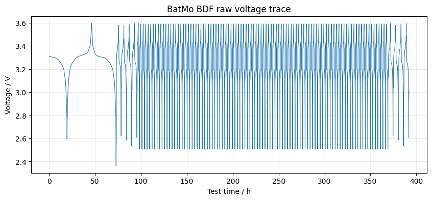
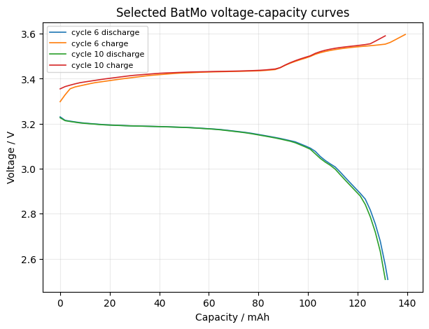

# Loading BatMo BDF CSV data

This notebook shows how to load a BatMo BDF CSV file with the built-in `batmo_bdf` loader, inspect the resulting cellpy data object, extract useful pandas DataFrames, make a simple voltage-capacity plot, and export the processed data to other formats.


```python
from pathlib import Path
import sys

import matplotlib.pyplot as plt
import pandas as pd

# Changes to the cellpy repo can directly be used without installing the package. This is useful for development and testing.
repo_root = next(
    (path for path in [Path.cwd(), Path.cwd().parent] if (path / "cellpy" / "__init__.py").exists()),
    None,
)
if repo_root is not None and str(repo_root) not in sys.path:
    sys.path.insert(0, str(repo_root))

import cellpy

%matplotlib inline
```

## Locate the example file

The notebook first looks for `batmo_bdf.csv` in `examples/data`. In a source checkout, the same test file is also available in `testdata/data`.


```python
candidates = [
    Path("data/batmo_bdf.csv"),
    Path("examples/data/batmo_bdf.csv"),
    Path("../testdata/data/batmo_bdf.csv"),
    Path("testdata/data/batmo_bdf.csv"),
]

raw_file = next((path for path in candidates if path.exists()), None)
if raw_file is None:
    raise FileNotFoundError("Could not find batmo_bdf.csv in examples/data or testdata/data")

raw_file
```


    PosixPath('../testdata/data/batmo_bdf.csv')


## Load with the BatMo loader

BatMo BDF CSV files are loaded by passing `instrument="batmo_bdf"`. The example data starts with a discharge step, so `cycle_mode="anode"` is used here.


```python
c = cellpy.get(
    raw_file,
    instrument="batmo_bdf",
    cycle_mode="anode",
    mass=1.0,
)

c
```

    (cellpy) - parsing with pandas.read_csv: /tmp/batmo_bdf.csv
    (cellpy) - parameters: self.sep=',', self.skiprows=0, self.header=0, self.encoding='utf-8', self.decimal='.'
    (cellpy) - running post-processor: rename_headers
    (cellpy) - running post-processor: cumulate_capacity_within_cycle
    (cellpy) - running post-processor: set_index
    


<div class="cellpy-dataframe">
<h2>CellpyCell-object</h2>
            <b>id</b>: 0x7f5910928ce0 <br>
            <b>name</b>: batmo_bdf <br>
            <b>tester</b>: batmo <br>
            <b>cycle_mode</b>: anode <br>
            <b>sep</b>: ; <br>
            <b>cellpy_datadir</b>: /home/meg/cellpy_data/cellpyfiles <br>
            <b>raw_datadir</b>: /home/meg/cellpy_data/raw <br>
        <p>
            <b>capacity_modifiers</b>: ['reset'] <br>
            <b>empty</b>: False <br>
            <b>ensure_step_table</b>: False <br>
            <b>filestatuschecker</b>: size <br>
            <b>force_step_table_creation</b>: True <br>
            <b>forced_errors</b>: 0 <br>
            <b>limit_loaded_cycles</b>: None <br>
            <b>profile</b>: False <br>
            <b>cellpy_units</b>: CellpyUnits(current='A', charge='mAh', voltage='V', time='sec', resistance='ohm', power='W', energy='Wh', frequency='hz', mass='mg', nominal_capacity='mAh/g', specific_gravimetric='g', specific_areal='cm**2', specific_volumetric='cm**3', length='cm', area='cm**2', volume='cm**3', temperature='C', pressure='bar') <br>
            <b>select_minimal</b>: False <br>
            <b>selected_scans</b>: [] <br>
        </p><h3>data</h3><blockquote><h2>Data-object</h2> <b>id</b>: 0x7f59066476e0<p><b>active_electrode_area</b>: 1.0<br><b>cell_name</b>: batmo_bdf<br><b>channel_index</b>: None<br><b>creator</b>: None<br><b>empty</b>: False<br><b>has_data</b>: True<br><b>has_steps</b>: True<br><b>has_summary</b>: True<br><b>loaded_from</b>: ../testdata/data/batmo_bdf.csv<br><b>loading</b>: 1.0<br><b>mass</b>: 1.0<br><b>material</b>: silicon<br><b>meta_common</b>: CellpyMetaCommon(cell_name='batmo_bdf', start_datetime=Timestamp('1970-01-01 00:08:20'), time_zone=None, comment='', file_errors=None, raw_id=None, cellpy_file_version=8, tester_ID=None, tester_server_software_version=None, tester_client_software_version=None, tester_calibration_date=None, material='silicon', mass=1.0, tot_mass=1.0, nom_cap=1.0, nom_cap_specifics='gravimetric', active_electrode_area=1.0, active_electrode_thickness=1.0, active_electrode_loading=1.0, electrolyte_volume=1.0, electrolyte_type='standard', active_electrode_type='standard', counter_electrode_type='standard', reference_electrode_type='standard', experiment_type='cycling', cell_type='standard', separator_type='standard', active_electrode_current_collector='standard', reference_electrode_current_collector='standard')<br><b>meta_test_dependent</b>: CellpyMetaIndividualTest(channel_index=None, creator=None, test_type=None, voltage_lim_low=0.0, voltage_lim_high=1.0, cycle_mode='anode', test_ID=None)<br><b>nom_cap</b>: 1.0<br><b>raw data files</b>: [batmo_bdf.csv]<br><b>raw_data_files_length</b>: [21206]<br><b>raw_id</b>: None<br><b>raw_limits</b>: CellpyLimits(current_hard=1e-13, current_soft=1e-05, stable_current_hard=2.0, stable_current_soft=4.0, stable_voltage_hard=2.0, stable_voltage_soft=4.0, stable_charge_hard=0.9, stable_charge_soft=5.0, ir_change=1e-05)<br><b>raw_units</b>: CellpyUnits(current='A', charge='Ah', voltage='V', time='sec', resistance='Ohm', power='W', energy='Wh', frequency='hz', mass='g', nominal_capacity='mAh/g', specific_gravimetric='g', specific_areal='cm**2', specific_volumetric='cm**3', length='cm', area='cm**2', volume='cm**3', temperature='C', pressure='bar')<br><b>schedule_file_name</b>: None<br><b>start_datetime</b>: 1970-01-01 00:08:20<br><b>test_ID</b>: None<br><b>test_name</b>: None<br><b>tot_mass</b>: 1.0<br></p><p><b>summary data-frame (summary)</b><br><div>

<table border="1" class="dataframe">
  <thead>
    <tr style="text-align: right;">
      <th></th>
      <th>data_point</th>
      <th>test_time</th>
      <th>date_time</th>
      <th>end_voltage_charge</th>
      <th>end_voltage_discharge</th>
      <th>charge_capacity</th>
      <th>discharge_capacity</th>
      <th>coulombic_efficiency</th>
      <th>cumulated_coulombic_efficiency</th>
      <th>cumulated_charge_capacity</th>
      <th>...</th>
      <th>cumulated_charge_capacity_absolute</th>
      <th>cumulated_discharge_capacity_absolute</th>
      <th>coulombic_difference_absolute</th>
      <th>cumulated_coulombic_difference_absolute</th>
      <th>discharge_capacity_loss_absolute</th>
      <th>charge_capacity_loss_absolute</th>
      <th>cumulated_discharge_capacity_loss_absolute</th>
      <th>cumulated_charge_capacity_loss_absolute</th>
      <th>shifted_charge_capacity_absolute</th>
      <th>shifted_discharge_capacity_absolute</th>
    </tr>
  </thead>
  <tbody>
    <tr>
      <th>count</th>
      <td>109.000000</td>
      <td>1.090000e+02</td>
      <td>109</td>
      <td>109.000000</td>
      <td>109.000000</td>
      <td>109.000000</td>
      <td>109.000000</td>
      <td>109.000000</td>
      <td>109.000000</td>
      <td>109.000000</td>
      <td>...</td>
      <td>109.000000</td>
      <td>109.000000</td>
      <td>109.000000</td>
      <td>109.000000</td>
      <td>108.000000</td>
      <td>108.000000</td>
      <td>108.000000</td>
      <td>108.000000</td>
      <td>109.000000</td>
      <td>109.000000</td>
    </tr>
    <tr>
      <th>mean</th>
      <td>10885.697248</td>
      <td>8.374226e+05</td>
      <td>1970-01-10 16:37:02.568807339</td>
      <td>3.590381</td>
      <td>2.512286</td>
      <td>0.132781</td>
      <td>0.133794</td>
      <td>99.660461</td>
      <td>5467.332177</td>
      <td>7.326264</td>
      <td>...</td>
      <td>7326.264370</td>
      <td>7430.245198</td>
      <td>1.013051</td>
      <td>103.980828</td>
      <td>1.178949</td>
      <td>0.088772</td>
      <td>144.216483</td>
      <td>26.409553</td>
      <td>103.980828</td>
      <td>237.774513</td>
    </tr>
    <tr>
      <th>min</th>
      <td>553.000000</td>
      <td>2.624200e+05</td>
      <td>1970-01-04 00:53:40</td>
      <td>3.581278</td>
      <td>2.363354</td>
      <td>0.131195</td>
      <td>0.131195</td>
      <td>57.446809</td>
      <td>57.446809</td>
      <td>0.158948</td>
      <td>...</td>
      <td>158.947898</td>
      <td>276.687081</td>
      <td>-8.325842</td>
      <td>103.358183</td>
      <td>-16.147088</td>
      <td>-10.091930</td>
      <td>127.326517</td>
      <td>3.784474</td>
      <td>103.358183</td>
      <td>234.553273</td>
    </tr>
    <tr>
      <th>25%</th>
      <td>6053.000000</td>
      <td>5.717800e+05</td>
      <td>1970-01-07 14:49:40.000000001</td>
      <td>3.590478</td>
      <td>2.507750</td>
      <td>0.131195</td>
      <td>0.131195</td>
      <td>100.000000</td>
      <td>2767.780143</td>
      <td>3.784726</td>
      <td>...</td>
      <td>3784.726054</td>
      <td>3888.084237</td>
      <td>0.000000</td>
      <td>103.358183</td>
      <td>0.000000</td>
      <td>0.000000</td>
      <td>145.491991</td>
      <td>27.752808</td>
      <td>103.358183</td>
      <td>234.553273</td>
    </tr>
    <tr>
      <th>50%</th>
      <td>10886.000000</td>
      <td>8.374600e+05</td>
      <td>1970-01-10 16:37:40.000000001</td>
      <td>3.590478</td>
      <td>2.507750</td>
      <td>0.131195</td>
      <td>0.131195</td>
      <td>100.000000</td>
      <td>5467.780143</td>
      <td>7.326993</td>
      <td>...</td>
      <td>7326.993489</td>
      <td>7430.351672</td>
      <td>0.000000</td>
      <td>103.358183</td>
      <td>0.000000</td>
      <td>0.000000</td>
      <td>145.491991</td>
      <td>27.752808</td>
      <td>103.358183</td>
      <td>234.553273</td>
    </tr>
    <tr>
      <th>75%</th>
      <td>15719.000000</td>
      <td>1.103140e+06</td>
      <td>1970-01-13 18:25:40.000000001</td>
      <td>3.590478</td>
      <td>2.507750</td>
      <td>0.131195</td>
      <td>0.131195</td>
      <td>100.000000</td>
      <td>8167.780143</td>
      <td>10.869261</td>
      <td>...</td>
      <td>10869.260925</td>
      <td>10972.619108</td>
      <td>0.000000</td>
      <td>103.358183</td>
      <td>0.000000</td>
      <td>0.000000</td>
      <td>145.491991</td>
      <td>27.752808</td>
      <td>103.358183</td>
      <td>234.553273</td>
    </tr>
    <tr>
      <th>max</th>
      <td>21206.000000</td>
      <td>1.411480e+06</td>
      <td>1970-01-17 08:04:40.000000001</td>
      <td>3.596597</td>
      <td>2.619610</td>
      <td>0.158948</td>
      <td>0.276687</td>
      <td>105.670103</td>
      <td>10862.990274</td>
      <td>14.473089</td>
      <td>...</td>
      <td>14473.089133</td>
      <td>14583.511667</td>
      <td>117.739184</td>
      <td>117.739184</td>
      <td>129.849500</td>
      <td>10.091930</td>
      <td>145.491991</td>
      <td>27.752808</td>
      <td>117.739184</td>
      <td>394.426265</td>
    </tr>
    <tr>
      <th>std</th>
      <td>5709.996761</td>
      <td>3.144652e+05</td>
      <td>NaN</td>
      <td>0.001768</td>
      <td>0.026906</td>
      <td>0.005277</td>
      <td>0.014522</td>
      <td>4.168069</td>
      <td>3161.151011</td>
      <td>4.152657</td>
      <td>...</td>
      <td>4152.656567</td>
      <td>4152.436458</td>
      <td>11.347850</td>
      <td>2.201780</td>
      <td>12.704656</td>
      <td>1.895045</td>
      <td>4.502405</td>
      <td>4.653151</td>
      <td>2.201780</td>
      <td>16.377038</td>
    </tr>
  </tbody>
</table>
<p>8 rows × 61 columns</p>
</div></p><p><b>summary data-frame (head)</b><br><div>

<table border="1" class="dataframe">
  <thead>
    <tr style="text-align: right;">
      <th></th>
      <th>data_point</th>
      <th>test_time</th>
      <th>date_time</th>
      <th>end_voltage_charge</th>
      <th>end_voltage_discharge</th>
      <th>charge_capacity</th>
      <th>discharge_capacity</th>
      <th>coulombic_efficiency</th>
      <th>cumulated_coulombic_efficiency</th>
      <th>cumulated_charge_capacity</th>
      <th>...</th>
      <th>cumulated_charge_capacity_absolute</th>
      <th>cumulated_discharge_capacity_absolute</th>
      <th>coulombic_difference_absolute</th>
      <th>cumulated_coulombic_difference_absolute</th>
      <th>discharge_capacity_loss_absolute</th>
      <th>charge_capacity_loss_absolute</th>
      <th>cumulated_discharge_capacity_loss_absolute</th>
      <th>cumulated_charge_capacity_loss_absolute</th>
      <th>shifted_charge_capacity_absolute</th>
      <th>shifted_discharge_capacity_absolute</th>
    </tr>
    <tr>
      <th>cycle_index</th>
      <th></th>
      <th></th>
      <th></th>
      <th></th>
      <th></th>
      <th></th>
      <th></th>
      <th></th>
      <th></th>
      <th></th>
      <th></th>
      <th></th>
      <th></th>
      <th></th>
      <th></th>
      <th></th>
      <th></th>
      <th></th>
      <th></th>
      <th></th>
      <th></th>
    </tr>
  </thead>
  <tbody>
    <tr>
      <th>1</th>
      <td>553</td>
      <td>262420.0</td>
      <td>1970-01-04 00:53:40</td>
      <td>3.595000</td>
      <td>2.363354</td>
      <td>0.158948</td>
      <td>0.276687</td>
      <td>57.446809</td>
      <td>57.446809</td>
      <td>0.158948</td>
      <td>...</td>
      <td>158.947898</td>
      <td>276.687081</td>
      <td>117.739184</td>
      <td>117.739184</td>
      <td>NaN</td>
      <td>NaN</td>
      <td>NaN</td>
      <td>NaN</td>
      <td>117.739184</td>
      <td>394.426265</td>
    </tr>
    <tr>
      <th>2</th>
      <td>905</td>
      <td>283300.0</td>
      <td>1970-01-04 06:41:40</td>
      <td>3.581278</td>
      <td>2.619608</td>
      <td>0.155163</td>
      <td>0.146838</td>
      <td>105.670103</td>
      <td>163.116912</td>
      <td>0.314111</td>
      <td>...</td>
      <td>314.111322</td>
      <td>423.524663</td>
      <td>-8.325842</td>
      <td>109.413341</td>
      <td>129.849500</td>
      <td>3.784474</td>
      <td>129.849500</td>
      <td>3.784474</td>
      <td>109.413341</td>
      <td>256.250923</td>
    </tr>
    <tr>
      <th>3</th>
      <td>1248</td>
      <td>303820.0</td>
      <td>1970-01-04 12:23:40</td>
      <td>3.582400</td>
      <td>2.588512</td>
      <td>0.147342</td>
      <td>0.147847</td>
      <td>99.658703</td>
      <td>262.775615</td>
      <td>0.461453</td>
      <td>...</td>
      <td>461.453500</td>
      <td>571.371438</td>
      <td>0.504597</td>
      <td>109.917938</td>
      <td>-1.009193</td>
      <td>7.821246</td>
      <td>128.840307</td>
      <td>11.605720</td>
      <td>109.917938</td>
      <td>257.764712</td>
    </tr>
    <tr>
      <th>4</th>
      <td>1593</td>
      <td>324460.0</td>
      <td>1970-01-04 18:07:40</td>
      <td>3.587022</td>
      <td>2.534302</td>
      <td>0.148351</td>
      <td>0.148856</td>
      <td>99.661017</td>
      <td>362.436632</td>
      <td>0.609805</td>
      <td>...</td>
      <td>609.804871</td>
      <td>720.227405</td>
      <td>0.504597</td>
      <td>110.422534</td>
      <td>-1.009193</td>
      <td>-1.009193</td>
      <td>127.831114</td>
      <td>10.596527</td>
      <td>110.422534</td>
      <td>259.278502</td>
    </tr>
    <tr>
      <th>5</th>
      <td>1939</td>
      <td>345220.0</td>
      <td>1970-01-04 23:53:40</td>
      <td>3.593878</td>
      <td>2.607985</td>
      <td>0.149361</td>
      <td>0.149361</td>
      <td>100.000000</td>
      <td>462.436632</td>
      <td>0.759165</td>
      <td>...</td>
      <td>759.165435</td>
      <td>869.587970</td>
      <td>0.000000</td>
      <td>110.422534</td>
      <td>-0.504597</td>
      <td>-1.009193</td>
      <td>127.326517</td>
      <td>9.587334</td>
      <td>110.422534</td>
      <td>259.783098</td>
    </tr>
  </tbody>
</table>
<p>5 rows × 61 columns</p>
</div></p><p><b>steps data-frame (summary)</b><br><div>

<table border="1" class="dataframe">
  <thead>
    <tr style="text-align: right;">
      <th></th>
      <th>index</th>
      <th>cycle</th>
      <th>step</th>
      <th>sub_step</th>
      <th>point_avr</th>
      <th>point_std</th>
      <th>point_min</th>
      <th>point_max</th>
      <th>point_first</th>
      <th>point_last</th>
      <th>...</th>
      <th>charge_last</th>
      <th>charge_delta</th>
      <th>discharge_avr</th>
      <th>discharge_std</th>
      <th>discharge_min</th>
      <th>discharge_max</th>
      <th>discharge_first</th>
      <th>discharge_last</th>
      <th>discharge_delta</th>
      <th>rate_avr</th>
    </tr>
  </thead>
  <tbody>
    <tr>
      <th>count</th>
      <td>445.000000</td>
      <td>445.000000</td>
      <td>445.000000</td>
      <td>445.0</td>
      <td>445.000000</td>
      <td>445.000000</td>
      <td>445.000000</td>
      <td>445.000000</td>
      <td>445.000000</td>
      <td>445.000000</td>
      <td>...</td>
      <td>445.000000</td>
      <td>445.000000</td>
      <td>445.000000</td>
      <td>445.000000</td>
      <td>445.000000</td>
      <td>445.000000</td>
      <td>445.000000</td>
      <td>445.000000</td>
      <td>445.000000</td>
      <td>445.000000</td>
    </tr>
    <tr>
      <th>mean</th>
      <td>222.000000</td>
      <td>54.887640</td>
      <td>223.000000</td>
      <td>1.0</td>
      <td>10772.908989</td>
      <td>13.899711</td>
      <td>10749.582022</td>
      <td>10796.235955</td>
      <td>10749.582022</td>
      <td>10796.235955</td>
      <td>...</td>
      <td>0.129738</td>
      <td>3.252380</td>
      <td>0.049591</td>
      <td>0.009668</td>
      <td>0.033201</td>
      <td>0.065973</td>
      <td>0.033201</td>
      <td>0.065973</td>
      <td>3.548456</td>
      <td>56646.343352</td>
    </tr>
    <tr>
      <th>std</th>
      <td>128.604691</td>
      <td>32.054092</td>
      <td>128.604691</td>
      <td>0.0</td>
      <td>5804.283991</td>
      <td>9.017974</td>
      <td>5805.001962</td>
      <td>5803.607964</td>
      <td>5805.001962</td>
      <td>5803.607964</td>
      <td>...</td>
      <td>0.020331</td>
      <td>5.722632</td>
      <td>0.055361</td>
      <td>0.016907</td>
      <td>0.057374</td>
      <td>0.066934</td>
      <td>0.057374</td>
      <td>0.066934</td>
      <td>8.514928</td>
      <td>59351.778471</td>
    </tr>
    <tr>
      <th>min</th>
      <td>0.000000</td>
      <td>1.000000</td>
      <td>1.000000</td>
      <td>1.0</td>
      <td>70.500000</td>
      <td>4.472136</td>
      <td>1.000000</td>
      <td>140.000000</td>
      <td>1.000000</td>
      <td>140.000000</td>
      <td>...</td>
      <td>0.000000</td>
      <td>0.000000</td>
      <td>0.000000</td>
      <td>0.000000</td>
      <td>0.000000</td>
      <td>0.000000</td>
      <td>0.000000</td>
      <td>0.000000</td>
      <td>0.000000</td>
      <td>0.000000</td>
    </tr>
    <tr>
      <th>25%</th>
      <td>111.000000</td>
      <td>27.000000</td>
      <td>112.000000</td>
      <td>1.0</td>
      <td>5810.500000</td>
      <td>4.760952</td>
      <td>5778.000000</td>
      <td>5843.000000</td>
      <td>5778.000000</td>
      <td>5843.000000</td>
      <td>...</td>
      <td>0.131195</td>
      <td>0.000000</td>
      <td>0.000000</td>
      <td>0.000000</td>
      <td>0.000000</td>
      <td>0.000000</td>
      <td>0.000000</td>
      <td>0.000000</td>
      <td>0.000000</td>
      <td>0.000000</td>
    </tr>
    <tr>
      <th>50%</th>
      <td>222.000000</td>
      <td>55.000000</td>
      <td>223.000000</td>
      <td>1.0</td>
      <td>10781.500000</td>
      <td>9.092121</td>
      <td>10774.000000</td>
      <td>10789.000000</td>
      <td>10774.000000</td>
      <td>10789.000000</td>
      <td>...</td>
      <td>0.131195</td>
      <td>0.000000</td>
      <td>0.000000</td>
      <td>0.000000</td>
      <td>0.000000</td>
      <td>0.000000</td>
      <td>0.000000</td>
      <td>0.000000</td>
      <td>0.000000</td>
      <td>0.000000</td>
    </tr>
    <tr>
      <th>75%</th>
      <td>333.000000</td>
      <td>83.000000</td>
      <td>334.000000</td>
      <td>1.0</td>
      <td>15752.500000</td>
      <td>19.196354</td>
      <td>15720.000000</td>
      <td>15785.000000</td>
      <td>15720.000000</td>
      <td>15785.000000</td>
      <td>...</td>
      <td>0.131195</td>
      <td>0.000000</td>
      <td>0.116898</td>
      <td>0.000000</td>
      <td>0.116898</td>
      <td>0.131195</td>
      <td>0.116898</td>
      <td>0.131195</td>
      <td>0.000000</td>
      <td>121103.160180</td>
    </tr>
    <tr>
      <th>max</th>
      <td>444.000000</td>
      <td>109.000000</td>
      <td>445.000000</td>
      <td>1.0</td>
      <td>21198.000000</td>
      <td>55.281100</td>
      <td>21190.000000</td>
      <td>21206.000000</td>
      <td>21190.000000</td>
      <td>21206.000000</td>
      <td>...</td>
      <td>0.158948</td>
      <td>15.894790</td>
      <td>0.196793</td>
      <td>0.046491</td>
      <td>0.149361</td>
      <td>0.276687</td>
      <td>0.149361</td>
      <td>0.276687</td>
      <td>136.690647</td>
      <td>121103.160180</td>
    </tr>
  </tbody>
</table>
<p>8 rows × 54 columns</p>
</div></p><p><b>steps data-frame (head)</b><br><div>

<table border="1" class="dataframe">
  <thead>
    <tr style="text-align: right;">
      <th></th>
      <th>index</th>
      <th>cycle</th>
      <th>step</th>
      <th>sub_step</th>
      <th>point_avr</th>
      <th>point_std</th>
      <th>point_min</th>
      <th>point_max</th>
      <th>point_first</th>
      <th>point_last</th>
      <th>...</th>
      <th>discharge_std</th>
      <th>discharge_min</th>
      <th>discharge_max</th>
      <th>discharge_first</th>
      <th>discharge_last</th>
      <th>discharge_delta</th>
      <th>rate_avr</th>
      <th>type</th>
      <th>sub_type</th>
      <th>info</th>
    </tr>
  </thead>
  <tbody>
    <tr>
      <th>0</th>
      <td>0</td>
      <td>1</td>
      <td>1</td>
      <td>1</td>
      <td>70.5</td>
      <td>40.558600</td>
      <td>1</td>
      <td>140</td>
      <td>1</td>
      <td>140</td>
      <td>...</td>
      <td>0.034110</td>
      <td>0.000000</td>
      <td>0.116898</td>
      <td>0.000000</td>
      <td>0.116898</td>
      <td>11.689819</td>
      <td>6055.15801</td>
      <td>discharge</td>
      <td>None</td>
      <td></td>
    </tr>
    <tr>
      <th>1</th>
      <td>1</td>
      <td>1</td>
      <td>2</td>
      <td>1</td>
      <td>148.5</td>
      <td>4.760952</td>
      <td>141</td>
      <td>156</td>
      <td>141</td>
      <td>156</td>
      <td>...</td>
      <td>0.000000</td>
      <td>0.116898</td>
      <td>0.116898</td>
      <td>0.116898</td>
      <td>0.116898</td>
      <td>0.000000</td>
      <td>0.00000</td>
      <td>rest</td>
      <td>None</td>
      <td></td>
    </tr>
    <tr>
      <th>2</th>
      <td>2</td>
      <td>1</td>
      <td>3</td>
      <td>1</td>
      <td>251.5</td>
      <td>54.992424</td>
      <td>157</td>
      <td>346</td>
      <td>157</td>
      <td>346</td>
      <td>...</td>
      <td>0.000000</td>
      <td>0.116898</td>
      <td>0.116898</td>
      <td>0.116898</td>
      <td>0.116898</td>
      <td>0.000000</td>
      <td>6055.15801</td>
      <td>charge</td>
      <td>None</td>
      <td></td>
    </tr>
    <tr>
      <th>3</th>
      <td>3</td>
      <td>1</td>
      <td>4</td>
      <td>1</td>
      <td>354.5</td>
      <td>4.760952</td>
      <td>347</td>
      <td>362</td>
      <td>347</td>
      <td>362</td>
      <td>...</td>
      <td>0.000000</td>
      <td>0.116898</td>
      <td>0.116898</td>
      <td>0.116898</td>
      <td>0.116898</td>
      <td>0.000000</td>
      <td>0.00000</td>
      <td>rest</td>
      <td>None</td>
      <td></td>
    </tr>
    <tr>
      <th>4</th>
      <td>4</td>
      <td>1</td>
      <td>5</td>
      <td>1</td>
      <td>458.0</td>
      <td>55.281100</td>
      <td>363</td>
      <td>553</td>
      <td>363</td>
      <td>553</td>
      <td>...</td>
      <td>0.046491</td>
      <td>0.116898</td>
      <td>0.276687</td>
      <td>0.116898</td>
      <td>0.276687</td>
      <td>136.690647</td>
      <td>6055.15801</td>
      <td>discharge</td>
      <td>None</td>
      <td></td>
    </tr>
  </tbody>
</table>
<p>5 rows × 57 columns</p>
</div></p><p><b>raw data-frame (summary)</b><br><div>

<table border="1" class="dataframe">
  <thead>
    <tr style="text-align: right;">
      <th></th>
      <th>test_time</th>
      <th>current</th>
      <th>voltage</th>
      <th>cycle_index</th>
      <th>step_index</th>
      <th>charge_capacity</th>
      <th>discharge_capacity</th>
      <th>data_point</th>
      <th>step_time</th>
      <th>date_time</th>
    </tr>
  </thead>
  <tbody>
    <tr>
      <th>count</th>
      <td>2.120600e+04</td>
      <td>21206.000000</td>
      <td>21206.000000</td>
      <td>21206.000000</td>
      <td>21206.000000</td>
      <td>21206.000000</td>
      <td>21206.000000</td>
      <td>21206.00000</td>
      <td>21206.000000</td>
      <td>21206</td>
    </tr>
    <tr>
      <th>mean</th>
      <td>8.189593e+05</td>
      <td>-0.000023</td>
      <td>3.249575</td>
      <td>54.046921</td>
      <td>219.445016</td>
      <td>0.106896</td>
      <td>0.048041</td>
      <td>10603.50000</td>
      <td>2871.466330</td>
      <td>1970-01-10 11:29:19.256106761</td>
    </tr>
    <tr>
      <th>min</th>
      <td>5.000000e+02</td>
      <td>-0.121103</td>
      <td>2.363354</td>
      <td>1.000000</td>
      <td>1.000000</td>
      <td>0.000000</td>
      <td>0.000000</td>
      <td>1.00000</td>
      <td>0.000000</td>
      <td>1970-01-01 00:08:20</td>
    </tr>
    <tr>
      <th>25%</th>
      <td>5.312350e+05</td>
      <td>-0.121103</td>
      <td>3.125167</td>
      <td>24.000000</td>
      <td>100.000000</td>
      <td>0.084772</td>
      <td>0.000000</td>
      <td>5302.25000</td>
      <td>480.000000</td>
      <td>1970-01-07 03:33:55</td>
    </tr>
    <tr>
      <th>50%</th>
      <td>8.223100e+05</td>
      <td>0.000000</td>
      <td>3.229508</td>
      <td>54.000000</td>
      <td>219.000000</td>
      <td>0.131195</td>
      <td>0.016147</td>
      <td>10603.50000</td>
      <td>1500.000000</td>
      <td>1970-01-10 12:25:10</td>
    </tr>
    <tr>
      <th>75%</th>
      <td>1.113385e+06</td>
      <td>0.121103</td>
      <td>3.420788</td>
      <td>84.000000</td>
      <td>338.000000</td>
      <td>0.131195</td>
      <td>0.105755</td>
      <td>15904.75000</td>
      <td>2940.000000</td>
      <td>1970-01-13 21:16:25</td>
    </tr>
    <tr>
      <th>max</th>
      <td>1.411480e+06</td>
      <td>0.121103</td>
      <td>3.596597</td>
      <td>109.000000</td>
      <td>445.000000</td>
      <td>0.158948</td>
      <td>0.276687</td>
      <td>21206.00000</td>
      <td>95000.000000</td>
      <td>1970-01-17 08:04:40.000000001</td>
    </tr>
    <tr>
      <th>std</th>
      <td>3.434444e+05</td>
      <td>0.097693</td>
      <td>0.200384</td>
      <td>33.616957</td>
      <td>135.058798</td>
      <td>0.042333</td>
      <td>0.055659</td>
      <td>6121.78924</td>
      <td>7904.683952</td>
      <td>NaN</td>
    </tr>
  </tbody>
</table>
</div></p><p><b>raw data-frame (head)</b><br><div>

<table border="1" class="dataframe">
  <thead>
    <tr style="text-align: right;">
      <th></th>
      <th>test_time</th>
      <th>current</th>
      <th>voltage</th>
      <th>Protocol Name / 1</th>
      <th>Step Type / 1</th>
      <th>cycle_index</th>
      <th>step_index</th>
      <th>charge_capacity</th>
      <th>discharge_capacity</th>
      <th>data_point</th>
      <th>step_time</th>
      <th>date_time</th>
    </tr>
    <tr>
      <th>data_point</th>
      <th></th>
      <th></th>
      <th></th>
      <th></th>
      <th></th>
      <th></th>
      <th></th>
      <th></th>
      <th></th>
      <th></th>
      <th></th>
      <th></th>
    </tr>
  </thead>
  <tbody>
    <tr>
      <th>1</th>
      <td>500.0</td>
      <td>-0.006055</td>
      <td>3.311215</td>
      <td>0</td>
      <td>discharge</td>
      <td>1</td>
      <td>1</td>
      <td>0.0</td>
      <td>0.000000</td>
      <td>1</td>
      <td>0.0</td>
      <td>1970-01-01 00:08:20</td>
    </tr>
    <tr>
      <th>2</th>
      <td>1000.0</td>
      <td>-0.006055</td>
      <td>3.310550</td>
      <td>0</td>
      <td>discharge</td>
      <td>1</td>
      <td>1</td>
      <td>0.0</td>
      <td>0.000841</td>
      <td>2</td>
      <td>500.0</td>
      <td>1970-01-01 00:16:40</td>
    </tr>
    <tr>
      <th>3</th>
      <td>1500.0</td>
      <td>-0.006055</td>
      <td>3.309933</td>
      <td>0</td>
      <td>discharge</td>
      <td>1</td>
      <td>1</td>
      <td>0.0</td>
      <td>0.001682</td>
      <td>3</td>
      <td>1000.0</td>
      <td>1970-01-01 00:25:00</td>
    </tr>
    <tr>
      <th>4</th>
      <td>2000.0</td>
      <td>-0.006055</td>
      <td>3.309573</td>
      <td>0</td>
      <td>discharge</td>
      <td>1</td>
      <td>1</td>
      <td>0.0</td>
      <td>0.002523</td>
      <td>4</td>
      <td>1500.0</td>
      <td>1970-01-01 00:33:20</td>
    </tr>
    <tr>
      <th>5</th>
      <td>2500.0</td>
      <td>-0.006055</td>
      <td>3.309229</td>
      <td>0</td>
      <td>discharge</td>
      <td>1</td>
      <td>1</td>
      <td>0.0</td>
      <td>0.003364</td>
      <td>5</td>
      <td>2000.0</td>
      <td>1970-01-01 00:41:40</td>
    </tr>
  </tbody>
</table>
</div></p><p><b>custom info</b><br>None</p></blockquote>
</div>


## Inspect the processed data

After loading, `cellpy` has generated the raw data table, the step table, and the summary table.


```python
raw = c.data.raw
steps = c.data.steps
summary = c.data.summary

print(f"Raw points: {len(raw):,}")
print(f"Cycles: {len(c.get_cycle_numbers())}")
print(f"Step types: {steps['type'].value_counts().to_dict()}")
```

    Raw points: 21,206
    Cycles: 109
    Step types: {'rest': 117, 'discharge': 110, 'charge': 109, 'ocvrlx_up': 109}
    


```python
r = cell.schema.raw
raw[[
    r.datapoint_num,
    r.test_time,
    r.step_time,
    r.current,
    r.potential,
    r.step_num,
    r.cycle_num,
    r.cumulative_charge_capacity,
    r.cumulative_discharge_capacity,
]].head()
```


<div class="cellpy-dataframe">
<table border="1" class="dataframe">
  <thead>
    <tr style="text-align: right;">
      <th></th>
      <th>data_point</th>
      <th>test_time</th>
      <th>step_time</th>
      <th>current</th>
      <th>voltage</th>
      <th>step_index</th>
      <th>cycle_index</th>
      <th>charge_capacity</th>
      <th>discharge_capacity</th>
    </tr>
    <tr>
      <th>data_point</th>
      <th></th>
      <th></th>
      <th></th>
      <th></th>
      <th></th>
      <th></th>
      <th></th>
      <th></th>
      <th></th>
    </tr>
  </thead>
  <tbody>
    <tr>
      <th>1</th>
      <td>1</td>
      <td>500.0</td>
      <td>0.0</td>
      <td>-0.006055</td>
      <td>3.311215</td>
      <td>1</td>
      <td>1</td>
      <td>0.0</td>
      <td>0.000000</td>
    </tr>
    <tr>
      <th>2</th>
      <td>2</td>
      <td>1000.0</td>
      <td>500.0</td>
      <td>-0.006055</td>
      <td>3.310550</td>
      <td>1</td>
      <td>1</td>
      <td>0.0</td>
      <td>0.000841</td>
    </tr>
    <tr>
      <th>3</th>
      <td>3</td>
      <td>1500.0</td>
      <td>1000.0</td>
      <td>-0.006055</td>
      <td>3.309933</td>
      <td>1</td>
      <td>1</td>
      <td>0.0</td>
      <td>0.001682</td>
    </tr>
    <tr>
      <th>4</th>
      <td>4</td>
      <td>2000.0</td>
      <td>1500.0</td>
      <td>-0.006055</td>
      <td>3.309573</td>
      <td>1</td>
      <td>1</td>
      <td>0.0</td>
      <td>0.002523</td>
    </tr>
    <tr>
      <th>5</th>
      <td>5</td>
      <td>2500.0</td>
      <td>2000.0</td>
      <td>-0.006055</td>
      <td>3.309229</td>
      <td>1</td>
      <td>1</td>
      <td>0.0</td>
      <td>0.003364</td>
    </tr>
  </tbody>
</table>
</div>


```python
steps[["cycle", "step", "type", "point_min", "point_max", "voltage_first", "voltage_last"]].head(10)
```


<div class="cellpy-dataframe">
<table border="1" class="dataframe">
  <thead>
    <tr style="text-align: right;">
      <th></th>
      <th>cycle</th>
      <th>step</th>
      <th>type</th>
      <th>point_min</th>
      <th>point_max</th>
      <th>voltage_first</th>
      <th>voltage_last</th>
    </tr>
  </thead>
  <tbody>
    <tr>
      <th>0</th>
      <td>1</td>
      <td>1</td>
      <td>discharge</td>
      <td>1</td>
      <td>140</td>
      <td>3.311215</td>
      <td>2.596938</td>
    </tr>
    <tr>
      <th>1</th>
      <td>1</td>
      <td>2</td>
      <td>rest</td>
      <td>141</td>
      <td>156</td>
      <td>2.754796</td>
      <td>2.780684</td>
    </tr>
    <tr>
      <th>2</th>
      <td>1</td>
      <td>3</td>
      <td>charge</td>
      <td>157</td>
      <td>346</td>
      <td>2.818439</td>
      <td>3.595000</td>
    </tr>
    <tr>
      <th>3</th>
      <td>1</td>
      <td>4</td>
      <td>rest</td>
      <td>347</td>
      <td>362</td>
      <td>3.581786</td>
      <td>3.581428</td>
    </tr>
    <tr>
      <th>4</th>
      <td>1</td>
      <td>5</td>
      <td>discharge</td>
      <td>363</td>
      <td>553</td>
      <td>3.565638</td>
      <td>2.363354</td>
    </tr>
    <tr>
      <th>5</th>
      <td>2</td>
      <td>6</td>
      <td>ocvrlx_up</td>
      <td>554</td>
      <td>568</td>
      <td>2.471637</td>
      <td>2.561520</td>
    </tr>
    <tr>
      <th>6</th>
      <td>2</td>
      <td>7</td>
      <td>charge</td>
      <td>569</td>
      <td>725</td>
      <td>2.984307</td>
      <td>3.581278</td>
    </tr>
    <tr>
      <th>7</th>
      <td>2</td>
      <td>8</td>
      <td>rest</td>
      <td>726</td>
      <td>741</td>
      <td>3.470661</td>
      <td>3.450568</td>
    </tr>
    <tr>
      <th>8</th>
      <td>2</td>
      <td>9</td>
      <td>discharge</td>
      <td>742</td>
      <td>888</td>
      <td>3.336315</td>
      <td>2.619608</td>
    </tr>
    <tr>
      <th>9</th>
      <td>2</td>
      <td>10</td>
      <td>ocvrlx_up</td>
      <td>889</td>
      <td>905</td>
      <td>2.896960</td>
      <td>3.041850</td>
    </tr>
  </tbody>
</table>
</div>


```python
summary.head()
```


<div class="cellpy-dataframe">
<table border="1" class="dataframe">
  <thead>
    <tr style="text-align: right;">
      <th></th>
      <th>data_point</th>
      <th>test_time</th>
      <th>date_time</th>
      <th>end_voltage_charge</th>
      <th>end_voltage_discharge</th>
      <th>charge_capacity</th>
      <th>discharge_capacity</th>
      <th>coulombic_efficiency</th>
      <th>cumulated_coulombic_efficiency</th>
      <th>cumulated_charge_capacity</th>
      <th>...</th>
      <th>cumulated_charge_capacity_absolute</th>
      <th>cumulated_discharge_capacity_absolute</th>
      <th>coulombic_difference_absolute</th>
      <th>cumulated_coulombic_difference_absolute</th>
      <th>discharge_capacity_loss_absolute</th>
      <th>charge_capacity_loss_absolute</th>
      <th>cumulated_discharge_capacity_loss_absolute</th>
      <th>cumulated_charge_capacity_loss_absolute</th>
      <th>shifted_charge_capacity_absolute</th>
      <th>shifted_discharge_capacity_absolute</th>
    </tr>
    <tr>
      <th>cycle_index</th>
      <th></th>
      <th></th>
      <th></th>
      <th></th>
      <th></th>
      <th></th>
      <th></th>
      <th></th>
      <th></th>
      <th></th>
      <th></th>
      <th></th>
      <th></th>
      <th></th>
      <th></th>
      <th></th>
      <th></th>
      <th></th>
      <th></th>
      <th></th>
      <th></th>
    </tr>
  </thead>
  <tbody>
    <tr>
      <th>1</th>
      <td>553</td>
      <td>262420.0</td>
      <td>1970-01-04 00:53:40</td>
      <td>3.595000</td>
      <td>2.363354</td>
      <td>0.158948</td>
      <td>0.276687</td>
      <td>57.446809</td>
      <td>57.446809</td>
      <td>0.158948</td>
      <td>...</td>
      <td>158.947898</td>
      <td>276.687081</td>
      <td>117.739184</td>
      <td>117.739184</td>
      <td>NaN</td>
      <td>NaN</td>
      <td>NaN</td>
      <td>NaN</td>
      <td>117.739184</td>
      <td>394.426265</td>
    </tr>
    <tr>
      <th>2</th>
      <td>905</td>
      <td>283300.0</td>
      <td>1970-01-04 06:41:40</td>
      <td>3.581278</td>
      <td>2.619608</td>
      <td>0.155163</td>
      <td>0.146838</td>
      <td>105.670103</td>
      <td>163.116912</td>
      <td>0.314111</td>
      <td>...</td>
      <td>314.111322</td>
      <td>423.524663</td>
      <td>-8.325842</td>
      <td>109.413341</td>
      <td>129.849500</td>
      <td>3.784474</td>
      <td>129.849500</td>
      <td>3.784474</td>
      <td>109.413341</td>
      <td>256.250923</td>
    </tr>
    <tr>
      <th>3</th>
      <td>1248</td>
      <td>303820.0</td>
      <td>1970-01-04 12:23:40</td>
      <td>3.582400</td>
      <td>2.588512</td>
      <td>0.147342</td>
      <td>0.147847</td>
      <td>99.658703</td>
      <td>262.775615</td>
      <td>0.461453</td>
      <td>...</td>
      <td>461.453500</td>
      <td>571.371438</td>
      <td>0.504597</td>
      <td>109.917938</td>
      <td>-1.009193</td>
      <td>7.821246</td>
      <td>128.840307</td>
      <td>11.605720</td>
      <td>109.917938</td>
      <td>257.764712</td>
    </tr>
    <tr>
      <th>4</th>
      <td>1593</td>
      <td>324460.0</td>
      <td>1970-01-04 18:07:40</td>
      <td>3.587022</td>
      <td>2.534302</td>
      <td>0.148351</td>
      <td>0.148856</td>
      <td>99.661017</td>
      <td>362.436632</td>
      <td>0.609805</td>
      <td>...</td>
      <td>609.804871</td>
      <td>720.227405</td>
      <td>0.504597</td>
      <td>110.422534</td>
      <td>-1.009193</td>
      <td>-1.009193</td>
      <td>127.831114</td>
      <td>10.596527</td>
      <td>110.422534</td>
      <td>259.278502</td>
    </tr>
    <tr>
      <th>5</th>
      <td>1939</td>
      <td>345220.0</td>
      <td>1970-01-04 23:53:40</td>
      <td>3.593878</td>
      <td>2.607985</td>
      <td>0.149361</td>
      <td>0.149361</td>
      <td>100.000000</td>
      <td>462.436632</td>
      <td>0.759165</td>
      <td>...</td>
      <td>759.165435</td>
      <td>869.587970</td>
      <td>0.000000</td>
      <td>110.422534</td>
      <td>-0.504597</td>
      <td>-1.009193</td>
      <td>127.326517</td>
      <td>9.587334</td>
      <td>110.422534</td>
      <td>259.783098</td>
    </tr>
  </tbody>
</table>
<p>5 rows × 61 columns</p>
</div>


## Make a quick raw-data plot

The raw table is a normal pandas DataFrame, so you can use pandas, matplotlib, seaborn, plotly, or the cellpy plotting helpers.


```python
fig, ax = plt.subplots(figsize=(10, 4))
ax.plot(raw["test_time"] / 3600, raw["voltage"], lw=0.8)
ax.set_xlabel("Test time / h")
ax.set_ylabel("Voltage / V")
ax.set_title("BatMo BDF raw voltage trace")
ax.grid(alpha=0.25);
```


    

    


## Extract voltage-capacity curves

`get_cap()` returns tidy pandas DataFrames that are convenient for plotting or further analysis. Here `mode="absolute"` keeps the capacities in absolute units.


```python
cycles = [6, 10]
curve = c.get_cap(
    cycles=cycles,
    method="forth-and-forth",
    categorical_column=True,
    label_cycle_number=True,
    mode="absolute",
)

curve.head()
```


<div class="cellpy-dataframe">
<table border="1" class="dataframe">
  <thead>
    <tr style="text-align: right;">
      <th></th>
      <th>cycle</th>
      <th>voltage</th>
      <th>capacity</th>
      <th>direction</th>
    </tr>
  </thead>
  <tbody>
    <tr>
      <th>2735</th>
      <td>10</td>
      <td>3.226422</td>
      <td>0.000000</td>
      <td>-1</td>
    </tr>
    <tr>
      <th>2736</th>
      <td>10</td>
      <td>3.213438</td>
      <td>2.018386</td>
      <td>-1</td>
    </tr>
    <tr>
      <th>2737</th>
      <td>10</td>
      <td>3.209859</td>
      <td>4.036772</td>
      <td>-1</td>
    </tr>
    <tr>
      <th>2738</th>
      <td>10</td>
      <td>3.206538</td>
      <td>6.055158</td>
      <td>-1</td>
    </tr>
    <tr>
      <th>2739</th>
      <td>10</td>
      <td>3.203454</td>
      <td>8.073544</td>
      <td>-1</td>
    </tr>
  </tbody>
</table>
</div>


```python
fig, ax = plt.subplots(figsize=(7, 5))

for (cycle, direction), frame in curve.groupby(["cycle", "direction"]):
    label = f"cycle {cycle} {'charge' if direction > 0 else 'discharge'}"
    ax.plot(frame["capacity"], frame["voltage"], label=label, lw=1.2)

ax.set_xlabel("Capacity / mAh")
ax.set_ylabel("Voltage / V")
ax.set_title("Selected BatMo voltage-capacity curves")
ax.legend(fontsize=8)
ax.grid(alpha=0.25);
```


    

    


## Export to other formats

The processed cellpy object can be saved as a cellpy HDF5 file and exported to CSV or Excel. The CSV export below keeps the output compact by exporting summary and cycle data only.


```python
out_dir = Path("out/batmo_bdf")
csv_dir = out_dir / "csv"
csv_dir.mkdir(parents=True, exist_ok=True)

cellpy_file = out_dir / "batmo_bdf.cellpy"
excel_file = out_dir / "batmo_bdf.xlsx"

c.save(cellpy_file)
c.to_csv(datadir=csv_dir, raw=False, summary=True, cycles=True, last_cycle=5)
c.to_excel(excel_file, cycles=[1, 2, 10], raw=False)

sorted(path.name for path in out_dir.iterdir())
```

    <ApiModule 'cellpy.readers.externals'>
    


    ['batmo_bdf.cellpy', 'batmo_bdf.xlsx', 'csv']


## Reload the saved cellpy file

Once saved as a cellpy file, loading is faster and does not require specifying the BatMo raw-data loader again.


```python
c2 = cellpy.get(cellpy_file)

print(f"Reloaded raw points: {len(c2.data.raw):,}")
print(f"Reloaded cycles: {len(c2.get_cycle_numbers())}")
```

    Reloaded raw points: 21,206
    Reloaded cycles: 109
    


```python

```
