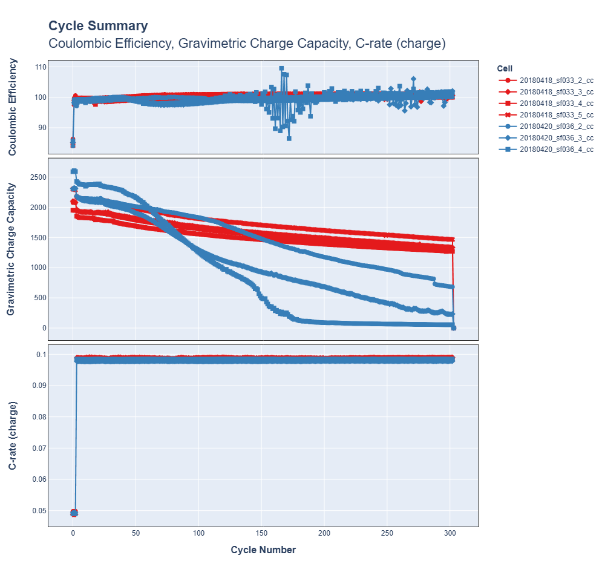
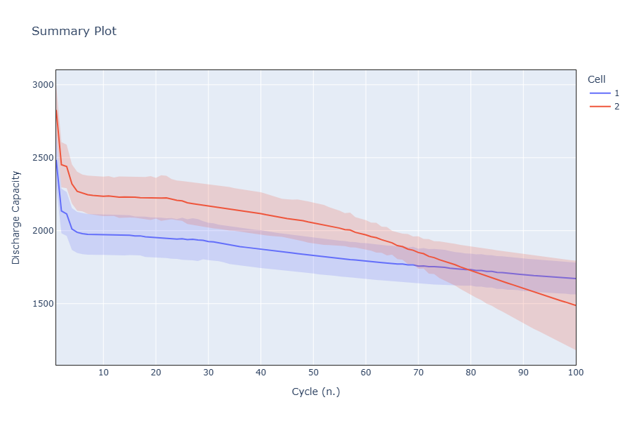
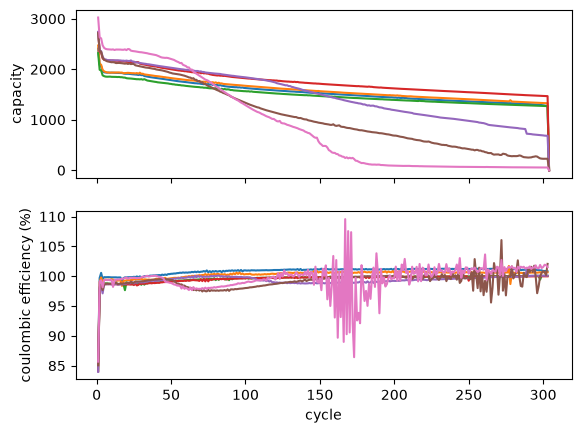
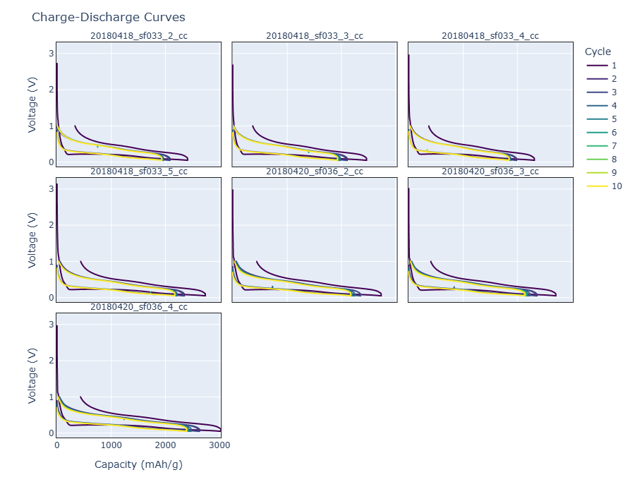
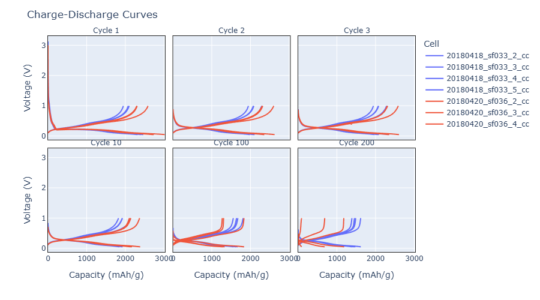
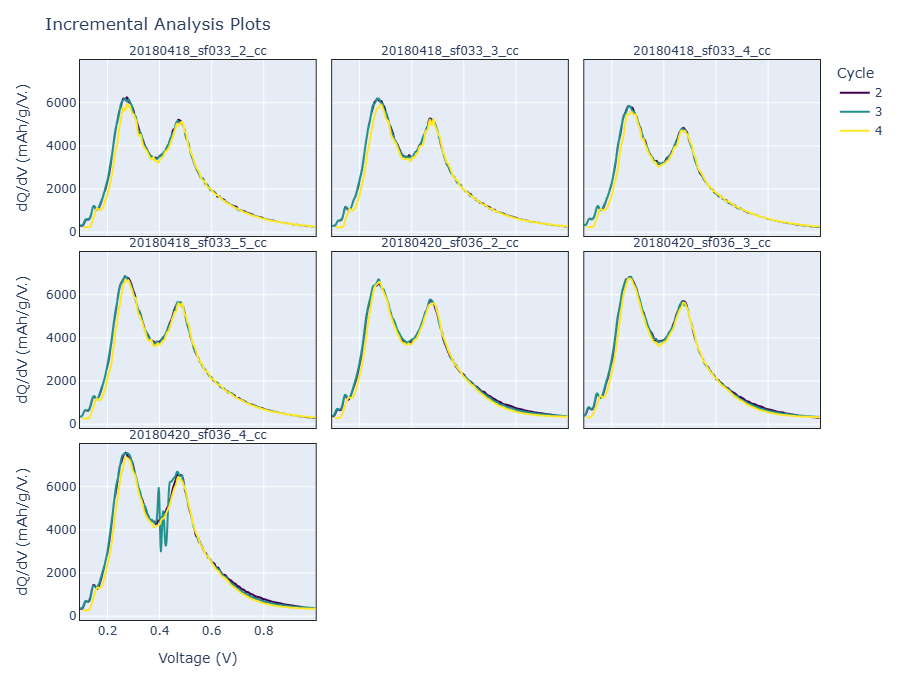
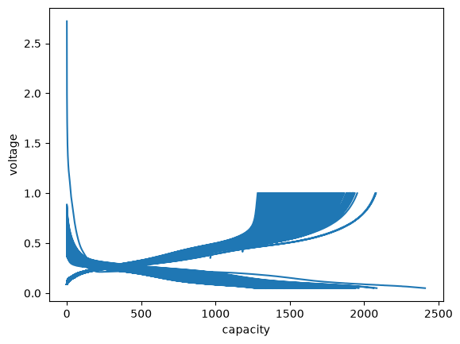
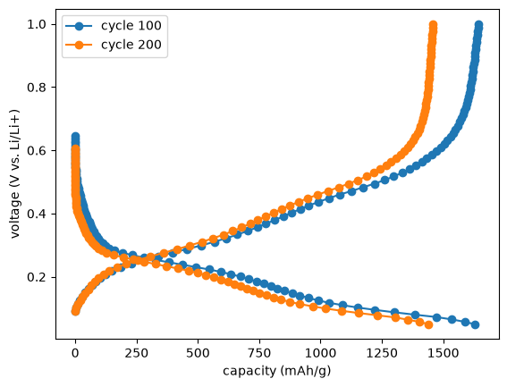

# Batch processing
The batch processing routines allow for convenient processing and comparison of multiple datasets simultaneously. These rely on a proper configuration of cellpy, including a properly working config file and a database file. A basic introduction on how to setup and use the batch processing routines is given here.

## Setting up things properly

### Make sure you have a properly working config file
For `cellpy` to find stuff, it needs to know where to look. Settings live in `cellpy.toml` and are reached at runtime through `cellpy.config` — see [Setup and configuration](../../getting_started/configuration.md).

!!! note "Coming from cellpy 1.x"

    The old `prms.Paths.<name>` API was removed in 2.x; use `cellpy.config.paths.<name>`
    instead, as shown below.

For more details on the config file, have a look at [Setup and configuration](../../getting_started/configuration.md).


### The database file
This notebook uses the `cellpy` `batch` utility. For it to work properly (or at all) you will have to provide it with a database. Currently, `cellpy` ships with a very simple database solution that hardly justifies its name as a database. It reads an excel-file where the first row acts as column headers, the second provides the type (*e.g.* string, bool, etc), and the rest provides the necessary information for each of the cells (one row pr. cell). You can of course choose to implement a database and a loader your self.

A sample excel file ("db-file") is provided within the [examples folder on GitHub](https://github.com/jepegit/cellpy/tree/master/examples/cellpy%20batch%20utility). You will need fill inn values manually, one row for each cell you want to load. Then you will have to put it in the database folder (as defined in your config file where it says `db_file:` in the `Paths`-section). The name of the file must also be the same as defined in the config-file (`db_filename:`, *i.e* `cellpy_db.xlsx` in the example config file snippet above).

When `cellpy` reads the file, it uses the batch column (see below) to select which rows (*i.e.* cells) to load. For example, if the "b01" batch column is the one you tell `cellpy` to use and you provide it with the name "casandras_experiment", it will only select the rows that has "casandras_experiment" in the "b01" column. You provide `cellpy` with the "lookup" name when you issue the `batch.init` command, for example:

```python
b = batch.init("paper01", "cool_project", batch_col="b01")
```

You must always have the columns colored green filled out. And make sure that the `id` column (the first one in the example xlsx file) has a unique integer for each row (it is used as a "key" when looking up stuff from the file).

### Filenames
Make sure that the names of your experiment-files (for example your .res files) are of the form `date_something_that_describes_the_cell.res` (this is the name-format supported at the moment).

## Loading batch data


```python
import numpy as np
import matplotlib.pyplot as plt
import plotly.express as px
from rich import print

import cellpy
import cellpy.config as config
from cellpy.utils import batch
from cellpy.collect import summary_collector, cycles_collector, ica_collector
```

Check and (if necessary) override some of the configuration parameters:


```python
config.paths.db_path = "."
config.paths.db_filename = "cellpy_db.xlsx"
config.paths.rawdatadir = "data/raw"
config.paths.cellpydatadir = "data/cellpyfiles"
config.paths.filelogdir = "out"
config.paths.notebookdir = "out"
config.paths.batchfiledir = "out"
config.paths.outdatadir = "out"
```

### Initialising the cellpy batch object
To create *Journal Pages*, appropriate names for the project and the experiment have to be set:


```python
project = "cool_project"
name = "paper01"
batch_col = "b01"
```


```python
print(" INITIALISATION OF BATCH ".center(80, "="))
b = batch.init(name, project, batch_col=batch_col)
```

    =========================== INITIALISATION OF BATCH ============================
    

Setting some parameters on automatic export of selected files:


```python
b.experiment.export_raw = False
b.experiment.export_cycles = False
b.experiment.export_ica = False
```

Load info from your database and write the corresponding journal pages:


```python
b.create_journal()
```


    Journal(name='paper01', project='cool_project', pages=shape: (7, 19)
    ┌─────────────┬──────────┬──────────┬────────────┬───┬───────┬────────────┬────────────┬───────────┐
    │ filename    ┆ argument ┆ mass     ┆ total_mass ┆ … ┆ group ┆ raw_file_n ┆ cellpy_fil ┆ sub_group │
    │ ---         ┆ ---      ┆ ---      ┆ ---        ┆   ┆ ---   ┆ ames       ┆ e_name     ┆ ---       │
    │ str         ┆ null     ┆ f64      ┆ f64        ┆   ┆ i64   ┆ ---        ┆ ---        ┆ i64       │
    │             ┆          ┆          ┆            ┆   ┆       ┆ list[str]  ┆ str        ┆           │
    ╞═════════════╪══════════╪══════════╪════════════╪═══╪═══════╪════════════╪════════════╪═══════════╡
    │ 20180418_sf ┆ null     ┆ 0.337149 ┆ 0.56       ┆ … ┆ 1     ┆ ["C:\scrip ┆ data\cellp ┆ 1         │
    │ 033_2_cc    ┆          ┆          ┆            ┆   ┆       ┆ ting\cellp ┆ yfiles\201 ┆           │
    │             ┆          ┆          ┆            ┆   ┆       ┆ y-workspac ┆ 80418_sf03 ┆           │
    │             ┆          ┆          ┆            ┆   ┆       ┆ …          ┆ …          ┆           │
    │ 20180418_sf ┆ null     ┆ 0.343169 ┆ 0.57       ┆ … ┆ 1     ┆ ["C:\scrip ┆ data\cellp ┆ 2         │
    │ 033_3_cc    ┆          ┆          ┆            ┆   ┆       ┆ ting\cellp ┆ yfiles\201 ┆           │
    │             ┆          ┆          ┆            ┆   ┆       ┆ y-workspac ┆ 80418_sf03 ┆           │
    │             ┆          ┆          ┆            ┆   ┆       ┆ …          ┆ …          ┆           │
    │ 20180418_sf ┆ null     ┆ 0.288984 ┆ 0.48       ┆ … ┆ 1     ┆ ["C:\scrip ┆ data\cellp ┆ 3         │
    │ 033_4_cc    ┆          ┆          ┆            ┆   ┆       ┆ ting\cellp ┆ yfiles\201 ┆           │
    │             ┆          ┆          ┆            ┆   ┆       ┆ y-workspac ┆ 80418_sf03 ┆           │
    │             ┆          ┆          ┆            ┆   ┆       ┆ …          ┆ …          ┆           │
    │ 20180418_sf ┆ null     ┆ 0.295005 ┆ 0.49       ┆ … ┆ 1     ┆ ["C:\scrip ┆ data\cellp ┆ 4         │
    │ 033_5_cc    ┆          ┆          ┆            ┆   ┆       ┆ ting\cellp ┆ yfiles\201 ┆           │
    │             ┆          ┆          ┆            ┆   ┆       ┆ y-workspac ┆ 80418_sf03 ┆           │
    │             ┆          ┆          ┆            ┆   ┆       ┆ …          ┆ …          ┆           │
    │ 20180420_sf ┆ null     ┆ 0.572383 ┆ 0.95       ┆ … ┆ 2     ┆ ["C:\scrip ┆ data\cellp ┆ 1         │
    │ 036_2_cc    ┆          ┆          ┆            ┆   ┆       ┆ ting\cellp ┆ yfiles\201 ┆           │
    │             ┆          ┆          ┆            ┆   ┆       ┆ y-workspac ┆ 80420_sf03 ┆           │
    │             ┆          ┆          ┆            ┆   ┆       ┆ …          ┆ …          ┆           │
    │ 20180420_sf ┆ null     ┆ 0.716985 ┆ 1.19       ┆ … ┆ 2     ┆ ["C:\scrip ┆ data\cellp ┆ 2         │
    │ 036_3_cc    ┆          ┆          ┆            ┆   ┆       ┆ ting\cellp ┆ yfiles\201 ┆           │
    │             ┆          ┆          ┆            ┆   ┆       ┆ y-workspac ┆ 80420_sf03 ┆           │
    │             ┆          ┆          ┆            ┆   ┆       ┆ …          ┆ …          ┆           │
    │ 20180420_sf ┆ null     ┆ 0.584433 ┆ 0.97       ┆ … ┆ 2     ┆ ["C:\scrip ┆ data\cellp ┆ 3         │
    │ 036_4_cc    ┆          ┆          ┆            ┆   ┆       ┆ ting\cellp ┆ yfiles\201 ┆           │
    │             ┆          ┆          ┆            ┆   ┆       ┆ y-workspac ┆ 80420_sf03 ┆           │
    │             ┆          ┆          ┆            ┆   ┆       ┆ …          ┆ …          ┆           │
    └─────────────┴──────────┴──────────┴────────────┴───┴───────┴────────────┴────────────┴───────────┘, session={'starred': None, 'bad_cells': None, 'bad_cycles': None, 'notes': None}, meta={'name': 'paper01', 'project': 'cool_project'})


Create the appropriate folders where cellpy will place the output files:


```python
b.paginate()
```


    (WindowsPath('C:/scripting/cellpy-workspace/cellpy/docs/examples/batch_utility'),
     WindowsPath('C:/scripting/cellpy-workspace/cellpy/docs/examples/batch_utility/dump'),
     WindowsPath('C:/scripting/cellpy-workspace/cellpy/docs/examples/batch_utility/dump/raw_data'))


Have a look at the resulting dataframe:


```python
b.pages
```


<div class="cellpy-dataframe">
<small>shape: (7, 19)</small><table border="1" class="dataframe"><thead><tr><th>filename</th><th>argument</th><th>mass</th><th>total_mass</th><th>nom_cap_specifics</th><th>file_name_indicator</th><th>loading</th><th>nom_cap</th><th>area</th><th>experiment</th><th>fixed</th><th>label</th><th>cell_type</th><th>instrument</th><th>comment</th><th>group</th><th>raw_file_names</th><th>cellpy_file_name</th><th>sub_group</th></tr><tr><td>str</td><td>null</td><td>f64</td><td>f64</td><td>null</td><td>str</td><td>f64</td><td>f64</td><td>f64</td><td>str</td><td>i64</td><td>str</td><td>str</td><td>str</td><td>str</td><td>i64</td><td>list[str]</td><td>str</td><td>i64</td></tr></thead><tbody><tr><td>&quot;20180418_sf033_2_cc&quot;</td><td>null</td><td>0.337149</td><td>0.56</td><td>null</td><td>&quot;20180418_sf033_2_cc&quot;</td><td>0.190787</td><td>3118.817466</td><td>1.767146</td><td>&quot;cycling&quot;</td><td>0</td><td>&quot;sf033_2&quot;</td><td>&quot;anode&quot;</td><td>&quot;arbin_res&quot;</td><td>&quot;SF12 Filter D micro-slurry&quot;</td><td>1</td><td>[&quot;C:\scripting\cellpy-workspace\cellpy\docs\examples\batch_utility\data\raw\20180418_sf033_2_cc_01.res&quot;]</td><td>&quot;data\cellpyfiles\20180418_sf03…</td><td>1</td></tr><tr><td>&quot;20180418_sf033_3_cc&quot;</td><td>null</td><td>0.343169</td><td>0.57</td><td>null</td><td>&quot;20180418_sf033_3_cc&quot;</td><td>0.194194</td><td>3118.817466</td><td>1.767146</td><td>&quot;cycling&quot;</td><td>0</td><td>&quot;sf033_3&quot;</td><td>&quot;anode&quot;</td><td>&quot;arbin_res&quot;</td><td>&quot;SF12 Filter D micro-slurry&quot;</td><td>1</td><td>[&quot;C:\scripting\cellpy-workspace\cellpy\docs\examples\batch_utility\data\raw\20180418_sf033_3_cc_01.res&quot;]</td><td>&quot;data\cellpyfiles\20180418_sf03…</td><td>2</td></tr><tr><td>&quot;20180418_sf033_4_cc&quot;</td><td>null</td><td>0.288984</td><td>0.48</td><td>null</td><td>&quot;20180418_sf033_4_cc&quot;</td><td>0.163532</td><td>3118.817466</td><td>1.767146</td><td>&quot;cycling&quot;</td><td>0</td><td>&quot;sf033_4&quot;</td><td>&quot;anode&quot;</td><td>&quot;arbin_res&quot;</td><td>&quot;SF12 Filter D micro-slurry&quot;</td><td>1</td><td>[&quot;C:\scripting\cellpy-workspace\cellpy\docs\examples\batch_utility\data\raw\20180418_sf033_4_cc_01.res&quot;]</td><td>&quot;data\cellpyfiles\20180418_sf03…</td><td>3</td></tr><tr><td>&quot;20180418_sf033_5_cc&quot;</td><td>null</td><td>0.295005</td><td>0.49</td><td>null</td><td>&quot;20180418_sf033_5_cc&quot;</td><td>0.166939</td><td>3118.817466</td><td>1.767146</td><td>&quot;cycling&quot;</td><td>0</td><td>&quot;sf033_5&quot;</td><td>&quot;anode&quot;</td><td>&quot;arbin_res&quot;</td><td>&quot;SF12 Filter D micro-slurry&quot;</td><td>1</td><td>[&quot;C:\scripting\cellpy-workspace\cellpy\docs\examples\batch_utility\data\raw\20180418_sf033_5_cc_01.res&quot;]</td><td>&quot;data\cellpyfiles\20180418_sf03…</td><td>4</td></tr><tr><td>&quot;20180420_sf036_2_cc&quot;</td><td>null</td><td>0.572383</td><td>0.95</td><td>null</td><td>&quot;20180420_sf036_2_cc&quot;</td><td>0.323902</td><td>3122.348698</td><td>1.767146</td><td>&quot;cycling&quot;</td><td>0</td><td>&quot;sf036_2&quot;</td><td>&quot;anode&quot;</td><td>&quot;arbin_res&quot;</td><td>&quot;SF12 Filter 1 micro-slurry&quot;</td><td>2</td><td>[&quot;C:\scripting\cellpy-workspace\cellpy\docs\examples\batch_utility\data\raw\20180420_sf036_2_cc_01.res&quot;]</td><td>&quot;data\cellpyfiles\20180420_sf03…</td><td>1</td></tr><tr><td>&quot;20180420_sf036_3_cc&quot;</td><td>null</td><td>0.716985</td><td>1.19</td><td>null</td><td>&quot;20180420_sf036_3_cc&quot;</td><td>0.40573</td><td>3122.348698</td><td>1.767146</td><td>&quot;cycling&quot;</td><td>0</td><td>&quot;sf036_3&quot;</td><td>&quot;anode&quot;</td><td>&quot;arbin_res&quot;</td><td>&quot;SF12 Filter 1 micro-slurry&quot;</td><td>2</td><td>[&quot;C:\scripting\cellpy-workspace\cellpy\docs\examples\batch_utility\data\raw\20180420_sf036_3_cc_01.res&quot;]</td><td>&quot;data\cellpyfiles\20180420_sf03…</td><td>2</td></tr><tr><td>&quot;20180420_sf036_4_cc&quot;</td><td>null</td><td>0.584433</td><td>0.97</td><td>null</td><td>&quot;20180420_sf036_4_cc&quot;</td><td>0.330721</td><td>3122.348698</td><td>1.767146</td><td>&quot;cycling&quot;</td><td>0</td><td>&quot;sf036_4&quot;</td><td>&quot;anode&quot;</td><td>&quot;arbin_res&quot;</td><td>&quot;SF12 Filter 1 micro-slurry&quot;</td><td>2</td><td>[&quot;C:\scripting\cellpy-workspace\cellpy\docs\examples\batch_utility\data\raw\20180420_sf036_4_cc_01.res&quot;]</td><td>&quot;data\cellpyfiles\20180420_sf03…</td><td>3</td></tr></tbody></table>
</div>


**Note:** You can of course also create this dataframe yourself without loading from the .xlsx database file.

### Loading data into the initialised batch object

Now that everything is set up `b.update()` loads the data (and exports the corresponding .csv-files if export_(raw/cycles/ica) = True). Depending on the size of your datafiles, this might take some time:


```python
b.update()
```


    BatchResult(results=[CellResult(label='20180418_sf033_2_cc', outcome=<CellOutcome.LOADED: 'loaded'>, cell=<CellpyCell> (id=0x221eaec9be0) [name=20180418_sf033_2_cc_01], source='raw', seconds=5.4500465000164695, error=None), CellResult(label='20180418_sf033_3_cc', outcome=<CellOutcome.LOADED: 'loaded'>, cell=<CellpyCell> (id=0x22252bd0830) [name=20180418_sf033_3_cc_01], source='raw', seconds=3.83964950000518, error=None), CellResult(label='20180418_sf033_4_cc', outcome=<CellOutcome.LOADED: 'loaded'>, cell=<CellpyCell> (id=0x22252bd1550) [name=20180418_sf033_4_cc_01], source='raw', seconds=3.574297299986938, error=None), CellResult(label='20180418_sf033_5_cc', outcome=<CellOutcome.LOADED: 'loaded'>, cell=<CellpyCell> (id=0x221ece58440) [name=20180418_sf033_5_cc_01], source='raw', seconds=4.090850799984764, error=None), CellResult(label='20180420_sf036_2_cc', outcome=<CellOutcome.LOADED: 'loaded'>, cell=<CellpyCell> (id=0x221ece58590) [name=20180420_sf036_2_cc_01], source='raw', seconds=4.030073800007813, error=None), CellResult(label='20180420_sf036_3_cc', outcome=<CellOutcome.LOADED: 'loaded'>, cell=<CellpyCell> (id=0x221ece58050) [name=20180420_sf036_3_cc_01], source='raw', seconds=3.3505931999825407, error=None), CellResult(label='20180420_sf036_4_cc', outcome=<CellOutcome.LOADED: 'loaded'>, cell=<CellpyCell> (id=0x221ece58830) [name=20180420_sf036_4_cc_01], source='raw', seconds=3.0614136999938637, error=None)])


## Exploring batch data

The `report()` method creates a report/summary on all the cells in your cellpy batch object:


```python
b.report()
```


<div class="cellpy-dataframe">
<small>shape: (7, 11)</small><table border="1" class="dataframe"><thead><tr><th>cell</th><th>empty</th><th>n_raw</th><th>n_steps</th><th>n_summary</th><th>n_cycles</th><th>max_cap</th><th>min_cap</th><th>avg_cap</th><th>std_cap</th><th>pass</th></tr><tr><td>str</td><td>bool</td><td>i64</td><td>i64</td><td>i64</td><td>i64</td><td>f64</td><td>f64</td><td>f64</td><td>f64</td><td>bool</td></tr></thead><tbody><tr><td>&quot;20180418_sf033_2_cc&quot;</td><td>false</td><td>160059</td><td>1578</td><td>304</td><td>304</td><td>2079.481739</td><td>0.0</td><td>1567.198001</td><td>209.150717</td><td>true</td></tr><tr><td>&quot;20180418_sf033_3_cc&quot;</td><td>false</td><td>160980</td><td>1587</td><td>304</td><td>304</td><td>2103.339517</td><td>0.0</td><td>1597.665927</td><td>205.046181</td><td>true</td></tr><tr><td>&quot;20180418_sf033_4_cc&quot;</td><td>false</td><td>155754</td><td>1567</td><td>304</td><td>304</td><td>1952.530597</td><td>0.0</td><td>1493.788287</td><td>189.297846</td><td>true</td></tr><tr><td>&quot;20180418_sf033_5_cc&quot;</td><td>false</td><td>169567</td><td>1588</td><td>304</td><td>304</td><td>2302.442797</td><td>0.0</td><td>1741.579324</td><td>227.149486</td><td>true</td></tr><tr><td>&quot;20180420_sf036_2_cc&quot;</td><td>false</td><td>157750</td><td>1586</td><td>304</td><td>304</td><td>2319.709751</td><td>0.0</td><td>1479.043916</td><td>474.42122</td><td>true</td></tr><tr><td>&quot;20180420_sf036_3_cc&quot;</td><td>false</td><td>134496</td><td>1571</td><td>304</td><td>304</td><td>2323.285459</td><td>0.0</td><td>1062.506245</td><td>622.550951</td><td>true</td></tr><tr><td>&quot;20180420_sf036_4_cc&quot;</td><td>false</td><td>128547</td><td>1561</td><td>304</td><td>304</td><td>2608.773865</td><td>0.0</td><td>880.014288</td><td>889.235451</td><td>true</td></tr></tbody></table>
</div>


To get a visual overview over all cells in your cellpy batch object, we can use the convenient `b.plot()` function. This plots the charge capacity, coulombic efficiency and resistance vs. cycle number. Setting `rate=True` adds a plot of C-rates.


```python
b.plot(rate=True)
```


    

    


## Working with batch objects
The *collectors* in `cellpy.collect` are meant to simplify plotting and exporting when working with batch objects: `summary_collector`, `cycles_collector` and `ica_collector` (plus `dva_collector`). Each returns a `Collection` that you inspect with `.plot()` and write out with `.save()`.

!!! note "Coming from cellpy 1.x / 2.0"

    The old `collectors.BatchSummaryCollector` / `BatchCyclesCollector` / `BatchICACollector`
    classes were retired in 2.1 and now raise `NotImplementedError`. The functions below
    replace them; `.show()` became `.plot()`. See the
    [collect API reference](../../api/collect.md).

### Summaries
`summary_collector` collects and shows summaries, including, e.g., the option to show statistical variations in the data (`spread=True`). Facet rows follow `columns=` top → bottom; default y-axis titles include units. `custom_group_labels=` is what the legend shows when `group_it=True`:


```python
group_labels = {1: "starts ok", 2: "starts best"}
discharge_cap_summaries_full = summary_collector(
    b,
    columns=("discharge_capacity_gravimetric",),
    max_cycle=100,
    group_it=True,
    custom_group_labels=group_labels,
)
discharge_cap_summaries_full.plot(spread=True, height=600)
```


    

    


These summaries can be saved for later:


```python
# discharge_cap_summaries_full.save(directory="out")
```

Summary data can also be accessed from `b.summaries`. This is a `polars` DataFrame in long (tidy) form — one row per cell and cycle — so pick columns explicitly and pivot to get one column per cell:


```python
discharge_capacity = b.summaries.pivot(
    values="discharge_capacity_gravimetric", index="cycle_num", on="cell"
)
coulombic_efficiency = b.summaries.pivot(
    values="coulombic_efficiency", index="cycle_num", on="cell"
)
discharge_capacity.head()
```


<div class="cellpy-dataframe">
<small>shape: (5, 8)</small><table border="1" class="dataframe"><thead><tr><th>cycle_num</th><th>20180418_sf033_2_cc</th><th>20180418_sf033_3_cc</th><th>20180418_sf033_4_cc</th><th>20180418_sf033_5_cc</th><th>20180420_sf036_2_cc</th><th>20180420_sf036_3_cc</th><th>20180420_sf036_4_cc</th></tr><tr><td>i64</td><td>f64</td><td>f64</td><td>f64</td><td>f64</td><td>f64</td><td>f64</td><td>f64</td></tr></thead><tbody><tr><td>1</td><td>2410.344052</td><td>2470.919948</td><td>2319.703848</td><td>2738.528722</td><td>2741.669006</td><td>2716.346428</td><td>3025.053861</td></tr><tr><td>2</td><td>2084.742948</td><td>2113.488897</td><td>1991.10792</td><td>2351.284743</td><td>2359.465284</td><td>2365.12461</td><td>2631.741818</td></tr><tr><td>3</td><td>2063.335009</td><td>2089.558613</td><td>1975.797964</td><td>2328.242558</td><td>2359.648097</td><td>2348.338226</td><td>2612.730491</td></tr><tr><td>4</td><td>1963.377783</td><td>1987.847841</td><td>1879.833318</td><td>2215.186859</td><td>2251.088259</td><td>2235.185286</td><td>2475.062489</td></tr><tr><td>5</td><td>1940.375824</td><td>1959.532358</td><td>1864.076532</td><td>2190.237154</td><td>2199.538629</td><td>2186.971316</td><td>2423.963912</td></tr></tbody></table>
</div>


and plotted using matplotlib (converting to pandas so the cycle number becomes the index):


```python
fig, (ax1, ax2) = plt.subplots(2, 1, sharex=True)
ax1.plot(discharge_capacity.to_pandas().set_index("cycle_num"))
ax1.set_ylabel("capacity")
ax2.plot(coulombic_efficiency.to_pandas().set_index("cycle_num"))
ax2.set_xlabel("cycle")
ax2.set_ylabel("coulombic efficiency (%)")
```


    Text(0, 0.5, 'coulombic efficiency (%)')


    

    


### Cycles
`cycles_collector` creates a collection of capacity plots, including several different options for customization. Two examples are shown here:


```python
cells_collected = cycles_collector(b, cycles=tuple(range(1, 11)))
cells_collected.plot()
```


    

    


```python
cycles_collected = cycles_collector(
    b,
    cycles=(1, 2, 3, 10, 100, 200),
    method="forth-and-forth",
)
cycles_collected.plot(layout="per_cycle")
```


    

    


### Incremental capacity analysis (ICA)
Similarly, `ica_collector` creates a collection of ICA (dQ/dV) plots:


```python
icas_collected = ica_collector(b, cycles=(2, 3, 4))
icas_collected.plot()
```


    

    


## Looking at individual cells in a batch
The batch object is in principle a collection of several CellpyCell objects. Those can of course be selected and looked at individually.

To check which cells are contained within your batch, you can simply print the cell names:


```python
cell_labels = b.experiment.cell_names
print(cell_labels)
```

    [
        '20180418_sf033_2_cc',
        '20180418_sf033_3_cc',
        '20180418_sf033_4_cc',
        '20180418_sf033_5_cc',
        '20180420_sf036_2_cc',
        '20180420_sf036_3_cc',
        '20180420_sf036_4_cc'
    ]
    

Select one cell to look at:


```python
label = cell_labels[0]
c = b.experiment.data[label]
```

Now that you have selected one cell, you can use all the standard cellpy routines available for CellpyCells, e.g. view the available info on this cell:


```python
# c
```

And use the `get_cap` method to extract and plot voltage curves:


```python
cap = c.get_cap(categorical_column=True, method="forth-and-forth")
cap.head(2)
```


<div class="cellpy-dataframe">
<table border="1" class="dataframe">
  <thead>
    <tr style="text-align: right;">
      <th></th>
      <th>potential</th>
      <th>capacity</th>
      <th>direction</th>
    </tr>
  </thead>
  <tbody>
    <tr>
      <th>266</th>
      <td>2.721604</td>
      <td>0.000054</td>
      <td>-1</td>
    </tr>
    <tr>
      <th>267</th>
      <td>2.708690</td>
      <td>0.002016</td>
      <td>-1</td>
    </tr>
  </tbody>
</table>
</div>


```python
fig, ax = plt.subplots()
ax.plot(cap.capacity, cap.potential)
ax.set_xlabel("capacity")
ax.set_ylabel("voltage");
```


    

    


Cleaning up the plot a bit...


```python
voltage_capacity_100 = c.get_cap(
    cycle=100, method="forth-and-forth", interpolated=True, number_of_points=80
)
voltage_capacity_200 = c.get_cap(
    cycle=200, method="forth-and-forth", interpolated=True, number_of_points=80
)

fig, ax = plt.subplots()
ax.set_xlabel(
    f"capacity ({c.cellpy_units.charge}/{c.cellpy_units.specific_gravimetric})"
)
ax.set_ylabel(f"voltage ({c.cellpy_units.voltage} vs. Li/Li+)")
ax.plot(
    voltage_capacity_100.capacity,
    voltage_capacity_100.potential,
    "o-",
    label="cycle 100",
)
ax.plot(
    voltage_capacity_200.capacity,
    voltage_capacity_200.potential,
    "o-",
    label="cycle 200",
)
ax.legend();
```


    

    


```python

```
