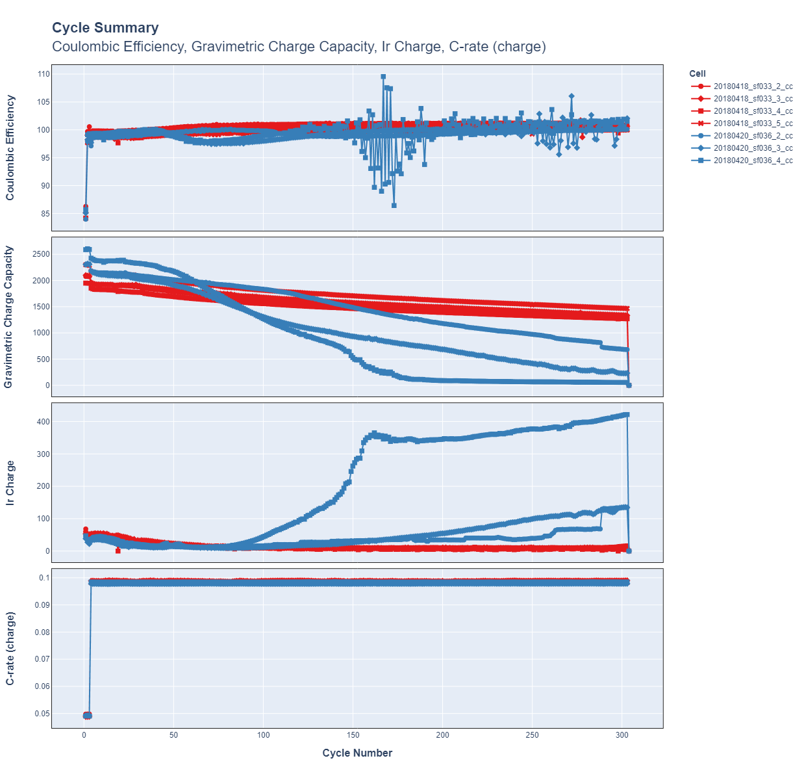
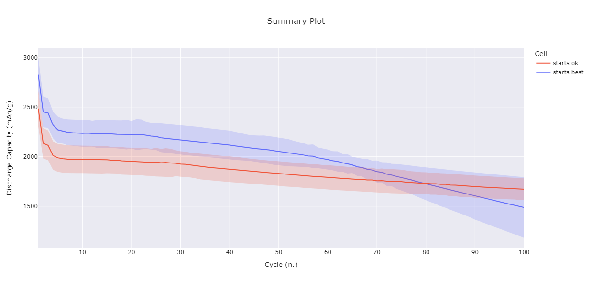
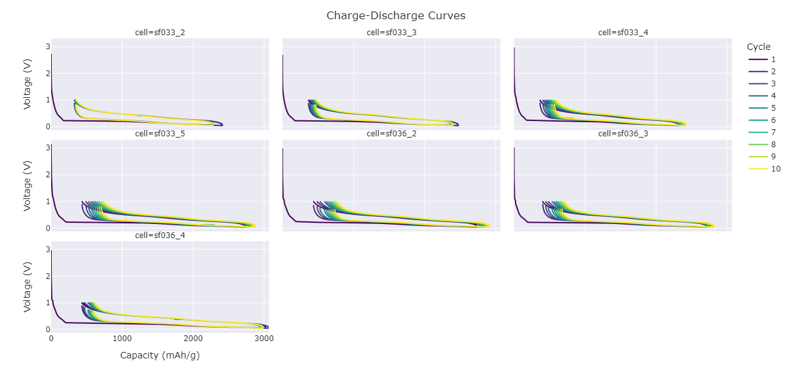
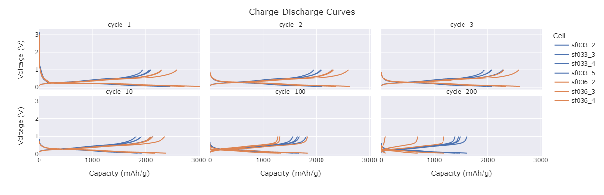
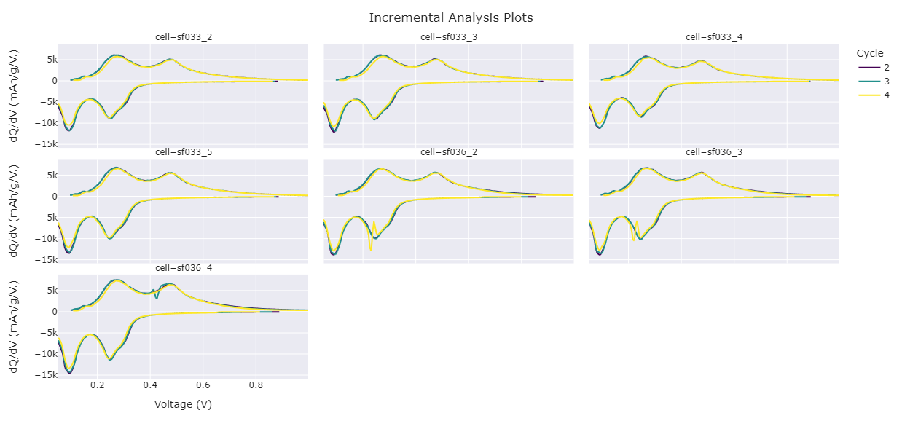

# Batch processing
The batch processing routines allow for convenient processing and comparison of multiple datasets simultaneously. These rely on a proper configuration of cellpy, including a properly working config file and a database file. A basic introduction on how to setup and use the batch processing routines is given here.

## Setting up things properly

### Make sure you have a properly working config file
For `cellpy` to find stuff, it needs to know where to look. Older installs used a `.cellpy_prms_username.conf` in the home directory and the `prms.Paths` API shown below. Prefer `cellpy.toml` and the 2.x config API — see [Setup and configuration](../../getting_started/configuration.md). The legacy names still work via the compatibility layer.

For more details on the config file, have a look at [Setup and configuration](../../getting_started/configuration.md).


### The database file
This notebook uses the `cellpy` `batch` utility. For it to work properly (or at all) you will have to provide it with a database. Currently, `cellpy` ships with a very simple database solution that hardly justifies its name as a database. It reads an excel-file where the first row acts as column headers, the second provides the type (*e.g.* string, bool, etc), and the rest provides the necessary information for each of the cells (one row pr. cell). You can of course choose to implement a database and a loader your self.

A sample excel file ("db-file") is provided within the [examples folder on GitHub](https://github.com/jepegit/cellpy/tree/master/examples/cellpy%20batch%20utility). You will need fill inn values manually, one row for each cell you want to load. Then you will have to put it in the database folder (as defined in your config file where it says `db_file:` in the `Paths`-section). The name of the file must also be the same as defined in the config-file (`db_filename:`, *i.e* `cellpy_db.xlsx` in the example config file snippet above).

When `cellpy` reads the file, it uses the batch column (see below) to select which rows (*i.e.* cells) to load. For example, if the "b01" batch column is the one you tell `cellpy` to use and you provide it with the name "casandras_experiment", it will only select the rows that has "casandras_experiment" in the "b01" column. You provide `cellpy` with the "lookup" name when you issue the `batch.init` command, for example:

```python
b = batch.init("paper01", "cool_project", batch_col="b01")
```

You must always have the columns colored green filled out. And make sure that the `id` column (the first one in the example xlsx file) has a unique integer for each row (it is used as a "key" when looking up stuff from the file).

### Filenames
Make sure that the names of your experiment-files (for example your .res files) are of the form `date_something_that_describes_the_cell.res` (this is the name-format supported at the moment).

## Loading batch data


```python
import numpy as np
import matplotlib.pyplot as plt
import plotly.express as px
from rich import print

import cellpy
from cellpy import prms
from cellpy import prmreader
from cellpy.utils import batch, collectors
```

Check and (if necessary) override some of the configuration parameters:


```python
prms.Paths.db_path = "."
prms.Paths.db_filename = "cellpy_db.xlsx"
prms.Paths.rawdatadir = "data/raw"
prms.Paths.cellpydatadir = "data/cellpyfiles"
prms.Paths.filelogdir = "out"
prms.Paths.notebookdir = "out"
prms.Paths.batchfiledir = "out"
prms.Paths.outdatadir = "out"
```

### Initialising the cellpy batch object
To create *Journal Pages*, appropriate names for the project and the experiment have to be set:


```python
project = "cool_project"
name = "paper01"
batch_col = "b01"
```


```python
print(" INITIALISATION OF BATCH ".center(80, "="))
b = batch.init(name, project, batch_col=batch_col)
```

    =========================== INITIALISATION OF BATCH ============================
    

Setting some parameters on automatic export of selected files:


```python
b.experiment.export_raw = False
b.experiment.export_cycles = False
b.experiment.export_ica = False
```

Load info from your database and write the corresponding journal pages:


```python
b.create_journal()
```

Create the appropriate folders where cellpy will place the output files:


```python
b.paginate()
```

Have a look at the resulting dataframe:


```python
b.pages
```


<div class="cellpy-dataframe">
<table border="1" class="dataframe">
  <thead>
    <tr style="text-align: right;">
      <th></th>
      <th>argument</th>
      <th>mass</th>
      <th>total_mass</th>
      <th>loading</th>
      <th>nom_cap</th>
      <th>area</th>
      <th>experiment</th>
      <th>fixed</th>
      <th>label</th>
      <th>cell_type</th>
      <th>instrument</th>
      <th>raw_file_names</th>
      <th>cellpy_file_name</th>
      <th>comment</th>
      <th>group</th>
      <th>sub_group</th>
    </tr>
    <tr>
      <th>filename</th>
      <th></th>
      <th></th>
      <th></th>
      <th></th>
      <th></th>
      <th></th>
      <th></th>
      <th></th>
      <th></th>
      <th></th>
      <th></th>
      <th></th>
      <th></th>
      <th></th>
      <th></th>
      <th></th>
    </tr>
  </thead>
  <tbody>
    <tr>
      <th>20180418_sf033_2_cc</th>
      <td>None</td>
      <td>0.337149</td>
      <td>0.56</td>
      <td>0.190787</td>
      <td>3118.817466</td>
      <td>1.767146</td>
      <td>cycling</td>
      <td>0</td>
      <td>sf033_2</td>
      <td>anode</td>
      <td>arbin_res</td>
      <td>[data/raw\20180418_sf033_2_cc_01.res]</td>
      <td>data/cellpyfiles/20180418_sf033_2_cc.h5</td>
      <td>SF12 Filter D micro-slurry</td>
      <td>1</td>
      <td>1</td>
    </tr>
    <tr>
      <th>20180418_sf033_3_cc</th>
      <td>None</td>
      <td>0.343169</td>
      <td>0.57</td>
      <td>0.194194</td>
      <td>3118.817466</td>
      <td>1.767146</td>
      <td>cycling</td>
      <td>0</td>
      <td>sf033_3</td>
      <td>anode</td>
      <td>arbin_res</td>
      <td>[data/raw\20180418_sf033_3_cc_01.res]</td>
      <td>data/cellpyfiles/20180418_sf033_3_cc.h5</td>
      <td>SF12 Filter D micro-slurry</td>
      <td>1</td>
      <td>2</td>
    </tr>
    <tr>
      <th>20180418_sf033_4_cc</th>
      <td>None</td>
      <td>0.288984</td>
      <td>0.48</td>
      <td>0.163532</td>
      <td>3118.817466</td>
      <td>1.767146</td>
      <td>cycling</td>
      <td>0</td>
      <td>sf033_4</td>
      <td>anode</td>
      <td>arbin_res</td>
      <td>[data/raw\20180418_sf033_4_cc_01.res]</td>
      <td>data/cellpyfiles/20180418_sf033_4_cc.h5</td>
      <td>SF12 Filter D micro-slurry</td>
      <td>1</td>
      <td>3</td>
    </tr>
    <tr>
      <th>20180418_sf033_5_cc</th>
      <td>None</td>
      <td>0.295005</td>
      <td>0.49</td>
      <td>0.166939</td>
      <td>3118.817466</td>
      <td>1.767146</td>
      <td>cycling</td>
      <td>0</td>
      <td>sf033_5</td>
      <td>anode</td>
      <td>arbin_res</td>
      <td>[data/raw\20180418_sf033_5_cc_01.res]</td>
      <td>data/cellpyfiles/20180418_sf033_5_cc.h5</td>
      <td>SF12 Filter D micro-slurry</td>
      <td>1</td>
      <td>4</td>
    </tr>
    <tr>
      <th>20180420_sf036_2_cc</th>
      <td>None</td>
      <td>0.572383</td>
      <td>0.95</td>
      <td>0.323902</td>
      <td>3122.348698</td>
      <td>1.767146</td>
      <td>cycling</td>
      <td>0</td>
      <td>sf036_2</td>
      <td>anode</td>
      <td>arbin_res</td>
      <td>[data/raw\20180420_sf036_2_cc_01.res]</td>
      <td>data/cellpyfiles/20180420_sf036_2_cc.h5</td>
      <td>SF12 Filter 1 micro-slurry</td>
      <td>2</td>
      <td>1</td>
    </tr>
    <tr>
      <th>20180420_sf036_3_cc</th>
      <td>None</td>
      <td>0.716985</td>
      <td>1.19</td>
      <td>0.405730</td>
      <td>3122.348698</td>
      <td>1.767146</td>
      <td>cycling</td>
      <td>0</td>
      <td>sf036_3</td>
      <td>anode</td>
      <td>arbin_res</td>
      <td>[data/raw\20180420_sf036_3_cc_01.res]</td>
      <td>data/cellpyfiles/20180420_sf036_3_cc.h5</td>
      <td>SF12 Filter 1 micro-slurry</td>
      <td>2</td>
      <td>2</td>
    </tr>
    <tr>
      <th>20180420_sf036_4_cc</th>
      <td>None</td>
      <td>0.584433</td>
      <td>0.97</td>
      <td>0.330721</td>
      <td>3122.348698</td>
      <td>1.767146</td>
      <td>cycling</td>
      <td>0</td>
      <td>sf036_4</td>
      <td>anode</td>
      <td>arbin_res</td>
      <td>[data/raw\20180420_sf036_4_cc_01.res]</td>
      <td>data/cellpyfiles/20180420_sf036_4_cc.h5</td>
      <td>SF12 Filter 1 micro-slurry</td>
      <td>2</td>
      <td>3</td>
    </tr>
  </tbody>
</table>
</div>


**Note:** You can of course also create this dataframe yourself without loading from the .xlsx database file.

### Loading data into the initialised batch object

Now that everything is set up `b.update()` loads the data (and exports the corresponding .csv-files if export_(raw/cycles/ica) = True). Depending on the size of your datafiles, this might take some time:


```python
b.update()
```

      0%|          | 0/7 [00:00<?, ?it/s]
    

## Exploring batch data

The `report()` method creates a report/summary on all the cells in your cellpy batch object:


```python
b.report()
```


<div class="cellpy-dataframe">
<table id="T_7d5d5">
  <thead>
    <tr>
      <th class="blank level0" >&nbsp;</th>
      <th id="T_7d5d5_level0_col0" class="col_heading level0 col0" >mass</th>
      <th id="T_7d5d5_level0_col1" class="col_heading level0 col1" >total_mass</th>
      <th id="T_7d5d5_level0_col2" class="col_heading level0 col2" >loading</th>
      <th id="T_7d5d5_level0_col3" class="col_heading level0 col3" >nom_cap</th>
      <th id="T_7d5d5_level0_col4" class="col_heading level0 col4" >empty</th>
      <th id="T_7d5d5_level0_col5" class="col_heading level0 col5" >raw_rows</th>
      <th id="T_7d5d5_level0_col6" class="col_heading level0 col6" >steps_rows</th>
      <th id="T_7d5d5_level0_col7" class="col_heading level0 col7" >summary_rows</th>
      <th id="T_7d5d5_level0_col8" class="col_heading level0 col8" >last_cycle</th>
      <th id="T_7d5d5_level0_col9" class="col_heading level0 col9" >average_capacity</th>
      <th id="T_7d5d5_level0_col10" class="col_heading level0 col10" >max_capacity</th>
      <th id="T_7d5d5_level0_col11" class="col_heading level0 col11" >min_capacity</th>
      <th id="T_7d5d5_level0_col12" class="col_heading level0 col12" >std_capacity</th>
    </tr>
    <tr>
      <th class="index_name level0" >filename</th>
      <th class="blank col0" >&nbsp;</th>
      <th class="blank col1" >&nbsp;</th>
      <th class="blank col2" >&nbsp;</th>
      <th class="blank col3" >&nbsp;</th>
      <th class="blank col4" >&nbsp;</th>
      <th class="blank col5" >&nbsp;</th>
      <th class="blank col6" >&nbsp;</th>
      <th class="blank col7" >&nbsp;</th>
      <th class="blank col8" >&nbsp;</th>
      <th class="blank col9" >&nbsp;</th>
      <th class="blank col10" >&nbsp;</th>
      <th class="blank col11" >&nbsp;</th>
      <th class="blank col12" >&nbsp;</th>
    </tr>
  </thead>
  <tbody>
    <tr>
      <th id="T_7d5d5_level0_row0" class="row_heading level0 row0" >20180418_sf033_2_cc</th>
      <td id="T_7d5d5_row0_col0" class="data row0 col0" >0.337149</td>
      <td id="T_7d5d5_row0_col1" class="data row0 col1" >0.560000</td>
      <td id="T_7d5d5_row0_col2" class="data row0 col2" >0.190787</td>
      <td id="T_7d5d5_row0_col3" class="data row0 col3" >3118.817466</td>
      <td id="T_7d5d5_row0_col4" class="data row0 col4" >False</td>
      <td id="T_7d5d5_row0_col5" class="data row0 col5" >160059</td>
      <td id="T_7d5d5_row0_col6" class="data row0 col6" >1578</td>
      <td id="T_7d5d5_row0_col7" class="data row0 col7" >304</td>
      <td id="T_7d5d5_row0_col8" class="data row0 col8" >304</td>
      <td id="T_7d5d5_row0_col9" class="data row0 col9" >1567.198001</td>
      <td id="T_7d5d5_row0_col10" class="data row0 col10" >2079.481739</td>
      <td id="T_7d5d5_row0_col11" class="data row0 col11" >0.000000</td>
      <td id="T_7d5d5_row0_col12" class="data row0 col12" >209.150717</td>
    </tr>
    <tr>
      <th id="T_7d5d5_level0_row1" class="row_heading level0 row1" >20180418_sf033_3_cc</th>
      <td id="T_7d5d5_row1_col0" class="data row1 col0" >0.343169</td>
      <td id="T_7d5d5_row1_col1" class="data row1 col1" >0.570000</td>
      <td id="T_7d5d5_row1_col2" class="data row1 col2" >0.194194</td>
      <td id="T_7d5d5_row1_col3" class="data row1 col3" >3118.817466</td>
      <td id="T_7d5d5_row1_col4" class="data row1 col4" >False</td>
      <td id="T_7d5d5_row1_col5" class="data row1 col5" >160980</td>
      <td id="T_7d5d5_row1_col6" class="data row1 col6" >1587</td>
      <td id="T_7d5d5_row1_col7" class="data row1 col7" >304</td>
      <td id="T_7d5d5_row1_col8" class="data row1 col8" >304</td>
      <td id="T_7d5d5_row1_col9" class="data row1 col9" >1597.665927</td>
      <td id="T_7d5d5_row1_col10" class="data row1 col10" >2103.339517</td>
      <td id="T_7d5d5_row1_col11" class="data row1 col11" >0.000000</td>
      <td id="T_7d5d5_row1_col12" class="data row1 col12" >205.046181</td>
    </tr>
    <tr>
      <th id="T_7d5d5_level0_row2" class="row_heading level0 row2" >20180418_sf033_4_cc</th>
      <td id="T_7d5d5_row2_col0" class="data row2 col0" >0.288984</td>
      <td id="T_7d5d5_row2_col1" class="data row2 col1" >0.480000</td>
      <td id="T_7d5d5_row2_col2" class="data row2 col2" >0.163532</td>
      <td id="T_7d5d5_row2_col3" class="data row2 col3" >3118.817466</td>
      <td id="T_7d5d5_row2_col4" class="data row2 col4" >False</td>
      <td id="T_7d5d5_row2_col5" class="data row2 col5" >155754</td>
      <td id="T_7d5d5_row2_col6" class="data row2 col6" >1567</td>
      <td id="T_7d5d5_row2_col7" class="data row2 col7" >304</td>
      <td id="T_7d5d5_row2_col8" class="data row2 col8" >304</td>
      <td id="T_7d5d5_row2_col9" class="data row2 col9" >1493.788287</td>
      <td id="T_7d5d5_row2_col10" class="data row2 col10" >1952.530597</td>
      <td id="T_7d5d5_row2_col11" class="data row2 col11" >0.000000</td>
      <td id="T_7d5d5_row2_col12" class="data row2 col12" >189.297846</td>
    </tr>
    <tr>
      <th id="T_7d5d5_level0_row3" class="row_heading level0 row3" >20180418_sf033_5_cc</th>
      <td id="T_7d5d5_row3_col0" class="data row3 col0" >0.295005</td>
      <td id="T_7d5d5_row3_col1" class="data row3 col1" >0.490000</td>
      <td id="T_7d5d5_row3_col2" class="data row3 col2" >0.166939</td>
      <td id="T_7d5d5_row3_col3" class="data row3 col3" >3118.817466</td>
      <td id="T_7d5d5_row3_col4" class="data row3 col4" >False</td>
      <td id="T_7d5d5_row3_col5" class="data row3 col5" >169567</td>
      <td id="T_7d5d5_row3_col6" class="data row3 col6" >1588</td>
      <td id="T_7d5d5_row3_col7" class="data row3 col7" >304</td>
      <td id="T_7d5d5_row3_col8" class="data row3 col8" >304</td>
      <td id="T_7d5d5_row3_col9" class="data row3 col9" >1741.579324</td>
      <td id="T_7d5d5_row3_col10" class="data row3 col10" >2302.442797</td>
      <td id="T_7d5d5_row3_col11" class="data row3 col11" >0.000000</td>
      <td id="T_7d5d5_row3_col12" class="data row3 col12" >227.149486</td>
    </tr>
    <tr>
      <th id="T_7d5d5_level0_row4" class="row_heading level0 row4" >20180420_sf036_2_cc</th>
      <td id="T_7d5d5_row4_col0" class="data row4 col0" >0.572383</td>
      <td id="T_7d5d5_row4_col1" class="data row4 col1" >0.950000</td>
      <td id="T_7d5d5_row4_col2" class="data row4 col2" >0.323902</td>
      <td id="T_7d5d5_row4_col3" class="data row4 col3" >3122.348698</td>
      <td id="T_7d5d5_row4_col4" class="data row4 col4" >False</td>
      <td id="T_7d5d5_row4_col5" class="data row4 col5" >157750</td>
      <td id="T_7d5d5_row4_col6" class="data row4 col6" >1586</td>
      <td id="T_7d5d5_row4_col7" class="data row4 col7" >304</td>
      <td id="T_7d5d5_row4_col8" class="data row4 col8" >304</td>
      <td id="T_7d5d5_row4_col9" class="data row4 col9" >1479.043916</td>
      <td id="T_7d5d5_row4_col10" class="data row4 col10" >2319.709751</td>
      <td id="T_7d5d5_row4_col11" class="data row4 col11" >0.000000</td>
      <td id="T_7d5d5_row4_col12" class="data row4 col12" >474.421220</td>
    </tr>
    <tr>
      <th id="T_7d5d5_level0_row5" class="row_heading level0 row5" >20180420_sf036_3_cc</th>
      <td id="T_7d5d5_row5_col0" class="data row5 col0" >0.716985</td>
      <td id="T_7d5d5_row5_col1" class="data row5 col1" >1.190000</td>
      <td id="T_7d5d5_row5_col2" class="data row5 col2" >0.405730</td>
      <td id="T_7d5d5_row5_col3" class="data row5 col3" >3122.348698</td>
      <td id="T_7d5d5_row5_col4" class="data row5 col4" >False</td>
      <td id="T_7d5d5_row5_col5" class="data row5 col5" >134496</td>
      <td id="T_7d5d5_row5_col6" class="data row5 col6" >1571</td>
      <td id="T_7d5d5_row5_col7" class="data row5 col7" >304</td>
      <td id="T_7d5d5_row5_col8" class="data row5 col8" >304</td>
      <td id="T_7d5d5_row5_col9" class="data row5 col9" >1062.506245</td>
      <td id="T_7d5d5_row5_col10" class="data row5 col10" >2323.285459</td>
      <td id="T_7d5d5_row5_col11" class="data row5 col11" >0.000000</td>
      <td id="T_7d5d5_row5_col12" class="data row5 col12" >622.550951</td>
    </tr>
    <tr>
      <th id="T_7d5d5_level0_row6" class="row_heading level0 row6" >20180420_sf036_4_cc</th>
      <td id="T_7d5d5_row6_col0" class="data row6 col0" >0.584433</td>
      <td id="T_7d5d5_row6_col1" class="data row6 col1" >0.970000</td>
      <td id="T_7d5d5_row6_col2" class="data row6 col2" >0.330721</td>
      <td id="T_7d5d5_row6_col3" class="data row6 col3" >3122.348698</td>
      <td id="T_7d5d5_row6_col4" class="data row6 col4" >False</td>
      <td id="T_7d5d5_row6_col5" class="data row6 col5" >128547</td>
      <td id="T_7d5d5_row6_col6" class="data row6 col6" >1561</td>
      <td id="T_7d5d5_row6_col7" class="data row6 col7" >304</td>
      <td id="T_7d5d5_row6_col8" class="data row6 col8" >304</td>
      <td id="T_7d5d5_row6_col9" class="data row6 col9" >880.014288</td>
      <td id="T_7d5d5_row6_col10" class="data row6 col10" >2608.773865</td>
      <td id="T_7d5d5_row6_col11" class="data row6 col11" >0.000000</td>
      <td id="T_7d5d5_row6_col12" class="data row6 col12" >889.235451</td>
    </tr>
  </tbody>
</table>
</div>


To get a visual overview over all cells in your cellpy batch object, we can use the convenient `b.plot()` function. This plots the charge capacity, coulombic efficiency and resistance vs. cycle number. Setting `rate=True` adds a plot of C-rates.


```python
b.plot(rate=True)
```


    

    


## Working with batch objects
The implemented *Collectors* are meant to simplify plotting and exporting when working with batch objects. Available collectors include the `BatchSummaryCollector`, the `BatchCycleCollector` and the `BatchICACollector`.

### Summaries
The `BatchSummaryCollector` class collects and shows sumaries, including, e.g., the option to show statistical variations in the data (`spread=True`):


```python
group_labels = {1: "starts ok", 2: "starts best"}
discharge_cap_summaries_full = collectors.BatchSummaryCollector(
    b,
    columns=["discharge_capacity_gravimetric"],
    max_cycle=100,
    group_it=True,
    data_collector_arguments=dict(custom_group_labels=group_labels),
    spread=True,
    height=600,
)
discharge_cap_summaries_full.show()
```

    figure name: paper01_collected_summaries_discharge_capacity_gravimetric_average
    


    

    


These summaries can be saved for later:


```python
# discharge_cap_summaries_full.save(serial_number=1)
```

Summary data can also be accessed from `b.summaries`:


```python
discharge_capacity = b.summaries.discharge_capacity_gravimetric
charge_capacity = b.summaries.charge_capacity_gravimetric
coulombic_efficiency = b.summaries.coulombic_efficiency
ir_charge = b.summaries.ir_charge
```

and ploted using matplotlib:


```python
fig, (ax1, ax2) = plt.subplots(2, 1)
ax1.plot(discharge_capacity)
ax1.set_ylabel("capacity ")
ax2.plot(ir_charge)
ax2.set_xlabel("cycle")
ax2.set_ylabel("resistance")
```


    Text(0, 0.5, 'resistance')


    

    


### Cycles
The `BatchCyclesCollector` class creates a collection of capacity plots, including several different options for customization. Two examples are shown here:


```python
cells_collected = collectors.BatchCyclesCollector(b, max_cycle=10)
cells_collected.show()
```

    figure name: paper01_collected_cycles_intp_p100_bf_pr_cell
    


    

    


```python
cycles_collected = collectors.BatchCyclesCollector(
    b,
    cycles=[1, 2, 3, 10, 100, 200],
    collector_type="forth-and-forth",
    plot_type="fig_pr_cycle",
)
cycles_collected.show()
```

    figure name: paper01_collected_cycles_intp_p100_ff_pr_cyc
    


    

    


### Incremental capacity analysis (ICA)
Similarly, the `BatchICACollector` creates a collection of ICA (dQ/dV) plots:


```python
icas_collected = collectors.BatchICACollector(b, cycles=[2, 3, 4])
icas_collected.show()
```

    figure name: paper01_collected_ica_pr_cell
    


    

    


## Looking at individual cells in a batch
The batch object is in principle a collection of several CellpyCell objects. Those can of course be selected and looked at individually.

To check which cells are contained within your batch, you can simply print the cell names:


```python
cell_labels = b.experiment.cell_names
print(cell_labels)
```

    [
        '20180418_sf033_2_cc',
        '20180418_sf033_3_cc',
        '20180418_sf033_4_cc',
        '20180418_sf033_5_cc',
        '20180420_sf036_2_cc',
        '20180420_sf036_3_cc',
        '20180420_sf036_4_cc'
    ]
    

Select one cell to look at:


```python
label = cell_labels[0]
c = b.experiment.data[label]
```

Now that you have selected one cell, you can use all the standard cellpy routines available for CellpyCells, e.g. view the available info on this cell:


```python
# c
```

And use the `get_cap` method to extract and plot voltage curves:


```python
cap = c.get_cap(categorical_column=True, method="forth-and-forth")
cap.head(2)
```


<div class="cellpy-dataframe">
<table border="1" class="dataframe">
  <thead>
    <tr style="text-align: right;">
      <th></th>
      <th>voltage</th>
      <th>capacity</th>
      <th>direction</th>
    </tr>
  </thead>
  <tbody>
    <tr>
      <th>267</th>
      <td>2.721604</td>
      <td>0.000054</td>
      <td>-1</td>
    </tr>
    <tr>
      <th>268</th>
      <td>2.708690</td>
      <td>0.002016</td>
      <td>-1</td>
    </tr>
  </tbody>
</table>
</div>


```python
fig, ax = plt.subplots()
ax.plot(cap.capacity, cap.voltage)
ax.set_xlabel("capacity")
ax.set_ylabel("voltage");
```


    

    


Cleaning up the plot a bit...


```python
voltage_capacity_100 = c.get_cap(
    cycle=100, method="forth-and-forth", interpolated=True, number_of_points=80
)
voltage_capacity_200 = c.get_cap(
    cycle=200, method="forth-and-forth", interpolated=True, number_of_points=80
)

fig, ax = plt.subplots()
ax.set_xlabel(
    f"capacity ({c.cellpy_units.charge}/{c.cellpy_units.specific_gravimetric})"
)
ax.set_ylabel(f"voltage ({c.cellpy_units.voltage} vs. Li/Li+)")
ax.plot(
    voltage_capacity_100.capacity, voltage_capacity_100.voltage, "o-", label="cycle 100"
)
ax.plot(
    voltage_capacity_200.capacity, voltage_capacity_200.voltage, "o-", label="cycle 200"
)
ax.legend();
```


    

    


```python

```
