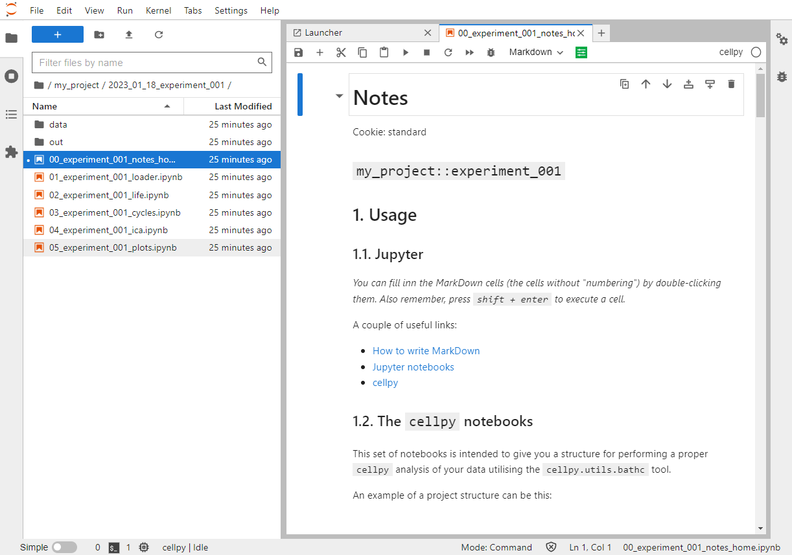

# The `cellpy` templating system

Often the steps you have to go through when analysing your cells are a bit repetetive. To help facilitate a smoother workflow, `cellpy` provides a templating system using `cookiecutter` in the background.
The publicly available templates are located in a repository on github (https://github.com/jepegit/cellpy_cookies).

## How to start a session and set-up a project using a template

In a command window / shell in the python or conda environment where `cellpy` is installed, write:

```bash
> cellpy new
```

`cellpy` will then list all the directories ("projects") in your project directory (typically called "out") and you must choose one of them (write one of the numbers, or go for the default):

```bash
Template: standard
Select project folder:
1 - [create new dir]
2 - Internal
3 - SuperBatteries
4 - AmazingCell
5 - MoZEES
6 - SIMBA
7 - LongLife
8 - MoreIsLess
9 - MoZEES
Choose from 1, 2, 3, 4, 5, 6, 7, 8, 9 [1]:
``` 

If you press enter without writing a number, it will select the default, whatever is written in the square brackets. The projects listed will be different for you than it is here. If this is the first time using `cellpy`, most likely only the option `1` exists.

For example, if we would like to look at some cells belonging the the MoreIsLess project, we write `8` and press Enter. Next  `cellpy` needs you to confirm that the project name is correct (shown in square brackets) by pressing Enter again. If you want to change the name, you can also give it here.

```bash
Choose from 1, 2, 3, 4, 5, 6, 7, 8, 9 [1]: 8 ⏎
project_name [MoreIsLess]:
```

However, in this example we will chose to create a new directory ("project") by selecting the default (by just pressing enter).

```bash
Choose from 1, 2, 3, 4, 5, 6, 7, 8, 9 [1]: ⏎
New name [cellpy_project]:
```

Write `my_project` and press Enter. Confirm the project name by pressing Enter once more:

```bash

New name [cellpy_project]: my_project ⏎
created my_project
project_name [my_project]: ⏎
```

Next we need to provide a session id (for example the batch name used in your db). Here we chose to call it `experiment_001`:

```bash
session_id: experiment_001 ⏎
```

`cellpy` then asks you to confirm the version of `cellpy` you are using (not all templates works with all versions), author name (your user name most likely), and date. Accept all by pressing Enter for each item.

```bash
cellpy_version [1.0.0a]: ⏎
author_name [jepe]: ⏎
date [2023-01-18]: ⏎
```


Next `cellpy` will suggest a name for the directory / folder that the template will create, as well as the "core" name of the notebook(s) (or script). Once again, confirm the by pressing Enter:

```bash
experiment_folder_name [2023_01_18_experiment_001]: ⏎
notebook_name [experiment_001]: ⏎
```

Under the hood, `cellpy` uses `cookiecutter` to download and create the structure from the template:

```bash
   Cellpy Cookie says: 'using cookie from the cellpy_cookies repository'
   Cellpy Cookie says: 'setting up project in the following directory: C:\cellpy_data\notebooks\my_project\2023_01_18_experiment_001'
created:
2023_01_18_experiment_001/
    00_experiment_001_notes_home.ipynb
    01_experiment_001_loader.ipynb
    02_experiment_001_life.ipynb
    03_experiment_001_cycles.ipynb
    04_experiment_001_ica.ipynb
    05_experiment_001_plots.ipynb
    data/
        external/
        interim/
        processed/
        raw/
    out/
        note.md
```


Congratulations - you have succesfully created a directory structure and several `jupyter` notebooks you can use for processing your cell data!

## Run the notebooks

Start `jupyter` (either jupyter notebook or jupyterlab). If you want, there exists a `cellpy` command for this as well. The benefit is that it starts up the `jupyter` server in the correct directory. Obviously, this will not work if you dont have `jupyter` properly installed.

In a command window / shell in the python or conda environment where `cellpy` is installed, write:

```bash
> cellpy serve -l  ⏎
```

The `-l` option means that you want to run `jupyterlab`. You can also tell `cellpy` to automatically start `jupyter` after it has finished populating stuff from the template by issuing the `-s` option when you run the `new` sub-command.

Hopefully you will see something like this:



## More in-depth on the templating system

Get some help:

```bash

> cellpy new --help  ⏎


Usage: cellpy new [OPTIONS]

  Set up a batch experiment (might need git installed).

Options:
  -t, --template TEXT        Provide template name.
  -d, --directory TEXT       Create in custom directory.
  -p, --project TEXT         Provide project name (i.e. sub-directory name).
  -e, --experiment TEXT      Provide experiment name (i.e. lookup-value).
  -u, --local-user-template  Use local template from the templates directory.
  -s, --serve                Run Jupyter.
  -r, --run                  Use PaperMill to run the notebook(s) from the
                             template (will only work properly if the
                             notebooks can be sorted in correct run-order by
                             'sorted'.
  -j, --lab                  Use Jupyter Lab instead of Notebook when serving.
  -l, --list                 List available templates and exit.
  --help                     Show this message and exit.
  
```

Assume you have the following inside your templates folder (cellpy_data\templates):

```bash

> ls  ⏎
cellpy_cookie_advanced.zip  cellpy_cookie_easy.zip  cellpy_cookie_pytorch.zip  just_a_regular_zipped_folder.zip

```

You can list the available templates using the `--list` option:

```bash

> cellpy new --list

[cellpy] batch templates
[cellpy] - default: standard
[cellpy] - registered templates (on github):
                standard           ('https://github.com/jepegit/cellpy_cookies.git', 'standard')
                ife                ('https://github.com/jepegit/cellpy_cookies.git', 'ife')
[cellpy] - local templates (C:\cellpy_data\templates):
                advanced           ('C:\\cellpy_data\\templates\\cellpy_cookie_advanced.zip', None)
                easy               ('C:\\cellpy_data\\templates\\cellpy_cookie_easy.zip', None)
                pytorch            ('C:\\cellpy_data\\templates\\cellpy_cookie_pytorch.zip', None)

```

Your local templates needs to adhere to the following structure:

- it must be in a zipped file (.zip)
- the zip-file needs to start with "cellpy_cookie" and contain one top level folder with the same name
- the top folder can not contain several templates
- you need a cookiecutter configuration file (you can copy-paste from the github repository to get a starting point for editing)
- you will also need the "hooks" folder with the "post_gen_project.py" and the "pre_gen_project.py" files (copy-paste them from the github repository and modify if needed)
- `cookiecutter` variables are enclosed in double curly brackets


Here is an example (content of the zip file "cellpy_cookie_standard.zip"):

```bash
└───cellpy_cookie_standard
     │   cookiecutter.json
     │
     ├───hooks
     │       post_gen_project.py
     │       pre_gen_project.py
     │
     └───{{cookiecutter.experiment_folder_name}}
         │   00_{{cookiecutter.notebook_name}}_notes.ipynb
         │   01_{{cookiecutter.notebook_name}}_loader.ipynb
         │   02_{{cookiecutter.notebook_name}}_life.ipynb
         │   03_{{cookiecutter.notebook_name}}_cycles.ipynb
         │   04_{{cookiecutter.notebook_name}}_ica.ipynb
         │   05_{{cookiecutter.notebook_name}}_plots.ipynb
         │
         ├───data
         │   ├───external
         │   │
         │   ├───interim
         │   │
         │   ├───processed
         │   │
         │   └───raw
         │
         └───out
                 note.md
    
```

## Example template

You can find an example template in the `cellpy` examples folder on GitHub 

```

https://github.com/jepegit/cellpy/tree/master/examples/cellpy%20project%20template

```


### Hint

To download a folder from GitHub, navigate to your desired repository, select the folder you want to download from GitHub, copy the URL, navigate to [GitHub Downloader](https://download-directory.github.io/) and paste the URL into the text box, and hit enter .

### Note
For the temlates located on GitHub (non-local) an additional folder level is added.
