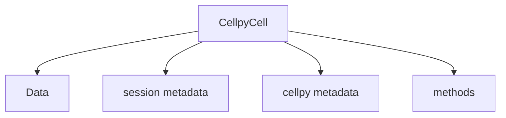
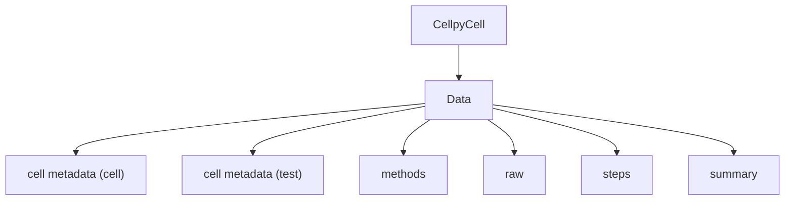

# Data structure

The most important file formats and data structures for cellpy are
summarized here. It is also possible to look into the source-code at the
repository <https://github.com/jepegit/cellpy>.

## CellpyCell - main structure

The **CellpyCell** is the main work-horse for cellpy, containing
all the data, stored in the **Data** object, as well as all the functions
for reading, selecting, and tweaking your data.
It also contains the header definitions, both for the cellpy HDF5 format,
and for the various cell-tester file-formats that can be read. The class
can contain several tests and each test is stored in a list. The class also
contains several attributes that can be assigned directly.



## Methods

The **CellpyCell** object contains lots of methods for manipulating, extracting
and summarising the data from the run(s).
The following two methods are typically automatically run upon loading your data using
`cellpy.get(filename)` and thereby creating your **CellpyCell** object:

> - `make_step_table`: creates a statistical summary of all the steps in the run(s) and categorizes
>   the step type from that. It is also possible to give the step types directly (step_specifications).
> - `make_summary`: create a summary based on cycle number.

Other common methods worth mentioning are:

> - `load`: load a cellpy file.
> - `load_raw`: load raw data file(s) (merges automatically if several filenames are given as a list).
> - `get_cap`: get the capacity-voltage graph from one or more cycles in three different formats as well
>   as optionally interpolated, normalized and/or scaled.
> - `get_cycle_numbers`: get the cycle numbers for your run.
> - `get_ocv`: get the rest steps after each charge and discharge step.


## Data

The data is stored as an instance of the Data class, `CellpyCell.data`
(a `cellpy.cellreader.Data` instance).



The Data object contains the data and the metadata for the cell characterisation experiment(s).

The actual measurement data, information, and summary are stored in three `pandas.DataFrames`:

> - `raw`: raw data from the run.
> - `steps`: stats from each step (and step type), created using the `CellpyCell.make_step_table` method.
> - `summary`: summary data vs. cycle number (e.g. coulombic efficiency), created using the `CellpyCell.make_summary` method.

For details on column headings, see below.

### Metadata

The Data object contains the following metadata:

```python
cell_no = None
mass = prms.Materials.default_mass  # active material (in mg)
tot_mass = prms.Materials.default_mass  # total material (in mg)
no_cycles = 0.0
charge_steps = None
discharge_steps = None
ir_steps = None
ocv_steps = None
nom_cap = prms.DataSet.nom_cap  # mAh/g (for finding c-rates)
mass_given = False
material = prms.Materials.default_material
merged = False
file_errors = None  # not in use at the moment
loaded_from = None  # loaded from (can be list if merged)
channel_index = None
channel_number = None
creator = None
item_ID = None
schedule_file_name = None
start_datetime = None
test_ID = None
name = None
cycle_mode = prms.Reader.cycle_mode
active_electrode_area = None  # [cm2]
active_electrode_thickness = None  # [micron]
electrolyte_type = None  #
electrolyte_volume = None  # [micro-liter]
active_electrode_type = None
counter_electrode_type = None
reference_electrode_type = None
experiment_type = None
cell_type = None
separator_type = None
active_electrode_current_collector = None
reference_electrode_current_collector = None
comment = None
```

The `Data` object can also take custom metadata if provided as keyword arguments.

### FileID

The `FileID` object contains information about the raw file(s) and is used when comparing the cellpy-file
with the raw file(s) (for example to check if it has been updated compared to the cellpy-file).
Notice that `FileID` will contain a list of file identification parameters if the run is from several raw files.

## Column headings

In cellpy 2.0 the on-frame column names are the **native** `cellpycore`
schema (`RawCols` / `StepCols` / `CycleCols`). Prefer **`c.schema`** so code
tracks the runtime:

```python
c.schema.raw.cycle_num                 # -> "cycle_num"
c.schema.raw.potential                 # -> "potential"
c.schema.raw.cumulative_discharge_capacity
c.schema.steps.step_type               # -> "step_type"
c.schema.summary.charge_capacity
```

Legacy `headers_normal` / `headers_step_table` / `headers_summary` still resolve
via a shim (one-shot deprecation warning per attribute; removal **2.1**). Full
1.x → 2.x rename table:
[header migration map](../other/header_migration_map.md). Coming from 1.x:
[migration guide](../getting_started/migration_v1_to_v2.md).

### Key columns — raw

| Logical field | Column (`c.schema.raw.…`) |
|---|---|
| data point | `datapoint_num` |
| cycle | `cycle_num` |
| step | `step_num` |
| potential (was `voltage`) | `potential` |
| current | `current` |
| charge capacity | `cumulative_charge_capacity` |
| discharge capacity | `cumulative_discharge_capacity` |
| test / step time | `test_time` / `step_time` |
| internal resistance | `internal_resistance` |

**Gotcha:** there is no `schema.raw.discharge_capacity` — use
`cumulative_discharge_capacity`.

### Key columns — step table

| Logical field | Column (`c.schema.steps.…`) |
|---|---|
| cycle | `cycle_num` |
| step | `step_num` |
| sub-step | `sub_step_num` |
| step type | `step_type` |
| C-rate | `c_rate` |

Statistic columns are expanded as `<base>_<stat>` (e.g. `potential_mean`,
`charge_capacity_last`, `datapoint_num_first`). See the migration map for the
full list.

#### Step types

Step-type labels are written to the **`step_type`** column. Typical values:

```python
['charge', 'discharge',
 'cv_charge', 'cv_discharge',
 'charge_cv', 'discharge_cv',
 'ocvrlx_up', 'ocvrlx_down', 'ir',
 'rest', 'not_known']
```

Example:

```python
discharge_steps = c.data.steps.query(
    f"{c.schema.steps.step_type}=='discharge'"
)
```

### Key columns — summary

| Logical field | Column (`c.schema.summary.…`) |
|---|---|
| cycle | `cycle_num` |
| charge / discharge capacity | `charge_capacity` / `discharge_capacity` |
| coulombic efficiency | `coulombic_efficiency` |
| C-rates | `charge_c_rate` / `discharge_c_rate` |

Specific (mass-/area-normalized) columns still use postfixes such as
`_gravimetric` and `_areal`. The summary frame has more native-only columns
than 1.x (durations, energies, per-direction stats); see the migration map.

### Column headings - journal pages

```python
@dataclass
class HeadersJournal(BaseHeaders):
    filename: str = "filename"
    mass: str = "mass"
    total_mass: str = "total_mass"
    loading: str = "loading"
    area: str = "area"
    nom_cap: str = "nom_cap"
    experiment: str = "experiment"
    fixed: str = "fixed"
    label: str = "label"
    cell_type: str = "cell_type"
    instrument: str = "instrument"
    raw_file_names: str = "raw_file_names"
    cellpy_file_name: str = "cellpy_file_name"
    group: str = "group"
    sub_group: str = "sub_group"
    comment: str = "comment"
    argument: str = "argument"


CellpyCell.keys_journal_session = ["starred", "bad_cells", "bad_cycles", "notes"]
```

## Tester-dependent attributes

For each type of testers that are supported by `cellpy`,
a set of column headings and other different settings/attributes might also exist.
These definitions stored in the `cellpy.parameters.internal_settings` module and
are also injected into the `CellpyCell` class upon initiation.
