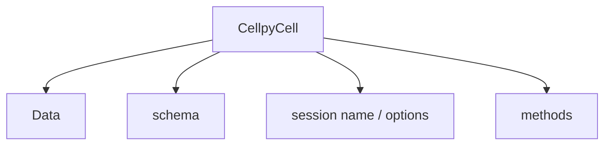
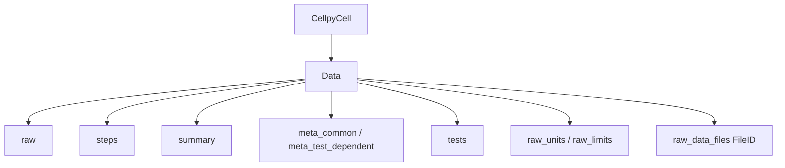

# Data structure

How cellpy 2.x organises a loaded run: the **`CellpyCell`** facade, the
**`Data`** object (frames + metadata), and how to refer to columns via
**`c.schema`**. Source: <https://github.com/jepegit/cellpy>.

Coming from 1.x? Start with the
[migration guide](../getting_started/migration_v1_to_v2.md).

## CellpyCell — main structure

**`CellpyCell`** is the main work-horse: load / process / save, plus helpers
that extract curves and cycle views. Measurement data live on
**`CellpyCell.data`** (a [`Data`](#data) instance). Column identities for the
active runtime schema are on **`CellpyCell.schema`** (prefer this over legacy
`headers_*` attributes).



Typical entry point:

```python
import cellpy

c = cellpy.get("my_run.cellpy")   # or a raw instrument file
# c.data.raw / .steps / .summary
# c.schema.raw.potential, …
```

Multi-test / campaign merges are keyed by compact **`test_id`** on the frames
and recorded in **`Data.tests`** — not a list of separate `Data` objects on
`CellpyCell`. See
[Metadata and campaign merge](../getting_started/migration_v1_to_v2.md#metadata-and-campaign-merge).

## Methods

These two usually run when you load with `cellpy.get(...)`:

- `make_step_table` — step statistics and step-type labels (or use
  `step_specifications` to supply types).
- `make_summary` — per-cycle summary (capacities, efficiencies, C-rates, …).

Other common methods:

- `load` / `save` — cellpy files (default **v9** `.cellpy`; see
  [file formats](file_formats.md)).
- `load_raw` — raw instrument file(s); several paths merge automatically.
- `get_cap` — capacity–potential curves (optionally interpolated / scaled).
- `get_cycle_numbers` — cycle numbers present in the run.
- `get_ocv` — rest steps after charge / discharge.

## Data

Data live on `c.data` (`cellpy.readers.data_structures.Data`).



### Frames

Three **pandas** `DataFrame`s hold the measurement content (still the public
surface in 2.x):

| Attribute | Contents |
|---|---|
| `raw` | Point-wise data from the instrument run |
| `steps` | Per-step stats and `step_type`, from `make_step_table` |
| `summary` | Per-cycle summary, from `make_summary` |

Column names follow the native `cellpycore` schema by default — see
[Column headings](#column-headings).

### Metadata

Common fields are still convenient as properties on `Data` (they forward into
the meta boxes):

```python
c.data.mass = 1.2          # active material (mg)
c.data.tot_mass = 12.0
c.data.nom_cap = 3579.0    # used when deriving C-rates
c.data.material = "Si"
c.data.active_electrode_area = 1.767
```

Under the hood:

- **`meta_common`** / **`meta_test_dependent`** — authoritative boxes for the
  *active* test.
- **`tests`** — `TestMetaCollection` keyed by `test_id` (0 for a single
  unmerged test). Extra tests from a campaign merge live here; **v9** persists
  the full collection, **v8 HDF5** only the active test.
- **`raw_units`** / **`raw_limits`** — units and limits for the raw frame.
- **`custom_info`** — free-form extras; keyword args on `Data(...)` can set
  known attributes.

Defaults for mass / material / nominal capacity come from **`cellpy.config`**
(not the old `prms.Materials…` spelling). See
[configuration](../getting_started/configuration.md).

### FileID

`Data.raw_data_files` is a list of **`FileID`** objects describing the raw
source file(s). Cellpy uses them when deciding whether a saved cellpy file is
still in sync with the raw inputs (for example after the instrument wrote more
data). Merged loads keep one `FileID` entry per raw file.

## Column headings

In cellpy 2.0 the on-frame column names are the **native** `cellpycore`
schema (`RawCols` / `StepCols` / `CycleCols`). Prefer **`c.schema`** so code
tracks the runtime:

```python
c.schema.raw.cycle_num                 # -> "cycle_num"
c.schema.raw.potential                 # -> "potential"
c.schema.raw.cumulative_discharge_capacity
c.schema.steps.step_type               # -> "step_type"
c.schema.summary.charge_capacity
```

Legacy `headers_normal` / `headers_step_table` / `headers_summary` still resolve
via a shim (one-shot deprecation warning per attribute; removal **2.1**). Full
1.x → 2.x rename table:
[header migration map](../other/header_migration_map.md). Coming from 1.x:
[migration guide](../getting_started/migration_v1_to_v2.md).

### Key columns — raw

| Logical field | Column (`c.schema.raw.…`) |
|---|---|
| data point | `datapoint_num` |
| cycle | `cycle_num` |
| step | `step_num` |
| potential (was `voltage`) | `potential` |
| current | `current` |
| charge capacity | `cumulative_charge_capacity` |
| discharge capacity | `cumulative_discharge_capacity` |
| test / step time | `test_time` / `step_time` |
| internal resistance | `internal_resistance` |

**Gotcha:** there is no `schema.raw.discharge_capacity` — use
`cumulative_discharge_capacity`.

### Key columns — step table

| Logical field | Column (`c.schema.steps.…`) |
|---|---|
| cycle | `cycle_num` |
| step | `step_num` |
| sub-step | `sub_step_num` |
| step type | `step_type` |
| C-rate | `c_rate` |

Statistic columns are expanded as `<base>_<stat>` (e.g. `potential_mean`,
`charge_capacity_last`, `datapoint_num_first`). See the migration map for the
full list.

#### Step types

Step-type labels are written to the **`step_type`** column. Typical values:

```python
['charge', 'discharge',
 'cv_charge', 'cv_discharge',
 'charge_cv', 'discharge_cv',
 'ocvrlx_up', 'ocvrlx_down', 'ir',
 'rest', 'not_known']
```

Example:

```python
discharge_steps = c.data.steps.query(
    f"{c.schema.steps.step_type}=='discharge'"
)
```

### Key columns — summary

| Logical field | Column (`c.schema.summary.…`) |
|---|---|
| cycle | `cycle_num` |
| charge / discharge capacity | `charge_capacity` / `discharge_capacity` |
| coulombic efficiency | `coulombic_efficiency` |
| C-rates | `charge_c_rate` / `discharge_c_rate` |
| capacity throughput / EFC | `cumulated_capacity_throughput` / `equivalent_full_cycles` |

Specific (mass-/area-normalized) columns still use postfixes such as
`_gravimetric` and `_areal`. The summary frame has more native-only columns
than 1.x (durations, energies, per-direction stats); see the migration map.

### Batch journal columns

Batch journal page column names (filename, mass, loading, group, …) are part of
the batch workflow, not the per-cell frames above. See
[Batch processing](../examples/batch_utility/cellpy_batch_processing_docs.md).
