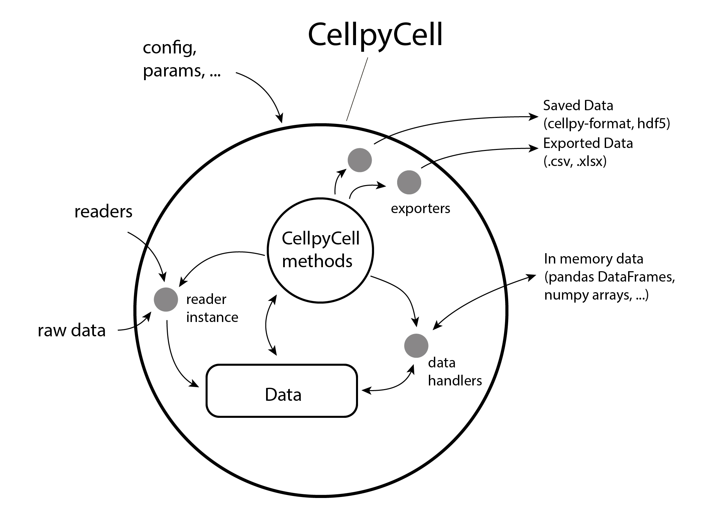
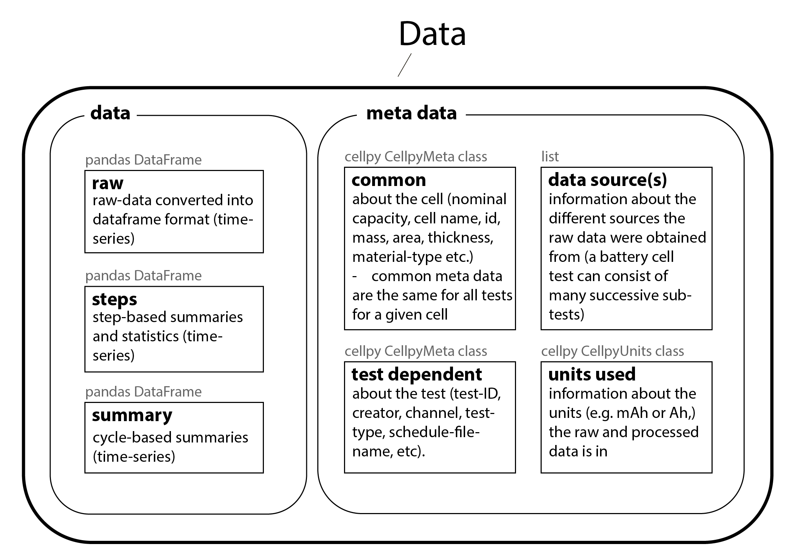
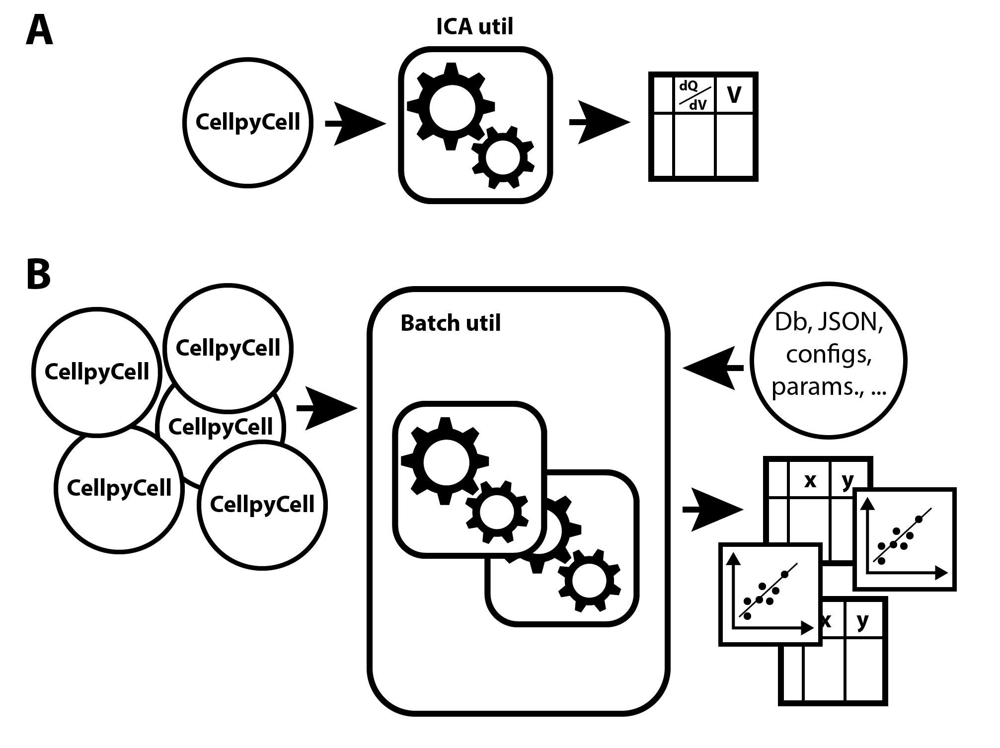

# The fundamentals of cellpy

`cellpy` is implemented in Python and can be used as either a library within Python scripts,
or as a stand-alone application for analysing battery cell test data. Internally, `cellpy` utilises the rich
ecosystem of scientific tools available for Python. In particular, `cellpy` uses `pandas` DataFrames as the
“storage containers” for the collected data within the `cellpy` Data object. This offers full flexibility and
makes it easy for the user to apply advanced methods, analyses of or transformations to the data in addition
to the features implemented in `cellpy`.

`pandas` is not the only frame library in play, though. The multi-cell
[collect](../api/collect.md) layer keeps its tidy frames in `polars`
(`Collection.data`), converting to `pandas` at the plotting seam, and the v9
cellpy-file stores its tables as parquet. Only the per-cell Data frames
(`c.data.raw` / `.steps` / `.summary`) are `pandas` at the public surface — see
the frame-type note in the [agents guide](../getting_started/agents.md) for where
that boundary sits and how to cross it explicitly.

The core of `cellpy` is the **CellpyCell** object ([illustration of the CellpyCell object](#the-fundamentals-of-cellpy)) that contains
both the data (stored in the **Data** object) and central methods required to read, process and store battery testing data.
The CellpyCell provides the appropriate interface and coordination of the resources needed, such as loading
configurations (*e.g* default reader, default raw-data location), selecting readers for different data formats and
exporters for saving the data. Column identities for the active schema are available as **`c.schema`**
(see [The data structure](data_structure.md)).

{ .center }

Illustration of the core object within ``cellpy``, the **CellpyCell**.

The **CellpyCell Data** object stores the battery test data as well as the corresponding metadata
([illustration of the Data object](#the-fundamentals-of-cellpy)). In addition to the central DataFrame containing the raw data (*raw*),
the DataFrames *steps* and *summary* provide step- (*e.g.*, maximum current, mean voltage,
type-of-step *vs.* step number) and cycle-based (*e.g.*, gravimetric charge capacity, coulombic
efficiency, C-rates *vs.* cycle number) summaries and statistics respectively.

{ .center }

Summary of the types of contents in a **CellpyCell Data** object.

The most common data processing routines, such as extraction of charge/discharge voltage curves in different
formats or selecting data for specified step-types, are implemented as methods on the CellpyCell object. In
addition, the `cellpy` library also consists of a rich set of utilities ([cellpy utilities](#the-fundamentals-of-cellpy)) that can be
used for further processing the data, both individually and within batch routines. Utility functions include *e.g.*,
ICA tools, assisting in creating dQ/dV graphs (employing different data-smoothing algorithms), or tools for
OCV relaxation analysis.

{ .center }

The `cellpy` library contains multiple utilities that assists in data analysis.
A utility can work on (A) a single **CellpyCell** object, or (B) a set of CellpyCell
objects such as the Batch utility that helps the user in automating
and comparing results from many data sets.

The default **cellpy-file** format in 2.x is **v9**: a zip of parquet tables plus
`meta.json` (usually with a `.cellpy` extension). Older HDF5 layouts remain
readable; see [File formats](file_formats.md) and the
[migration guide](../getting_started/migration_v1_to_v2.md).

(Ref: [paper.md](https://github.com/jepegit/cellpy/tree/master/paper))
