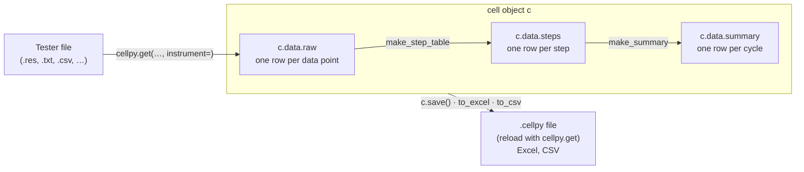

# How cellpy is organised

Everything in cellpy follows one path: a file from your tester is read into a
**cell object**, and cellpy derives two summary tables from it.

- **raw** is what the tester wrote, renamed to cellpy's column names.
- **steps** groups the raw data into steps (charge, discharge, rest, …). The
  [step table guide](../guides/step_table.md) explains how the types are
  decided.
- **summary** has one row per cycle: capacities, coulombic efficiency,
  C-rates. The [summary columns](../reference/summary_columns.md) page lists
  them all.

`cellpy.get` runs all three steps for you. If you change the mass, area,
nominal capacity or cycle mode later, `c.refresh_after("mass")` (or `"area"`,
…) updates the summary columns that depend on it. If you change how steps are
detected, rebuild with `c.make_step_table(...)` and then `c.make_summary()`.
The tables are pandas DataFrames, so anything you can do in pandas works on
them.

## The cell object

The core of `cellpy` is the **CellpyCell** object that contains
both the data (stored in the **Data** object) and central methods required to read, process and store battery testing data.
The CellpyCell provides the appropriate interface and coordination of the resources needed, such as loading
configurations (*e.g* default reader, default raw-data location), selecting readers for different data formats and
exporters for saving the data. Column identities for the active schema are available as **`c.schema`**
(see [The data structure](data_structure.md)).

{ .center }

Illustration of the core object within ``cellpy``, the **CellpyCell**.

The **CellpyCell Data** object stores the battery test data as well as the corresponding metadata. In addition to the central DataFrame containing the raw data (*raw*),
the DataFrames *steps* and *summary* provide step- (*e.g.*, maximum current, mean voltage,
type-of-step *vs.* step number) and cycle-based (*e.g.*, gravimetric charge capacity, coulombic
efficiency, C-rates *vs.* cycle number) summaries and statistics respectively.

{ .center }

Summary of the types of contents in a **CellpyCell Data** object.

## Utilities

The most common data processing routines, such as extraction of charge/discharge voltage curves in different
formats or selecting data for specified step-types, are implemented as methods on the CellpyCell object. In
addition, the `cellpy` library also consists of a rich set of utilities that can be
used for further processing the data, both individually and within batch routines. Incremental capacity
and differential voltage live on [`cellpy.ica`](../api/ica.md) (`dqdv` / `dvdq`);
`cellpy.utils.ica` re-exports the same API. Other helpers include OCV
relaxation analysis.

{ .center }

The `cellpy` library contains multiple utilities that assists in data analysis.
A utility can work on (A) a single **CellpyCell** object, or (B) a set of CellpyCell
objects such as the Batch utility that helps the user in automating
and comparing results from many data sets.

## Files

The default **cellpy-file** format in 2.x is **v9**: a zip of parquet tables plus
`meta.json` (usually with a `.cellpy` extension). Older HDF5 layouts remain
readable; see [File formats](file_formats.md) and the
[migration guide](../getting_started/migration_v1_to_v2.md).

## Under the hood

`cellpy` uses the scientific Python stack. The per-cell tables are `pandas`
DataFrames, so you can apply any pandas method or analysis to them.

`pandas` is not the only frame library in play, though. The multi-cell
[collect](../api/collect.md) layer keeps its tidy frames in `polars`
(`Collection.data`), converting to `pandas` at the plotting seam, and the v9
cellpy-file stores its tables as parquet. Only the per-cell Data frames
(`c.data.raw` / `.steps` / `.summary`) are `pandas` at the public surface — see
the frame-type note in the [agents guide](../agents/index.md) for where
that boundary sits and how to cross it explicitly.

(Ref: [paper.md](https://github.com/jepegit/cellpy/tree/master/paper))
